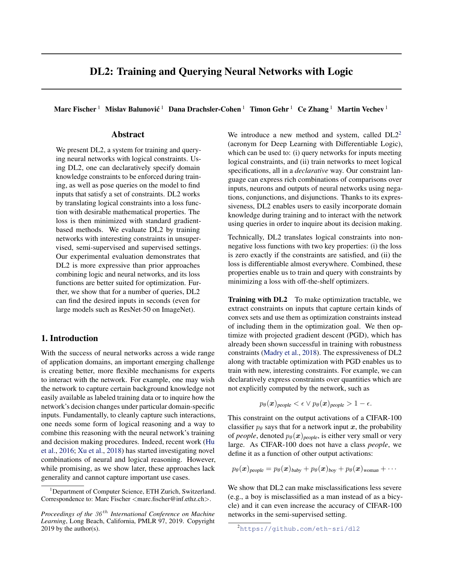

# Deep Structural Analysis of DL2

## 0. Name Disambiguation and Source-Paper Confirmation

### 0.1 Which paper this document mainly corresponds to

This document mainly corresponds to:

- Fischer et al., ICML 2019, *DL2: Training and Querying Neural Networks with Logic*

In this note, `DL2` refers by default to the system introduced in that paper:

- it takes declarative logical constraints $\phi$ as its object;
- it translates constraints into a numerical objective that is nonnegative, differentiable almost everywhere, and such that "the constraint is satisfied if and only if the loss is 0";
- it uses the same "logic $\to$ loss" mechanism to support both training and querying.

`DL2` is generally understood as `Deep Learning with Differentiable Logic`.  
Its focus is not to propose one standalone trick for one specific task, but to turn "how logical constraints enter neural networks" into a unified interface.

### 0.2 Its place in the reading path

If we regard `Hu et al. 2016 -> Semantic Loss -> DL2` as a progressively systematized line of work on logical constraints, then the question this paper answers is:

> Can logic be treated not merely as one particular kind of output loss, but as a unified constraint language, so that the same piece of logic can both participate in training and be used directly to query network behavior?

In other words:

- Hu 2016 is more like: `rule -> teacher distribution -> student`
- Semantic Loss is more like: `rule -> exact semantic loss -> parameter update`
- DL2 is more like: `declarative constraint -> translated loss + optimizer -> training / querying`

Therefore, the real advance of this paper is not "writing one more loss," but rather:

- extending the object of constraint from output probabilities to more general numerical terms;
- letting logic enter not only training, but also querying;
- letting training target not only fixed points in the training set, but also global constraints over input regions outside the training set.

---

## 0.5 Minimal Problem Setup and Notation

To keep the note self-contained, we first fix the minimal setup used below.

Let the neural-network parameter be
$$
\theta,
$$
let the input variable be denoted by
$$
x,
$$
and if the constraint also contains auxiliary variables that need to be searched, perturbed, or quantified over, denote them by
$$
z.
$$

DL2's logical language does not start directly from Boolean variables, but from **numerical terms**.  
A term is written as
$$
t(x,z,\theta),
$$
and it can be:

- a constant;
- an input coordinate;
- a network output probability $p_\theta(x)_i$;
- a pre-softmax logit;
- an internal neuron activation;
- an algebraic combination of several numerical terms.

This note assumes by default that a term is differentiable with respect to the variables and parameters at least on almost all points.

Two terms can form comparison constraints:
$$
t=t',\qquad t\le t',\qquad t\ne t',\qquad t<t'.
$$

More complex constraints are formed by combining these atomic constraints through
$$
\wedge,\qquad \vee,\qquad \neg
$$
and are written uniformly as
$$
\phi(x,z,\theta).
$$

### 0.5.1 Three running examples used throughout this note

Because DL2 simultaneously covers `loss translation`, `training`, and `querying`, this note fixes three minimal examples, each serving a different part of the discussion.

#### Example 1: an equality toy for explaining the geometry of loss translation

Define
$$
\phi_{\text{eq}}(u)=\bigl(u=(1,1)\bigr),
\qquad
u=(u_0,u_1)\in\mathbb R^2.
$$

This example has only one purpose:

- to explain why DL2's loss translation is more suitable for gradient optimization than some soft logic encodings.

#### Example 2: a people-group constraint for explaining the training interface

In the semi-supervised CIFAR-100 setting, define a group of semantic group probabilities.  
For example,
$$
p_{\text{people}}(x)
=
p_\theta(x)_{\text{baby}}
+p_\theta(x)_{\text{boy}}
+p_\theta(x)_{\text{girl}}
+p_\theta(x)_{\text{man}}
+p_\theta(x)_{\text{woman}}.
$$

Then impose the following constraint on each group:
$$
p_g(x)<\varepsilon\ \vee\ p_g(x)>1-\varepsilon.
$$

Its intuition is:

- the probability mass should concentrate as much as possible on one semantic group, rather than being evenly spread across multiple groups.

#### Example 3: a generator disagreement query for explaining querying

Define the query:

```text
FIND i[100]
WHERE i[:] in [-1, 1],
      class(N1(G(i)), c1),
      N1(G(i)).p[c1] > 0.3,
      class(N2(G(i)), c2),
      N2(G(i)).p[c2] > 0.3
RETURN G(i)
```

Its meaning is:

- search for a noise vector $i$;
- after passing it through the generator $G$ to produce a sample;
- that sample is classified by two classifiers $N_1,N_2$ into different classes with relatively high confidence.

This example is best suited to show:

- the object of a DL2 query is not only an output label, but can also be a joint logical condition across multiple networks.

---

## 1. The Core Problem the Paper Wants to Solve

### 1.1 The intuitive question

The question this paper truly wants to answer is:

> When an expert already knows that a network should satisfy some numerical-logical property, can these constraints be written in a unified declarative way and used for both training and querying, without having to design a separate task-specific loss for each type of constraint?

The authors target scenarios like the following:

- comparison constraints between output probabilities, for example
  $$
  p_\theta(x)_{\text{truck}} > p_\theta(x)_{\text{dog}} + \delta;
  $$
- robustness constraints over a neighborhood, for example
  $$
  \forall z\in B_\varepsilon(x),\ \log p_\theta(z)_y > \delta;
  $$
- function-stability constraints, such as Lipschitz conditions;
- physical or conservation constraints in regression tasks, for example
  $$
  \mathrm{sum}(x)=\mathrm{sum}(G(x));
  $$
- and query conditions jointly imposed on the input, output, and internal neurons.

### 1.2 Why earlier logical methods are still not enough

If we look only at Logic-Net or Semantic Loss, each of them has already solved part of the problem, but neither is systematic enough.

The limitations of Logic-Net are:

- rules mainly enter the student indirectly through a teacher distribution;
- the types of rules it expresses naturally are constrained by the form of posterior projection;
- it does not directly provide a querying interface.

The limitations of Semantic Loss are:

- its most natural object is "the set of satisfying assignments in the output space";
- it leans more toward certain types of output-structure constraints;
- it is not natural for continuous input regions outside the training set or for internal-neuron queries.

More generally, many soft logic encodings are "continuous" but not necessarily "optimizable."  
The issue especially emphasized by the authors is:

> If a logic translation can still produce zero gradient when a constraint is violated, then it is not truly usable for optimization.

This is also the most important dividing line between DL2 and methods that merely "write logic as a continuous expression."

---

## 2. Two Key Figures in the Paper

### 2.1 Figure 1: what DL2 querying is actually searching for



The most important thing about this figure is not the page layout, but that it makes the query objects of DL2 explicit as three categories:

- searching for inputs that satisfy adversarial conditions;
- searching for inputs that deactivate some internal neuron;
- searching for inputs that distinguish the behavior of two networks.

This shows that the logical object of DL2 is not a "label post-processing rule," but rather:

- over inputs;
- over outputs;
- over intermediate representations;
- and even over relations between multiple networks

all of these can be expressed as unified numerical constraints.

In other words, what this figure is really saying is:

- logic is no longer only a side regularizer used during training;
- it can also directly become a language for "searching network behavior."

### 2.2 The query benchmark page: why it is more like a system than a single trick


What is usually most worth looking at on this page is not the specific numbers, but two things:

1. the way query templates are written;
2. the runtime statistics of the queries.

What the authors want to emphasize is:

- DL2 does not only propose one way to translate constraints;
- it also turns that translation into an executable querying system;
- and the queries can run across multiple large models, not just toy examples.

Taken together with Figure 1, this page basically makes the difference between DL2 and the previous two papers clear:

- the previous two mainly solve "how to train";
- DL2 simultaneously solves "how to train" and "how to ask questions of a model."

---

## 3. What DL2's Logical Language Is Actually Constraining

### 3.1 The basic unit of constraint is not a Boolean output bit, but a numerical term

The most fundamental shift in DL2's perspective is:

- it does not first assume that the output is some set of Boolean variables;
- instead, it first allows you to write arbitrary numerical terms, and then compare those terms.

Therefore, the objects constrained by DL2 can be:

- input coordinates;
- output probabilities;
- pre-softmax logits;
- internal-layer activations;
- combined quantities from multiple network outputs;
- sums, differences, norms, or other differentiable expressions constructed from these quantities.

For example, the following constraints are all natural objects in DL2:

$$
p_\theta(x)_1 > p_\theta(x)_2,
$$
$$
\mathrm{sum}(x)=\mathrm{sum}(G(x)),
$$
$$
\mathrm{NN}(i).l_1[0,1,1,31]=0.
$$

This means that DL2's logic does not constrain only "whether the class is correct," but can directly constrain the numerical behavior both inside and outside the network.

### 3.2 The logical structure comes from Boolean combinations of comparison constraints

DL2's constraint form is uniformly:

- atomic comparison constraints;
- composite logical formulas formed through $\wedge,\vee,\neg$.

This naturally supports:

- equivalent rewritings of implication;
- disjunction for expressing the semantics of "one of two must hold";
- conjunction for expressing that multiple conditions must hold simultaneously;
- negation for expressing counterexamples or violation conditions.

For example, the people-group constraint above
$$
p_g(x)<\varepsilon\ \vee\ p_g(x)>1-\varepsilon
$$
is a typical disjunction:

- either the group is almost inactive;
- or the group is almost fully active;
- the intermediate "half-on half-off" state is treated as violating the constraint.

### 3.3 Where exactly it is more general than earlier work

DL2 is more general in a sense that goes beyond "it can write more symbols."

More precisely, it extends three dimensions:

1. **More general constraint objects**  
   It is not limited to output class probabilities, but can directly constrain inputs, logits, internal neurons, and cross-network relations.

2. **More general constraint shapes**  
   It is not limited to linear output rules, but can also express nonlinear conditions, norm-based conditions, neighborhood conditions, and interpolation-based conditions.

3. **More general usage modes**  
   Logic can be used both for training and for querying.

Only by stacking these three points together do we get the system-level character of DL2.

---

## 4. From Logical Constraints to Loss: DL2's Core Translation

### 4.1 The translation target: nonnegative, differentiable almost everywhere, and 0 if and only if satisfied

For each constraint $\phi$, DL2 associates a nonnegative loss
$$
L(\phi),
$$
and requires it to satisfy two core properties:

1. $L(\phi)=0$ if and only if $\phi$ is satisfied;
2. $L(\phi)$ is differentiable almost everywhere with respect to the variables and parameters.

Taken together, these two properties mean:

- logical satisfaction is preserved exactly in the zero-set structure;
- and at the same time that structure can be exploited by standard gradient methods.

### 4.2 How atomic comparison constraints are translated

For comparison constraints, the basic translation given by DL2 is:
$$
L(t\le t')=\max(t-t',0),
$$
$$
L(t\ne t')=\xi\cdot [t=t'],
$$
where $\xi>0$ is a constant and $[t=t']$ is the indicator function.

The remaining comparison constraints are obtained by logical-equivalence rewriting:
$$
L(t=t') := L(t\le t' \wedge t'\le t),
$$
$$
L(t<t') := L(t\le t' \wedge t\ne t').
$$

This step is crucial, because DL2 does not casually assign one penalty term to each symbol. Instead, it first preserves logical equivalence and only then performs a unified translation.

### 4.3 How Boolean combinations are translated

For conjunction and disjunction, DL2 defines:
$$
L(\phi'\wedge \phi'')=L(\phi')+L(\phi''),
$$
$$
L(\phi'\vee \phi'')=L(\phi')\cdot L(\phi'').
$$

The meanings of these two definitions are:

- under conjunction, all subconstraints must be pushed to 0 simultaneously, so addition is used;
- under disjunction, as long as the loss of one branch is 0, the product is 0, thereby preserving the semantics of "at least one holds."

For negation, DL2 does not directly invent a new penalty term, but first rewrites it by logical equivalence, for example:
$$
L(\neg(t\le t'))=L(t'<t),
$$
$$
L(\neg(\psi'\wedge\psi''))=L(\neg\psi'\vee\neg\psi'').
$$

The purpose of doing so is:

- to let the construction of the loss follow the logic itself as much as possible, rather than introducing extra semantic bias.

### 4.4 Why Theorem 1 matters

The paper gives the key conclusion:

> Theorem 1: $L(\phi)=0$ if and only if $\phi$ is satisfied.

The significance of this theorem is not just that "the loss is beautifully designed," but that:

- logical satisfiability and numerical optimization zeros are aligned strictly;
- therefore, optimizing the zeros of the loss is equivalent to finding assignments that satisfy the constraint;
- only then can training and querying reuse the same translation mechanism.

Without this property, both training and querying could only be understood as some heuristic approximation, rather than direct optimization of constraint satisfaction.

### 4.5 Why it is better suited to gradient descent than some soft logic encodings

Continue with the equality toy above:
$$
\phi_{\text{eq}}(u)=\bigl(u=(1,1)\bigr),\qquad u=(u_0,u_1).
$$

Under the PSL encoding compared in the paper, one may obtain
$$
L_{\text{PSL}}(\phi)(u)=\max(u_0+u_1-1,0).
$$

If the optimization starting point is
$$
u=(0.2,0.2),
$$
then
$$
u_0+u_1-1\le 0,
$$
so the gradient is 0 and optimization stops; however, $u$ does not satisfy the target assignment at that point.

Under the DL2 translation, by contrast,
$$
L(\phi_{\text{eq}})(u)=|u_0-1|+|u_1-1|.
$$

At the same point
$$
u=(0.2,0.2)
$$
the gradient is still nonzero, so optimization will continue pushing $u$ toward the satisfying point.

This example is meant to convey only one sentence:

> DL2 does not simply write logic as a continuous expression. It explicitly considers whether, when a constraint is violated, the gradient can still keep optimization moving forward.

---

## 5. How DL2 Enters Training

### 5.1 The training objective is first rewritten as "find counterexamples"

Let the training distribution be $D$, the search space be $A$, and the constraint be
$$
\phi(x,z,\theta).
$$

DL2 aims to find parameters $\theta$ such that for a random sample $x\sim D$, the constraint holds for all $z\in A$ as much as possible:
$$
\arg\max_\theta\Pr_{x\sim D}\bigl[\forall z\in A.\ \phi(x,z,\theta)\bigr].
$$

This objective can be rewritten equivalently as minimizing the probability that "there exists a counterexample":
$$
\arg\min_\theta\Pr_{x\sim D}\bigl[\exists z\in A.\ \neg\phi(x,z,\theta)\bigr].
$$

This step is crucial because it rewrites the training problem into:

- as long as one can find a $z$ that violates the constraint;
- that $z$ can be treated as a counterexample under the current parameters;
- and the network can then be pushed to repair that counterexample.

### 5.2 Inner and outer optimization: optimizer vs adversary

If for each given $x,\theta$, one can find a worst counterexample
$$
z^*(x,\theta)=\arg\max_{z\in A}[\neg\phi(x,z,\theta)],
$$
then the outer problem becomes:
$$
\arg\max_\theta \Pr_{x\sim D}\bigl[\phi(x,z^*(x,\theta),\theta)\bigr].
$$

DL2 interprets this process as a two-player game:

- **adversary**: given the current parameters, search for inputs or auxiliary variables that violate the constraint;
- **optimizer**: take these counterexamples and update the parameters so that those counterexamples no longer violate the constraint.

After approximation by a loss, the inner problem is written as
$$
z^*(x,\theta)=\arg\min_{z\in A} L(\neg\phi)(x,z,\theta),
$$
and the outer problem is approximated as
$$
\arg\min_\theta \mathbb E_{x\sim T}\bigl[L(\phi)(x,z^*(x,\theta),\theta)\bigr],
$$
where $T$ is the training set.

Therefore, the essence of DL2 training is not one static regularization term, but rather:

- first find counterexamples;
- then use those counterexamples to update the parameters.

### 5.3 Why convex input constraints are pulled out of the loss

Directly minimizing
$$
L(\neg\phi)
$$
can sometimes be difficult. The example given in the paper is the local robustness constraint:
$$
\phi((x,y),z,\theta)=\|x-z\|_\infty\le \varepsilon \Rightarrow \mathrm{logit}_\theta(z)_y>\delta.
$$

Under the direct translation, one obtains
$$
L(\neg\phi)
=
\max(0,\|x-z\|_\infty-\varepsilon)
+
\max(0,\mathrm{logit}_\theta(z)_y-\delta).
$$

The problem here is:

- the first term is the geometric constraint of "whether it is still inside the neighborhood";
- the second term is the semantic constraint of "whether the classification condition is violated";
- their numerical scales differ, which can easily cause a first-order method to greedily optimize only one of them.

Therefore, the key engineering treatment in DL2 is:

- to pull projectable convex input constraints such as balls, boxes, and line segments into a feasible set $B$;
- to denote the remaining part by $\psi$;
- and to rewrite the inner problem as
$$
z^*(x,\theta)=\arg\min_{z\in B}L(\psi)(x,z,\theta).
$$

This step does not change the logic semantics, but changes the optimization interface:

- being "inside the ball" is now enforced by projection;
- only "what is still violated inside the ball" is measured by the loss.

### 5.4 Why PGD appears here

Once the inner search space becomes a convex set $B$, DL2 uses projected gradient descent (PGD).

Its role is:

- first update the counterexample variable $z$ by the gradient at each step;
- then project the updated result back into the legal convex set $B$;
- thereby ensuring that counterexample search always stays inside the specified constrained region.

So in DL2, PGD is not an auxiliary trick, but a core component of whether training is tractable.

If we compress the training algorithm in the paper into the shortest main line, it is:

1. extract the projectable convex set $B$ and the remaining logical part $\psi$ from the constraint;
2. for mini-batch samples $x$, use PGD to find an approximate counterexample
   $$
   z^*\approx \arg\min_{z\in B}L(\psi)(x,z,\theta);
   $$
3. use
   $$
   \nabla_\theta L(\phi)(x,z^*,\theta)
   $$
   to update the network parameters.

### 5.5 Why it can do global training "outside the training set"

This is the point that most deserves to be singled out for DL2 relative to the previous two papers.

In much prior work, constraints mainly act only on the training samples themselves.  
DL2, however, allows:

- neighborhoods around training samples;
- entire segments, balls, or boxes induced by training samples;
- and even more general search spaces

to be searched for counterexamples that violate the constraint.

That is, the "globality" of DL2 mainly comes from:

- quantified variables explicitly written inside the constraint;
- and the adversary actively searching for counterexamples in those variable spaces.

For example, consider a Lipschitz constraint:
$$
\forall z\in B_\varepsilon(x),\ z'\in B_\varepsilon(x').\
\|f(z)-f(z')\|_2 < L\|z-z'\|_2.
$$

What is being constrained here is no longer a fixed pair of points in the training set, but all pairs of points in two neighborhoods.  
Constraints of this kind have essentially gone beyond "adding one extra loss on data points."

---

## 6. How DL2 Performs Querying

### 6.1 The basic form of the query DSL

DL2 designs a declarative query language close to SQL, whose basic shape is:

```text
FIND z1[m1], ..., zk[mk]
WHERE φ(z1, ..., zk)
[INIT z1 = c1, ..., zk = ck]
[RETURN t(z)]
```

Here:

- `FIND` defines the variables to search and their shapes;
- `WHERE` writes the logical constraints;
- `INIT` provides initial values;
- `RETURN` specifies the final object to return; if omitted, the search variables themselves are returned by default.

The DSL also provides some syntactic sugar:

- `,` denotes conjunction;
- `in` denotes a box constraint;
- `class` denotes the argmax class of a network at a given input.

Therefore, in the paper,
$$
\mathrm{class}(NN(x))=y
$$
can essentially be understood as:

- the probability of class $y$ is larger than the probability of every other class.

### 6.2 Why querying and training use the same core

DL2's querying is not another independent system.  
It reuses the same core as training:

- first compile the logical constraint into a loss;
- then perform numerical optimization over the variables that need to be searched.

The only difference is:

- during training, the main optimization target is the parameter $\theta$, usually accompanied by counterexample search;
- during querying, $\theta$ is fixed and the query variables themselves are optimized.

So the unity of training and querying is not a slogan, but the fact that:

- they share the same constraint language;
- they share the same zero-set semantics;
- they share the same "logic $\to$ loss" translation mechanism.

### 6.3 How to read the most typical query example

Continue with the generator disagreement query above:

```text
FIND i[100]
WHERE i[:] in [-1, 1],
      class(N1(G(i)), c1),
      N1(G(i)).p[c1] > 0.3,
      class(N2(G(i)), c2),
      N2(G(i)).p[c2] > 0.3
RETURN G(i)
```

Its logical structure can be decomposed into three layers:

1. **Domain constraint**  
   $i$ is a 100-dimensional noise vector, and each dimension lies in $[-1,1]$.

2. **Cross-network behavioral constraint**  
   The generator output $G(i)$ must be classified by two classifiers into different classes, both with relatively high confidence.

3. **Return object**  
   What is returned is not the noise itself, but the generated sample $G(i)$.

This shows that the real role of the query is not to "look up a label," but to:

- search for an input configuration that satisfies a composite neural-behavior condition.

### 6.4 Why querying uses L-BFGS-B

In querying, DL2 still compiles constraints into a loss, but the optimizer is changed to `L-BFGS-B`.

The reason is straightforward:

- querying usually optimizes a small number of variables rather than an entire batch of training samples;
- it can afford a slower but more sophisticated optimizer;
- `L-BFGS-B` is more suitable for this kind of continuous constrained search.

Therefore, the standard querying workflow is:

1. compile the query into a loss;
2. fix the network parameters;
3. optimize only the query variables;
4. when the loss drops to 0, obtain a solution satisfying the constraint; if timeout is reached, return failure.

---

## 7. What It Is Actually Optimizing

### 7.1 It is not optimizing the "total probability mass of satisfying worlds"

This point must be distinguished clearly from Semantic Loss.

Semantic Loss optimizes:

- under a discrete output distribution;
- the set of worlds satisfying some logical constraint;
- how much total probability mass is assigned to that set.

DL2 does not optimize this kind of "distribution-level satisfying mass."  
What DL2 optimizes is:

- under some continuous assignment $(x,z,\theta)$;
- the numerical violation loss produced by translating the constraint;
- or the minimization of that violation loss at counterexample points found by the adversary.

In other words:

- the core object of Semantic Loss is a **probability distribution over a set of worlds**;
- the core object of DL2 is the **degree of constraint violation on continuous variable assignments**.

### 7.2 It is not a teacher distribution either

This is also different from Logic-Net.

DL2 contains no:

- posterior projection;
- teacher distribution;
- intermediate distribution object used to distill a student.

Its chain is more like:

$$
\phi
\Longrightarrow
L(\phi)
\Longrightarrow
\text{adversary / optimizer}
\Longrightarrow
\theta \ \text{or}\ z.
$$

Therefore, what DL2 really systematizes is:

- logic entering the optimizable interface directly;
- rather than first becoming an intermediate teacher.

### 7.3 Why it is both local and potentially global

If we look only at one loss evaluation, DL2 is indeed evaluating violation at one concrete assignment point.  
In that sense, it is pointwise, rather than summing over an entire set of worlds as Semantic Loss does.

But once quantified variables and adversary search are taken into account, it can become global:

- the globality does not come from "summing over all satisfying worlds";
- but from "actively searching for the worst counterexample in a given continuous region."

So a more accurate statement is:

- DL2's loss is a pointwise violation loss;
- the coverage of DL2 training can be region-level, neighborhood-level, or even a global region outside the training set.

This is a completely different source of "globality" from that of Semantic Loss.

---

## 8. Its Essential Differences from Logic-Net, Semantic Loss, and PSL

### 8.1 The differences from Logic-Net and Semantic Loss

| Dimension | Logic-Net | Semantic Loss | DL2 |
| --- | --- | --- | --- |
| Rule entry point | teacher posterior | enters the output loss directly | unified declarative constraint language |
| Intermediate object | teacher distribution $q^\star$ | total probability mass of satisfying worlds | violation loss produced by constraint translation |
| Primary object | output distribution | set of worlds over a discrete output distribution | inputs, outputs, neurons, and their numerical relations |
| Supports querying | no | no | yes |
| Naturally supports constraints outside the training set | weak | weak | strong |
| Suitable for regression / physical constraints | moderate | relatively weak | more natural |

In one sentence:

- `Logic-Net`: first change the distribution, then change the parameters;
- `Semantic Loss`: directly optimize the total probability mass of satisfying worlds;
- `DL2`: compile general logical constraints into a unified loss, and then use it for training or querying.

### 8.2 The differences from PSL / XSAT / Bach et al.

| Method | Core object | Main issue | DL2 relative advantage |
| --- | --- | --- | --- |
| PSL | soft truth over $[0,1]$ | can produce zero gradients while still unsatisfied | the zeros of the loss are strictly aligned with constraint satisfaction, and the optimization geometry is more stable |
| XSAT | numerical satisfiability | atomic losses are discrete and nondifferentiable | suitable for gradient methods |
| Bach et al. | soft form of linear constraints | mainly handles linear conjunctions | DL2 supports more general Boolean combinations and nonlinear numerical terms |

Especially relative to PSL, the key strength of DL2 is not that it is "harder," but that:

- when a constraint is violated, the gradient still tries to provide a direction that keeps optimization moving.

### 8.3 A compressed relation among three logic-constraint papers

The three main logic papers can be compressed into:

$$
\text{Logic-Net}: \phi \to q^\star \to \theta,
$$
$$
\text{Semantic Loss}: \phi \to P_p(\phi) \to \theta,
$$
$$
\text{DL2}: \phi \to L(\phi) \to (\theta\ \text{or}\ z).
$$

The last line is the most important, because it simultaneously supports:

- training parameters;
- searching for counterexamples;
- and directly querying inputs that satisfy the condition.

---

## 9. Why This Paper Is Effective

### 9.1 Semi-supervised learning: it lets unlabeled data carry higher-level semantic group constraints

In the semi-supervised CIFAR-100 experiments, DL2 uses semantic group constraints such as people / trees.  
Its essence is not to tell the network "which exact class this is," but to tell the network:

- the probability mass should concentrate as much as possible on one reasonable high-level semantic group.

Therefore, although unlabeled data do not provide exact class labels, they still provide:

- group-level structural supervision;
- constraints saying that the probability distribution should not be evenly spread out.

The results reported in the paper are:

- the constraint satisfaction rate increases significantly;
- prediction accuracy also improves;
- and the wrong classes become "less absurd," for example, tending to be misclassified into semantically similar classes.

### 9.2 Unsupervised learning: structural properties alone can approach supervised solutions

The unsupervised experiment in the paper is a shortest-distance regression task on a graph.  
The network must predict the shortest distance from a source node to all nodes, but during training it is not given labels directly. It is given only the structural properties that the shortest-distance function must satisfy.

This shows that:

- DL2 does not require logic to correspond specifically to classification labels;
- as long as the task objective has declarable structural properties;
- those properties themselves can be used as learning signals.

This result is important because it pushes DL2 from "a classification trick with added rules" to a more general framework for structural learning.

### 9.3 Supervised learning: it can significantly improve constraint accuracy

In the supervised experiments, the authors consider:

- local robustness;
- global robustness;
- Lipschitz conditions;
- C-similarity;
- Segment constraint.

In terms of results, the core gain of DL2 is not that "prediction accuracy improves on all tasks," but rather that:

- the constraint satisfaction rate can often be greatly improved;
- especially for global constraints, for example some LipschitzG constraints go from near 0% to near complete satisfaction.

This shows that the value of DL2 mainly lies in:

- pushing the network toward regions that obey constraints better;
- rather than merely chasing a tiny accuracy improvement on conventional benchmarks.

### 9.4 Querying: it also turns "network behavior analysis" into a unified interface

In the querying experiments, DL2 is tested on multiple datasets, multiple networks, and multiple query templates.  
What the authors emphasize is not that "every query succeeds," but that:

- in many cases, the system can find a solution within seconds or tens of seconds;
- it can even execute queries across multiple large models;
- therefore querying is not a decorative add-on in the paper, but a genuinely runnable system capability.

---

## 10. Computational Cost and Limitations

### 10.1 Elegant constraint translation does not mean optimization is always easy

Although DL2 provides a unified logic $\to$ loss translation, the practical difficulties still lie in optimization:

- inner counterexample search can itself be difficult;
- the numerical scales of different constraint terms may not match;
- global constraints often require heavier PGD search.

That is, DL2 solves "how to express things uniformly and optimize them differentiably," not "all constraints suddenly become cheap."

### 10.2 Global constraints are clearly more expensive than training-set constraints

The paper states clearly in the experiments that:

- the extra training cost of training-set constraints is relatively controllable;
- global constraints are significantly more expensive because they include projection steps and heavier inner-loop search.

Put more plainly:

- `T`-type training-set constraints are more like "adding structure on top of existing sample relations";
- `G`-type global constraints are more like "doing region-level counterexample search while training."

### 10.3 Query failure does not imply unsatisfiability

For querying, if some query times out or no solution is found, this does not automatically mean:

- the corresponding constraint is unsatisfiable on the model.

More likely reasons are:

- the optimizer got stuck in a local minimum;
- the initialization was unsuitable;
- the query space was too large;
- the time budget was insufficient.

Therefore, DL2 querying should be understood more as:

- a satisfiability search based on continuous optimization;
- rather than a complete logical decision procedure.

### 10.4 Higher expressiveness also means a higher barrier to use

Compared with Logic-Net and Semantic Loss, DL2 is stronger, but the cost is also more obvious:

- one must distinguish more clearly between projectable constraints and loss constraints;
- one must understand the adversary / optimizer two-level structure;
- one must switch among interfaces such as the DSL, API, PGD, and L-BFGS-B;
- the engineering complexity rises significantly.

Therefore, DL2 is more like a framework or system than just "a prettier formula."

---

## 11. Correspondence with the Local Repository and Code

The current repository already contains local DL2 resources:

- [Paper PDF](../papers/dl2/dl2_2019_icml.pdf)
- [Extracted paper text](../Logic-1.txt)
- [DL2 code root directory](../dl2-master/dl2-master/README.md)
- [training README](../dl2-master/dl2-master/training/README.md)
- [querying README](../dl2-master/dl2-master/querying/README.md)

The code organization in the repository corresponds to the paper structure:

- `training/`
  - `supervised/`
  - `semisupervised/`
  - `unsupervised/`
- `querying/`
  - DSL entry point
  - API entry point
  - reproduction scripts

From the perspective of reading order, the safest entry path is:

1. first read the root `README.md` to clarify the system boundary;
2. then read `querying/README.md` to build intuition for the DSL as quickly as possible;
3. finally read `training/README.md`, and then return to the nested optimization in the paper.

The advantage of doing this is:

- first to see clearly what kind of system it actually is;
- and then to go back and understand why the formulas are written that way.

---

## 12. Suggestions for a Minimal Reproduction

### 12.1 What is best to do first

The best first step is a minimal `query-only` toy.

The reasons are:

- it most directly reflects DL2's "declarative interface";
- it does not require wiring up the full optimizer-adversary training chain from the very beginning;
- it is easy to distinguish from Semantic Loss: this time we are not writing another training loss, but first getting one query to run through.

### 12.2 A safest minimal reproduction path

1. Choose a tiny MLP or a two-dimensional toy classifier;
2. write the simplest declarative query, for example:
   - search for an input that flips the size relation between two class logits;
   - or search for a sample in a neighborhood that satisfies a specific classification condition;
3. first make it run through the DSL;
4. then write the same query with the querying API;
5. finally add the minimal training version and connect the constraint into the optimization loop.

### 12.3 The three comparisons most worth doing

- `query DSL` vs `query API`
  See the difference in how the same constraint is expressed in the high-level and low-level interfaces.

- `only training-set constraints` vs `constraints with global quantified variables`
  See where the "globality" of DL2 actually comes from.

- `semantic loss-style constraints` vs `DL2-style constraints`
  See the difference in expressiveness and engineering difficulty between "output-layer satisfying probability mass" and a "declarative numerical constraint system."

### 12.4 If we want to align with the toy path in the current repository

The most natural implementation directory is still:

```text
repro/04_dl2_toy/
```

A safe minimal structure could be:

```text
README.md
notes.md
config.py
toy_problem.py
dl2_bridge.py
run_query.py
run_train.py
experiment.py
results/
```

The most important thing here is not to pile up all functionality first, but to make these three points clear first:

1. what the constraint is;
2. who it optimizes in training / querying respectively;
3. which part of the original paper this toy actually corresponds to.

---

## 13. A One-Page Compressed Summary

If we keep only the most important sentences, then the skeleton of this paper is:

1. First define a declarative language for writing logical constraints over numerical terms.
2. Translate each constraint $\phi$ into a nonnegative loss that is differentiable almost everywhere and is exactly 0 when satisfied:
   $$
   L(\phi)=0 \iff \phi \text{ satisfied}.
   $$
3. During training, write constraint optimization as a two-level process of optimizer and adversary:
   - the adversary searches for counterexamples;
   - the optimizer updates the parameters to repair those counterexamples.
4. During querying, fix the network parameters and use the same constraint translation to search directly for inputs that satisfy the condition.

So what it truly solves is:

> How to lift "the interaction between logical constraints and neural networks" from a single task-specific trick into a unified declarative system that is trainable and queryable.

And the real price it pays is:

> The stronger the expressiveness, the heavier the inner-loop search during training, convex-set projection, query optimization, and engineering complexity become.
