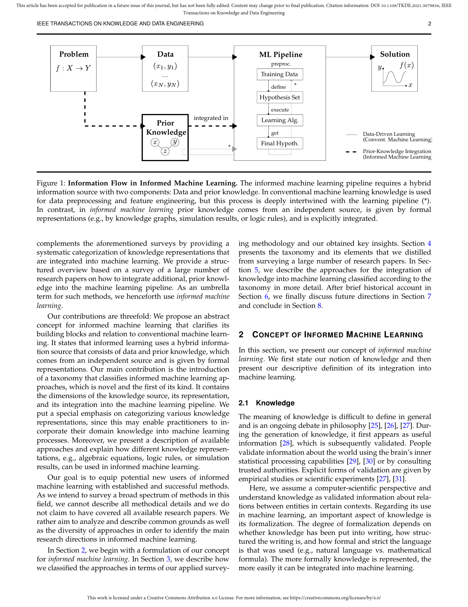
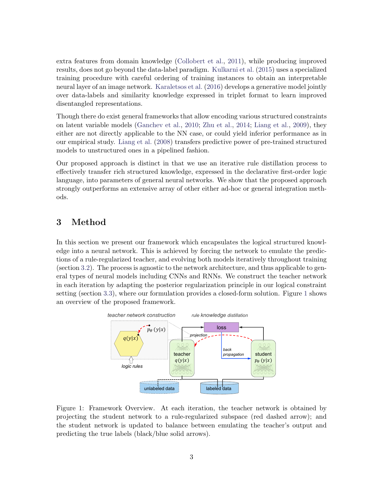
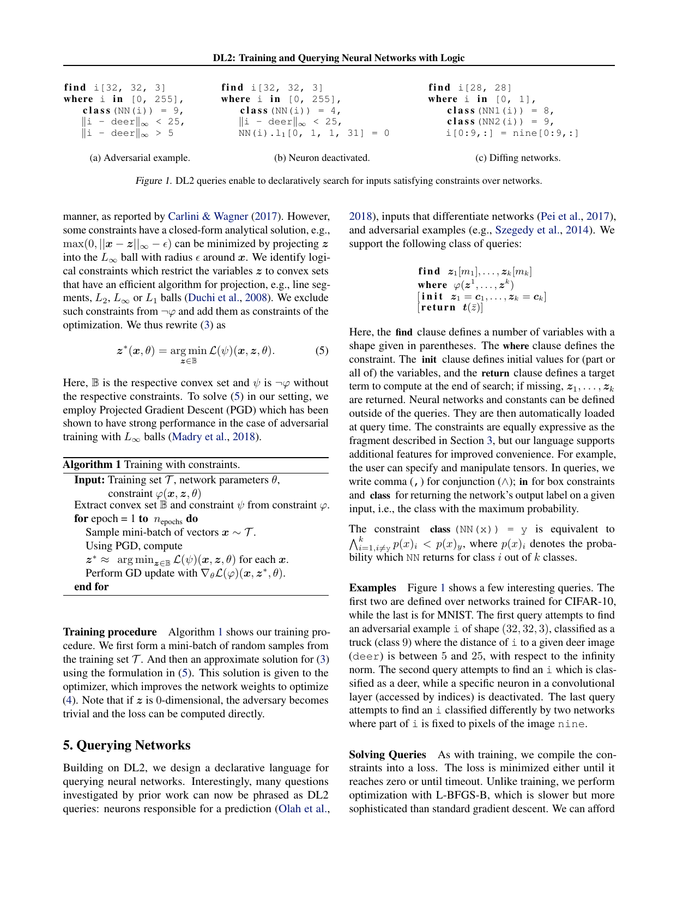
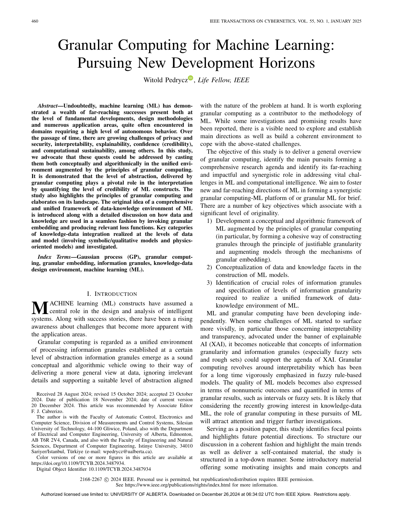
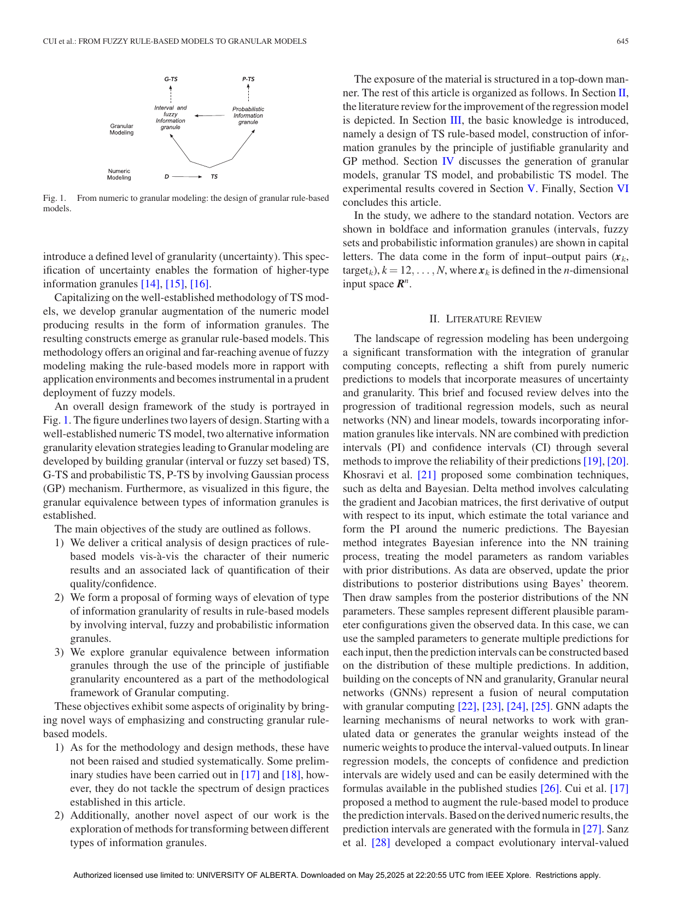
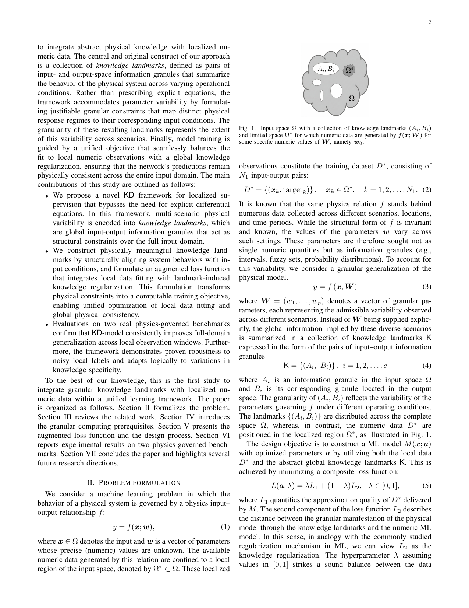
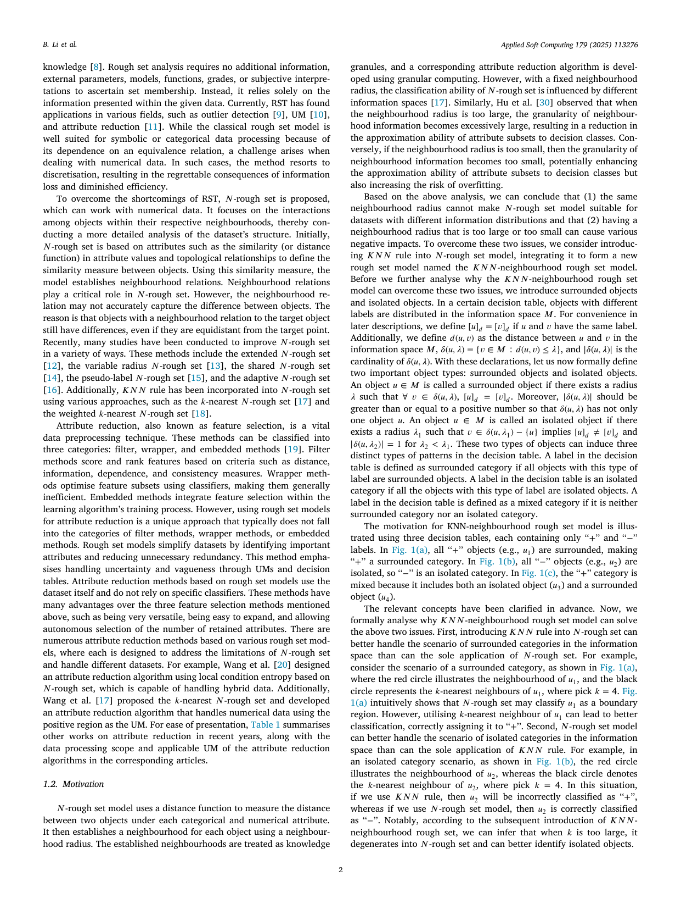

# Informed Machine Learning 逐篇精读、逻辑关系与渐进式复现路线

## 0. 这份文档怎么用

这份文档不是简单摘要，而是把当前文件夹里的核心论文整理成一条可执行的学习链。目标有四个：

1. 让你知道每篇论文到底在解决什么问题。
2. 让你知道它和前后论文的逻辑关系。
3. 让你知道每篇论文最值得看的图、公式和关键词。
4. 让你知道后续可以怎么做最小复现、标准复现和延伸复现。

阅读建议：

- 第一次看：先读第 1 节和第 2 节，建立全局结构。
- 第二次看：按第 3 节开始一篇篇读。
- 第三次看：直接从每篇后面的“复现建议”开始动手。

说明：

- 每篇论文都配了一张截图，截图来自当前仓库里的 PDF 页面渲染。
- 截图不是为了代替读原文，而是帮你抓住“这篇最值得盯住的图或核心页面”。
- 本文的重点是“结构化理解 + 可执行路线”，不是追求逐段翻译。

---

## 1. 先把整套材料看成两条主线

这批论文不是散的，实际上可以分成两条主线，再在后面汇合。

### 1.1 逻辑约束主线

这条线关心的问题是：

> 已知一些规则、逻辑、结构约束，怎样把它们注入神经网络，而不是只靠数据硬学？

对应论文：

1. Survey
2. Logic-net
3. Semantic Loss
4. DL2

这条线的推进顺序是：

- Survey 先告诉你“知识可以进模型”的大框架。
- Logic-net 先给一个最直观的规则注入思路。
- Semantic Loss 把逻辑约束更直接地写成损失。
- DL2 再把逻辑约束做成一个更系统、可声明、可查询的框架。

### 1.2 Granular / Uncertainty / Knowledge 主线

这条线关心的问题是：

> 现实中的知识往往不是严格逻辑公式，而是模糊的、区间式的、带抽象层次的，那么如何把这种知识和数据一起建模？

对应论文：

1. Survey
2. Granular Computing for Machine Learning
3. From Fuzzy Rule-Based Models to Granular Models
4. Informed Machine Learning with Knowledge Landmarks

这条线的推进顺序是：

- Survey 先给你知识注入的总框架。
- Granular Computing 说明为什么模型不能只给一个“看起来很精确”的点。
- Fuzzy Rule-Based -> Granular 说明如何从数值模型升级到区间/模糊/概率粒输出。
- Knowledge Landmarks 把“知识注入”和“信息粒表示”真正结合起来。

### 1.3 旁支：Rough Set / Attribute Reduction

`应用软计算一作论文.pdf` 对应的 rough set 论文不属于神经网络逻辑约束主线，但它和下面这些主题是相关的：

- uncertainty measurement
- information granules
- 特征选择 / 属性约简
- 混合数据上的不确定性表达

所以它更像一篇“相关方法论补充”，适合放在主线读完之后再看。

---

## 2. 论文之间的逻辑关系，按“上一篇解决了什么，下一篇为什么还需要存在”来理解

### 2.1 从总纲到逻辑注入

**Survey -> Logic-net**

- Survey 解决的是“这个领域到底长什么样”。
- 但它不会告诉你“规则到底怎样进神经网络”。
- Logic-net 于是给出第一个非常直观的工程答案：先做一个更守规则的 teacher，再蒸馏给 student。

**Logic-net -> Semantic Loss**

- Logic-net 的强项是直观、通用、易理解。
- 但规则是通过 teacher 间接传给 student 的。
- Semantic Loss 进一步追问：能不能不绕 teacher，而是直接定义“输出违不违反逻辑”的损失？

**Semantic Loss -> DL2**

- Semantic Loss 已经很漂亮，但它更偏“输出约束”的逻辑化损失。
- DL2 再往前走一步：不仅训练时可以加逻辑，查询时也可以问模型“什么输入满足某种条件？”
- 于是逻辑约束不再只是 loss 的一部分，而变成一个可编程、可声明的系统。

### 2.2 从逻辑有效性到可信表达

**DL2 -> Granular Computing for ML**

- DL2 非常强，但它主要处理的是“约束满足”。
- Granular Computing 提出另一个维度：即使模型满足约束，它的输出是否仍然过于“精确而自信”？
- 所以这一步开始从“正确性”扩展到“可信度、抽象层次、解释性”。

**Granular Computing -> Fuzzy Rule-Based to Granular Models**

- Granular Computing 是大的思想框架。
- 但如果只停在概念层，无法直接做模型。
- Fuzzy Rule-Based -> Granular 就把这个思想具体落到规则模型里：原来输出一个数，现在输出区间、模糊集或概率粒。

**Fuzzy Rule-Based -> Knowledge Landmarks**

- 前一篇解决的是“输出怎么更可信”。
- 但现实里更常见的问题是：数据是局部的，专家知识是全局的、模糊的、分区域的。
- Knowledge Landmarks 恰好就是把这种“模糊但有结构的知识”做成输入输出信息粒，用 regularizer 注入模型。

### 2.3 Rough Set 旁支怎么放

**Granular Computing / Knowledge Landmarks -> Rough Set**

- rough set 不是这条主线上的下一步。
- 但它同样强调：不确定性、粒化表示、类别边界、属性约简。
- 所以它更适合被理解为“数据预处理和不确定性建模的一条补充路线”。

---

## 3. 总览表：每篇论文应该怎样定位

| 顺序 | 论文 | 核心问题 | 知识表示 | 注入位置 | 当前仓库资源 | 推荐动作 |
| --- | --- | --- | --- | --- | --- | --- |
| 1 | Survey | informed ML 到底是什么 | taxonomy | 全流程 | [PDF](../N-636331.pdf), [TXT](../N-636331.txt) | 先建立地图 |
| 2 | Logic-net | 规则怎样进入 DNN | soft logic / rule distillation | 训练阶段 | [PDF](../参考资料/logic-net.pdf), [TXT](../logic-net.txt) | 做最小 toy |
| 3 | Semantic Loss | 逻辑如何直接变成 loss | propositional logic | 输出层 / loss | [PDF](../参考资料/logic2.pdf), [TXT](../logic2.txt) | 做 exactly-one 复现 |
| 4 | DL2 | 如何把逻辑做成系统 | declarative constraints | 训练 + 查询 | [PDF](../参考资料/Logic-1.pdf), [TXT](../Logic-1.txt), [Code](../dl2-master/dl2-master/README.md) | 先读代码再做 toy |
| 5 | Granular Computing for ML | 为什么需要粒化表达 | intervals / fuzzy / probabilistic granules | 数据层 + 模型层 + 知识层 | [PDF](../参考资料/Granular_Computing_for_Machine_Learning_Pursuing_New_Development_Horizons.pdf), [TXT](../Granular_Computing_for_Machine_Learning_Pursuing_New_Development_Horizons.txt) | 建立第二条主线 |
| 6 | From Fuzzy Rule-Based Models to Granular Models | 如何从数值规则模型升级到粒化模型 | interval / fuzzy / probabilistic granules | 模型输出层 | [PDF](../参考资料/From_Fuzzy_Rule-Based_Models_to_Granular_Models.pdf), [TXT](../From_Fuzzy_Rule-Based_Models_to_Granular_Models.txt) | 做区间输出 toy |
| 7 | Knowledge Landmarks | 局部数据 + 全局模糊知识如何联合建模 | input-output granule landmarks | 增强损失 regularizer | [PDF](../参考资料/Informed%20ML%20with%20Knowledge%20Landmarks.pdf) | 很适合后续自己延展 |
| 8 | Rough Set / Attribute Reduction | 混合数据下不确定性度量和约简 | KNN-neighbourhood rough set | 预处理 / 约简 | [PDF](../应用软计算一作论文.pdf), [TXT](../feature_selection_asoc.txt) | 放在第二阶段 |

---

## 4. 逐篇精读

## 4.1 Informed Machine Learning: A Taxonomy and Survey of Integrating Prior Knowledge into Learning Systems

**文件位置**

- [PDF](../N-636331.pdf)
- [TXT](../N-636331.txt)

**这篇的角色**

这篇是总纲，是地图，不是武器本身。

如果你没有先读它，后面每篇都会像孤立技巧；如果你先读了它，后面的论文都会自动落到一个清楚的坐标系里。



*截图解析：这里最值得看的不是正文，而是 Figure 1。它把 informed machine learning 和 conventional machine learning 的差别直接画出来了。重点是“Prior Knowledge”来自独立信息源，并被显式地集成到学习流程里。*

### 4.1.1 它到底在解决什么问题

这篇论文想回答的是：

> 当数据不够、规则不能违反、或者模型需要更可解释时，单纯的数据驱动学习不够，那么如何系统地讨论“知识进入机器学习”？

它指出：

- 机器学习不只是样本数量问题。
- 很多场景里，我们明明已经知道一些知识，只是没有把它显式利用起来。
- 这些知识可以是逻辑、方程、模拟结果、知识图谱、专家经验等。

### 4.1.2 最核心的结构：三维 taxonomy

这篇最重要的不是某个具体案例，而是 taxonomy 的三个维度：

1. **知识来源是什么**
   - 专家知识
   - 科学知识
   - 世界知识

2. **知识如何表示**
   - 逻辑规则
   - 代数方程
   - 模拟结果
   - 图结构
   - 其他形式化表示

3. **知识注入到哪里**
   - 数据层
   - 模型结构
   - 训练目标 / loss
   - 输出后处理

### 4.1.3 这篇论文真正帮你建立了什么能力

它帮你建立的，不是一个算法，而是一种“分类和比较论文”的能力。

读完后你应该能做这件事：

- 看到一篇新论文，先不急着看公式。
- 先问：知识来自哪里？怎么表示？加在哪里？
- 然后再判断它与已有方法的关系。

这会直接决定你后面和博导、师兄讨论时是否显得条理清楚。

### 4.1.4 和后续论文的关系

这篇论文是后面所有论文的共同母图。

- Logic-net / Semantic Loss / DL2 都属于“逻辑/规则知识进入训练或查询”的分支。
- Granular Computing / Fuzzy Granular / Knowledge Landmarks 都属于“粒化知识、抽象表达和可信输出”的分支。
- rough set 论文则更靠近“不确定性与数据粒化处理”。

### 4.1.5 你读这篇时最该盯住的内容

- Figure 1 的信息流
- taxonomy 的三维结构
- “prior knowledge 必须来自相对独立的信息源”这个判断

### 4.1.6 潜在复现

这篇不适合直接做算法复现，但非常适合做“结构复现”：

**最小复现**

- 建一张你自己的 taxonomy 表。
- 把当前文件夹里的所有论文填进去。

**标准复现**

- 选 3 篇来自不同注入位置的论文。
- 做一个“同一任务、不同知识注入方式”的对照展示。

**更高价值的延展**

- 以后你自己的论文，也可以先用这套 taxonomy 定位。
- 这会让你的工作在开头就显得结构清楚。

---

## 4.2 Harnessing Deep Neural Networks with Logic Rules

**文件位置**

- [PDF](../参考资料/logic-net.pdf)
- [TXT](../logic-net.txt)

**这篇的角色**

这是逻辑规则进入神经网络最直观的入口。

如果你只想先抓到“规则注入”的第一感觉，那这篇比 Semantic Loss 和 DL2 都更容易上手。



*截图解析：这页最重要。图中最关键的关系是“logic rules -> teacher q(y|x) -> student p(y|x)”。teacher 不是最终模型，而是把规则转成一个更守规则的中间监督信号。*

### 4.2.1 它到底在解决什么问题

这篇关心的是：

> 已有的神经网络很灵活，但不容易显式吸收高层规则；那么能否不改网络主体，而把规则通过训练过程注进去？

它的回答不是“把规则硬编码到网络结构里”，而是：

- 构造一个 rule-regularized teacher
- 再让 student 在真实标签和 teacher 输出之间学习

### 4.2.2 核心方法，必须看懂的三层逻辑

第一层：student 网络先给出当前预测。

第二层：利用 posterior regularization，把逻辑规则投影到一个更守规则的 teacher 分布上。

第三层：student 去模仿这个 teacher，同时也继续拟合原始标签。

可以把它压缩成下面这个训练思想：

```text
L = (1 - pi) * L_label + pi * L_teacher
```

这里最重要的不是公式本身，而是：

- `L_label` 保证模型不脱离原始任务。
- `L_teacher` 让模型逐渐学会规则诱导的结构。

### 4.2.3 这篇论文最有价值的直觉

它真正教你的不是一个公式，而是一个思想：

> 规则不一定要直接写到网络里，也可以先变成一个更“守规矩”的老师，再由学生网络吸收。

这对初学者很重要，因为它把“规则注入”从抽象概念，变成一个很能想象的训练过程。

### 4.2.4 实验上它想说明什么

论文里把这个框架用在：

- sentiment analysis
- named entity recognition

核心结论不是某个具体百分点，而是：

- 即使只加少量直观规则，也能明显帮助模型。
- 规则尤其在标注少、结构强的任务里更有价值。

### 4.2.5 它和前后论文的关系

**相对 Survey**

- Survey 讲“知识可以注入”。
- 这篇开始讲“一个具体的注入套路是什么”。

**相对 Semantic Loss**

- 这篇是间接注入。
- Semantic Loss 则追求更直接的逻辑损失化。

**相对 DL2**

- 这篇更像一个直观方法。
- DL2 更像一个系统化平台。

### 4.2.6 这篇的局限

- 规则进入模型的路径是间接的。
- 最后 student 学到的是 teacher 分布，不是直接对逻辑公式本身做零违约优化。
- 当规则很复杂时，teacher 构造和训练过程会变得不够简洁。

### 4.2.7 潜在复现

**最小复现**

做一个二维 toy classification：

- 输入是二维点
- 基础标签来自一个简单分类边界
- 再加一条人为规则，例如 “x1 > x2 时更倾向于类别 1”
- baseline 用 MLP
- 再做一个 teacher-student 版本
- 比较少量标注条件下的效果

**标准复现**

- 用文本或序列任务做一个更贴近原文的小规模版本
- 对比是否加入规则蒸馏

**仓库现状**

- 当前仓库没有对应的本地官方代码
- 所以最适合先做 toy reproduction，而不是一开始追全文实验

**汇报价值**

这篇很适合拿来向导师和师兄解释：

- 我已经理解了“规则如何进入训练”的第一代范式
- 我不只是看概念，而是能把它还原成 teacher-student 机制

---

## 4.3 A Semantic Loss Function for Deep Learning with Symbolic Knowledge

**文件位置**

- [PDF](../参考资料/logic2.pdf)
- [TXT](../logic2.txt)

**这篇的角色**

这篇是逻辑约束路线里最“干净”的一篇。

如果说 Logic-net 教你“规则可以通过老师传给学生”，那这篇教你的就是：

> 规则本身可以直接定义成一个损失函数。


*截图解析：图里列出了三类典型输出结构：one-hot、preference ranking、path in graph。作者想说明 semantic loss 不是只管简单分类，它本质上是在约束输出空间的结构。*

### 4.3.1 它到底在解决什么问题

它要解决的核心问题是：

> 如果我们已经知道输出必须满足某个逻辑结构，那么能不能直接度量“当前输出到底离这个结构有多远”？

作者的回答是：

- 定义一个 semantic loss
- 它衡量模型输出分布在“满足逻辑约束的世界”上到底放了多少概率质量

### 4.3.2 最核心的数学直觉

它的核心式子可以记成：

```text
L_s(alpha, p) = - log [满足 alpha 的所有赋值的概率质量之和]
```

直观理解：

- 如果模型把高概率都放在满足约束的那些输出上，loss 就小。
- 如果模型把概率分散到大量不满足约束的输出上，loss 就大。

这篇最漂亮的地方就在这里：

- 逻辑意义没有被简单替换成一个启发式惩罚
- 它仍然在尽量保留“满足/不满足”的真实语义

### 4.3.3 这篇真正比 Logic-net 多做了什么

Logic-net 里，规则是间接通过 teacher 进入 student。

Semantic Loss 里，规则直接变成 loss。

所以两篇最大的区别是：

- Logic-net 更像“规则蒸馏”
- Semantic Loss 更像“规则语义的直接损失化”

### 4.3.4 为什么这篇很重要

因为它教你建立一个很关键的思维方式：

> 如果知识能定义“哪些输出结构是合法的”，那它就有机会转成 differentiable objective。

这件事会直接帮你理解后面的 DL2。

### 4.3.5 实验层面它想证明什么

论文里不只是讨论简单分类，还讨论了：

- semi-supervised classification
- ranking
- path prediction

这说明它的目标不是让分类多一点点 accuracy，而是让模型学会尊重结构化输出空间。

### 4.3.6 它和前后论文的关系

**相对 Logic-net**

- Logic-net 先让你接受“规则可以影响训练”
- Semantic Loss 让你接受“规则可以直接变成 loss”

**相对 DL2**

- Semantic Loss 很优雅，但更偏某类输出约束
- DL2 更进一步追求约束语言、查询能力和系统化实现

### 4.3.7 它的局限

- 当逻辑约束很复杂时，计算 satisfying assignments 可能变重
- 它更自然地作用在输出结构上，而不是完整的神经网络内部约束语言

### 4.3.8 潜在复现

**最小复现**

从 exactly-one constraint 开始最合适：

- 做一个简单多分类器
- 减少标注数据
- 给无标签样本加入 exactly-one semantic loss
- 观察分类置信度与效果变化

**标准复现**

- 做一个小型 structured output 任务
- 比如简单路径、简单排序

**更进一步的延展**

- 对比 Logic-net 与 Semantic Loss 在同一个 toy task 上的差异
- 你会更清楚“蒸馏式规则注入”和“直接语义损失”之间的不同

**仓库现状**

- 当前仓库没有现成的对应代码
- 但这篇做 toy reproduction 的门槛不高，适合你自己写

---

## 4.4 DL2: Training and Querying Neural Networks with Logic

**文件位置**

- [PDF](../参考资料/Logic-1.pdf)
- [TXT](../Logic-1.txt)
- [本地代码根目录](../dl2-master/dl2-master/README.md)
- [Training README](../dl2-master/dl2-master/training/README.md)
- [Querying README](../dl2-master/dl2-master/querying/README.md)

**这篇的角色**

这篇是逻辑约束路线里最适合你进一步接代码的论文。

因为它不只是提出一个 loss，而是把“约束 + 神经网络”做成了一个系统。



*截图解析：这页展示了 DL2 的 querying 视角。它不只是训练模型满足约束，还能反过来问“什么输入会让两个网络输出不同”、“什么输入会激活某种行为”。这就是它比前两篇更像系统而不是单点方法的原因。*

### 4.4.1 它到底在解决什么问题

它想解决两个问题：

1. 如何用逻辑约束训练神经网络？
2. 如何查询神经网络，寻找满足某些逻辑条件的输入？

这个“querying”很关键，因为它把逻辑从训练阶段扩展到了模型分析阶段。

### 4.4.2 DL2 最核心的思想

DL2 把逻辑约束翻译成一个非负损失，并希望它满足两个关键性质：

1. 当且仅当约束满足时，loss 为 0
2. loss 几乎处处可微

这两个性质一旦成立，就能用标准梯度方法训练或搜索。

你可以把它理解为：

> 先用逻辑写约束，再自动编译成可以优化的目标。

### 4.4.3 这篇和 Semantic Loss 的本质差异

Semantic Loss 更像“为某类输出逻辑约束定义一个漂亮的 loss”。

DL2 更像“给你一个约束语言，让你可以写很多种逻辑条件，然后系统自动把它们转成 loss”。

所以 DL2 的重点是：

- 更通用
- 更工程化
- 还能做 querying

### 4.4.4 为什么它对你特别重要

因为当前仓库里已经有对应代码：

- `dl2-master/dl2-master/dl2lib`
- `training`
- `querying`

这意味着你不必停留在“看懂论文”，而可以继续往：

- 跑 toy query
- 跑 toy training
- 读 DSL / API
- 看官方样例

这条路径对后面给导师、师兄展示代码尤其有价值。

### 4.4.5 读这篇时必须抓住的三个点

1. **约束语言**
   - 这是它的核心卖点之一
   - 你不是手写一个临时惩罚，而是在声明一个逻辑条件

2. **训练与查询双重用途**
   - 训练：让模型更满足知识
   - 查询：探索模型输入-输出行为

3. **系统化而不是单公式**
   - 这篇最重要的不是某一个式子
   - 而是整个设计范式

### 4.4.6 实验层面它想说明什么

论文覆盖了：

- unsupervised
- semi-supervised
- supervised
- querying

这说明作者不是把 DL2 限定为某个窄场景，而是想把它做成一个广义框架。

### 4.4.7 它和前后论文的关系

**相对 Semantic Loss**

- Semantic Loss 更偏“输出逻辑一致性”
- DL2 更偏“可声明逻辑系统”

**相对 Granular 方向**

- DL2 主要处理精确可写的逻辑约束
- Granular 方向则开始处理模糊知识、抽象层次和可信区间

### 4.4.8 潜在复现

**最小复现**

先不要碰完整论文实验，先做这三步：

1. 读本地 `README`
2. 跑一个最小 query case
3. 再做一个最小 training constraint case

**标准复现**

- 基于本地 `querying/run.py` 或 `training/*/main.py`
- 选一条最轻量的实验路径跑通

**更高价值的延展**

- 自己写一个小型 PyTorch 网络
- 用 DL2 API 接一个你自定义的约束

**难点**

- 依赖和数据可能较重
- 论文实验不适合一上来全复现

**推荐顺序**

先 toy，再读 `dl2lib`，最后再看是否需要跑原论文例子。

---

## 4.5 Granular Computing for Machine Learning: Pursuing New Development Horizons

**文件位置**

- [PDF](../参考资料/Granular_Computing_for_Machine_Learning_Pursuing_New_Development_Horizons.pdf)
- [TXT](../Granular_Computing_for_Machine_Learning_Pursuing_New_Development_Horizons.txt)

**这篇的角色**

这是第二条主线的总纲。

如果说前面三篇主要在问“模型有没有遵守规则”，这篇开始问的是：

> 模型给出的结果是否表达了合适的抽象层次、可信度和知识-数据协同关系？



*截图解析：这页的价值在摘要和导言。它明确把 granular computing 与隐私、安全、解释性、可信度、可持续计算联系起来，不再只盯着 accuracy。它实际上是在给后面的 granular / knowledge-data 方向搭理论舞台。*

### 4.5.1 它到底在解决什么问题

这篇提出的核心判断是：

> 机器学习模型输出一个数值，不代表这个数值就值得信任。

现实中的很多问题需要的不是一个“尖锐的点预测”，而是：

- 一个带可信范围的结果
- 一个处在某种抽象层次上的表达
- 一个能与知识协同工作的表示方式

### 4.5.2 这篇最重要的概念

1. **information granule**
   - 可以是区间、模糊集、rough set、概率粒等
   - 它本质上是一种抽象表达

2. **information granularity**
   - 不同问题需要不同粒度
   - 太细和太粗都可能不合适

3. **principle of justifiable granularity**
   - 粒度不是越大越好或越小越好
   - 要在覆盖性和特异性之间平衡

4. **granular embedding**
   - 把粒化知识、粒化表示嵌入到机器学习模型中

### 4.5.3 为什么这篇和前面逻辑论文不同

前面三篇的关键词是：

- rule satisfaction
- logical validity
- differentiable constraints

这篇的关键词则变成：

- abstraction
- credibility
- uncertainty
- knowledge-data integration

所以它不是逻辑线的替代，而是把 informed ML 从“约束满足”扩到“可信表达”。

### 4.5.4 这篇最值得抓住的收获

读完这篇你应该形成的判断是：

- 不是所有知识都适合写成硬逻辑。
- 不是所有输出都应该是点值。
- 抽象和粒化不是“信息丢失”，而是更贴合复杂现实的一种表达。

### 4.5.5 和后续论文的关系

**相对 Fuzzy Rule-Based -> Granular**

- 这篇给你大思想
- 下一篇给你具体模型形态

**相对 Knowledge Landmarks**

- 这篇说明为什么要用粒化知识
- 后者说明如何把局部数据和全局粒化知识一起放进 loss

### 4.5.6 潜在复现

**最小复现**

做一个简单回归实验：

- baseline 输出点预测
- 扩展版输出一个区间
- 比较哪种更能表达不确定性

**标准复现**

- 做一个小型 interval / fuzzy prediction 模型
- 加入 coverage 与 specificity 的简单指标

**更高价值的延展**

- 把 granular 表达和前面的逻辑约束结合
- 例如“输出既要满足规则，又要给出可信范围”

**难点**

- 这篇偏方向性综述，不是拿来照着复现的
- 它更适合指导你怎么构思自己的研究问题

---

## 4.6 From Fuzzy Rule-Based Models to Granular Models

**文件位置**

- [PDF](../参考资料/From_Fuzzy_Rule-Based_Models_to_Granular_Models.pdf)
- [TXT](../From_Fuzzy_Rule-Based_Models_to_Granular_Models.txt)

**这篇的角色**

这是 granular 主线里最“可落到模型”的一篇。

它不是只说理念，而是在告诉你：

> 怎样把原来只输出数值的规则模型，升级为输出区间、模糊集或概率粒的 granular model。



*截图解析：Figure 1 很关键。它把“numeric TS model -> granular rule-based model”的升级路线画得很清楚：一条路走向 interval / fuzzy granulation，另一条路走向 probabilistic granulation。你可以把它理解为从点值输出走向带可信结构的输出。*

### 4.6.1 它到底在解决什么问题

作者的出发点非常直接：

> 一个数值输出看起来很精确，但这种精确往往是幻觉。

传统 Takagi-Sugeno 规则模型输出的是数值。

问题是：

- 数值并不表达置信度
- 在数据稀疏区、噪声区或模型不稳定区，单点输出会误导人

于是作者提出：

- 把结果提升为信息粒
- 让输出带上区间、模糊或概率结构

### 4.6.2 这篇最核心的概念

1. **type elevation**
   - 从 numeric output 升级到 granular output

2. **G-TS / P-TS**
   - granular Takagi-Sugeno
   - probabilistic Takagi-Sugeno

3. **justifiable granularity**
   - 通过 coverage 和 specificity 平衡，决定 granule 应该多宽、多模糊

4. **granular equivalence**
   - 讨论不同类型信息粒之间怎样比较、转换、等价

### 4.6.3 它和上一篇的关系

上一篇问的是：

- 为什么需要 granular computing？

这一篇回答的是：

- 具体怎么把一个规则模型改造为 granular model？

所以这篇是“思想 -> 模型化”的关键一步。

### 4.6.4 这篇对你最有价值的地方

它会帮你建立一个很实用的研究视角：

> 预测不一定只能是点值。输出形式本身也可以被设计。

这对后面做自己的实验很重要，因为你不再只盯着“怎么提高准确率”，而会开始考虑：

- 怎么表达可信范围
- 怎么衡量 granule 的质量
- 怎么做 coverage / specificity trade-off

### 4.6.5 实验层面它在说明什么

论文用 synthetic 和公开数据说明：

- 从 numeric 到 granular 的设计流程是可行的
- 区间、模糊、概率粒都可以作为结果表达
- 输出 granule 能给出更全面的结果质量解释

### 4.6.6 和后续论文的关系

**相对 Knowledge Landmarks**

- 这一篇主要在“输出层的粒化”
- Knowledge Landmarks 则进一步变成“知识本身的粒化”和“知识-数据联合 regularization”

### 4.6.7 潜在复现

**最小复现**

做一个简单局部加权回归模型：

- baseline 输出单点
- 每个局部规则的 consequent 从标量改为区间
- 最终聚合出一个预测区间

**标准复现**

- 实现一个简化版 TS 模型
- 分别输出 numeric / interval / probabilistic 结果
- 比较 coverage 与区间宽度

**更高价值的延展**

- 把 granule 与知识约束联合
- 例如既让输出有区间，又让区间满足某种领域边界

**难点**

- 全文完整复现涉及规则模型、粒化构造、概率部分
- 对初学者不适合一上来做完整版

---

## 4.7 Informed Machine Learning with Knowledge Landmarks

**文件位置**

- [PDF](../参考资料/Informed%20ML%20with%20Knowledge%20Landmarks.pdf)

**这篇的角色**

这是当前材料里最值得你后期重点盯住的一篇。

因为它不像传统 physics-informed ML 那样要求你必须有严格方程，而是允许：

- 数据是局部的
- 知识是全局的
- 知识是抽象的、模糊的、粒化的

这很接近很多真实科研场景。



*截图解析：这页同时出现了 Figure 1 和增强损失的表达。Figure 1 说明知识 landmarks 覆盖整个输入空间，而数据只覆盖局部区域。公式部分则说明训练目标是“数据项 + 知识 regularizer”的平衡。*

### 4.7.1 它到底在解决什么问题

它瞄准的是一个非常真实的问题：

> 现实里我们常常只有局部数值数据，但专家又能给出一些全局行为范围、趋势、区域性规律。怎样把这种知识系统地用起来？

传统数据驱动模型的问题是：

- 局部区域拟合可能很好
- 但超出训练数据覆盖区就容易不可靠

而传统 physics-informed ML 又常常要求：

- 明确方程
- 精确物理关系

很多实际问题不满足这些条件。

Knowledge Landmarks 的思路是：

- 把知识表示为输入输出信息粒对 `(A_i, B_i)`
- 把它们组织为 landmarks
- 再通过 regularizer 让模型在全局上更符合这些知识

### 4.7.2 这篇为什么很有启发性

它表达了一个很重要的判断：

> 知识不一定是方程，也不一定是硬逻辑。它也可以是“某类输入区域大概对应某类输出范围”的粒化知识。

这一步很关键，因为它把 informed ML 从“严格规则注入”推进到“模糊但结构化的知识注入”。

### 4.7.3 这篇和前面两条线是怎么汇合的

它同时继承了两条主线：

**来自 Survey / informed ML 主线**

- 数据与知识联合建模
- 知识以显式形式进入训练

**来自 Granular 主线**

- 知识是信息粒
- 不是点值或精确公式
- 训练中存在数据项与知识项的平衡

所以这篇可以看成：

> informed ML + granular knowledge 表达 的汇合点

### 4.7.4 这篇最值得抓住的结构

1. **局部数据**
   - 数值精确
   - 覆盖范围有限

2. **全局知识 landmarks**
   - 更抽象
   - 覆盖更广
   - 允许模糊与多场景变化

3. **增强损失**
   - 一部分拟合本地数据
   - 一部分约束模型遵守知识 landmarks

这对你后面做自己的 toy project 非常友好，因为结构清楚、容易人为构造。

### 4.7.5 实验层面它想说明什么

论文的目标不是追逐通用 benchmark，而是说明：

- 在 physics-governed 任务中
- 即使数据只在局部区域可得
- 抽象知识也能帮助模型提升全局泛化

这和你未来自己做研究的思路是非常接近的。

### 4.7.6 它和 rough set 的关系

它们不在同一条直接链上，但有共鸣：

- 都重视 granules
- 都重视 uncertainty / abstraction
- 都不把知识只看成精确点值

不同的是：

- rough set 更偏数据处理与属性约简
- knowledge landmarks 更偏知识-数据联合学习

### 4.7.7 潜在复现

**最小复现**

做一个 1D 或 2D toy regression：

- 真函数只在局部区间采样
- 形成有限训练数据
- 手工构造几个 landmarks，例如：
  - 当 `x` 在某区间时，`y` 应落在某范围
- baseline 用普通 MLP
- 再加 landmark regularizer
- 对比全局泛化

**标准复现**

- 设计两个不同质量的 landmarks
- 比较粒度大小、噪声水平和超参数对模型的影响

**更高价值的延展**

- 这篇非常适合和你自己的后续研究结合
- 因为 landmarks 很容易根据问题背景自己定义

**为什么它适合拿给导师/师兄看**

- 结构完整
- 实验可以做得小而清楚
- 同时有方法论味道和研究延展空间

---

## 4.8 Uncertainty Measurement for Hybrid Data Using KNN-Neighbourhood Rough Set Model: Application to Attribute Reduction Based on Overlap Degree

**文件位置**

- [PDF](../应用软计算一作论文.pdf)
- [TXT](../feature_selection_asoc.txt)

**这篇的角色**

这篇不是神经网络逻辑约束主线上的核心论文，但它和“粒化、不确定性、属性约简”这条补充路线高度相关。

如果你的目标是先建立 informed ML 主线，它应该放在后面读；如果你未来的方向更靠近粗糙集、混合数据、属性选择，它的价值会更高。



*截图解析：这页最重要的是作者对 neighbourhood rough set 局限的分析，以及为什么要引入 KNN 机制。它实际上是在解决传统 neighbourhood 关系不能很好区分边界对象和孤立对象的问题。*

### 4.8.1 它到底在解决什么问题

核心问题是：

> 在混合数据系统中，怎样更合理地度量不确定性，并据此做属性约简？

作者指出：

- 传统 rough set 更适合离散/符号数据
- neighbourhood rough set 更适合处理数值数据
- 但固定半径 neighbourhood 仍然会有问题
- 对于边界对象、孤立对象，分类能力可能不稳定

于是作者引入：

- KNN rule
- neighbourhood rough set
- uncertainty measurement
- overlap-degree based attribute reduction

### 4.8.2 这篇最该抓住的点

1. 它不是在做“知识注入神经网络”
2. 它是在做“混合数据上的不确定性表达与属性约简”
3. 它和 informed ML 的关系在于：
   - granules
   - uncertainty
   - 数据结构理解

### 4.8.3 它和主线的关系

它不应该插在 Logic-net 和 DL2 中间。

更合理的位置是：

- 当你读完 Granular / Knowledge Landmarks 之后
- 再把它当成一个“数据级 granulation 与 uncertainty measurement”的补充视角

### 4.8.4 什么时候值得你认真读它

- 你需要做混合数据特征选择
- 你对 rough set 有后续计划
- 你想把 granulation 视角往预处理阶段推进

### 4.8.5 潜在复现

**最小复现**

- 找一个小型混合数据集
- 实现 KNN-neighbourhood 关系
- 设计一个简单 uncertainty measure
- 比较属性约简前后分类表现

**标准复现**

- 实现论文中的 UM 与 attribute reduction 过程
- 在多个数据集上对比

**更高价值的延展**

- 研究属性约简结果是否能反哺前面的 knowledge-based learning
- 也就是让 rough set 先做结构整理，再交给 informed ML 模型

---

## 5. 你应该怎样一篇篇地看：推荐阅读顺序

这里给出最适合当前阶段的阅读顺序。

### 第一轮：先搭框架，不追细节

1. Survey
2. Logic-net
3. Semantic Loss
4. DL2

第一轮目标不是完全吃透公式，而是建立下面三个判断：

- knowledge 可以怎么表示
- knowledge 可以加在哪里
- logic 这条线是怎样逐渐系统化的

### 第二轮：切换到 granular / knowledge-data 视角

5. Granular Computing for ML
6. From Fuzzy Rule-Based Models to Granular Models
7. Knowledge Landmarks

第二轮要抓住：

- 为什么点预测不够
- 为什么需要 granule
- 为什么知识不一定是硬逻辑

### 第三轮：补充旁支

8. Rough Set 论文

这时候再看它，就不会把它误当成主线核心，而会把它放在：

- uncertainty measurement
- feature reduction
- data-side granulation

---

## 6. 最适合你的渐进式复现路线

这里不是“能不能复现”，而是“应该按什么顺序复现”。

## 6.1 第一阶段：只做最小 toy reproduction

目标：

- 每篇只抓一个核心思想
- 不追大数据集
- 不追原论文全部实验
- 先把方法直觉变成代码

推荐顺序：

1. `logic_net_toy`
2. `semantic_loss_toy`
3. `dl2_toy`
4. `granular_interval_toy`
5. `knowledge_landmarks_toy`

### 6.1.1 logic_net_toy

最小目标：

- 二维分类
- 一条简单规则
- teacher-student 蒸馏

你要学会的是：

- rule -> teacher -> student 的链条

代码入口：

- [logic_net_toy README](../repro/01_logic_net_toy/README.md)
- [logic_net_toy_代码逐行解析.md](../repro/01_logic_net_toy/logic_net_toy_代码逐行解析.md)

### 6.1.2 semantic_loss_toy

最小目标：

- 多分类
- exactly-one constraint
- 小量标注 + 无标签样本

你要学会的是：

- “满足约束的概率质量”怎样进入训练

这个 toy 在整条逻辑主线里的位置：

- 它最适合接在 `logic_net_toy` 后面，因为你已经看过“规则怎样进入训练”
- `logic_net_toy` 更像 `rule -> teacher -> student`，这里更像“直接在输出分布上定义约束损失”
- 它是你从“规则蒸馏”过渡到“可满足输出空间约束”的关键桥梁
- 后面如果继续看 `DL2`，你会更容易理解为什么有人要把约束语言和训练接口系统化

建议的最小实现：

- 先造一个二维输入、4 类输出的小型 toy 数据集
- 模型输出使用 4 个独立 `sigmoid`
- 监督部分使用 one-hot 标签上的 `BCEWithLogits`
- 无标签部分只对输出分布加 semantic loss
- 先只实现一条最简单的 `exactly-one(y1, y2, y3, y4)` 约束
- 最少保留两组对照：
  - baseline：只用 one-hot `BCEWithLogits`
  - semantic-loss：监督项 + semantic loss

当前目录结构：

```text
repro/03_semantic_loss_toy/
  README.md
  notes.md
  config.py
  data.py
  constraints.py
  model.py
  trainer.py
  experiment.py
  run.py
  results/
```

每个文件建议负责什么：

- `README.md`：说明 toy 任务、约束、运行命令、结果文件
- `notes.md`：把论文里的 semantic loss 公式和直觉翻译成你自己的话
- `config.py`：超参数、类别数、无标签比例、约束权重
- `data.py`：生成标注数据和无标签数据
- `constraints.py`：实现 `exactly-one`、`at-least-one` 这类 semantic loss
- `model.py`：最小 MLP 分类器
- `trainer.py`：联合优化监督 loss 和 semantic loss
- `experiment.py`：单次实验封装、画图、存指标
- `run.py`：命令行入口

当前实现状态：

- 已落地目录：`repro/03_semantic_loss_toy/`
- 当前状态：最小可运行版本已经完成，包含 `baseline` / `semantic-guided` 对照
- 当前支持的约束集：`exactly_one`、`at_least_one`、`exactly_two_bad`
- 实现来源上，确实是从 `logic_net_toy` 的训练组织方式平移过来的
- 复用建议：
  - 复用 `logic_net_toy` 的训练循环、绘图风格、结果落盘方式
  - 把原来的 rule distillation / rule regularizer 替换成 semantic loss
  - 把原来的二分类任务改成多分类任务

潜在可复现点：

- 最小复现：
  - 只做 `exactly-one`，先验证 semantic loss 数值和训练曲线是正常的
- 标准复现：
  - 加入少量标注 + 较多无标签，对比 baseline 与 semantic loss 的决策边界
- 扩展复现：
  - 再加 `mutual exclusion`、`implication`、`group constraint`
  - 增加错误约束对照，观察它对 accuracy、校准性、边界形状的影响

推荐实施顺序：

1. 先把一个 4 类 toy 数据集上的纯监督 baseline 跑通。
2. 在 `constraints.py` 里只实现最简单的 `exactly-one` semantic loss。
3. 先只在无标签样本上启用 semantic loss，确认 loss 曲线和指标都合理。
4. 再增加错误约束对照，观察错误知识如何扭曲输出分布。
5. 最后再补 sweep，例如扫 `lambda_semantic`、无标签比例、错误约束比例。

代码入口：

- [semantic_loss_toy README](../repro/03_semantic_loss_toy/README.md)
- [semantic_loss_toy_代码逐行解析.md](../repro/03_semantic_loss_toy/semantic_loss_toy_代码逐行解析.md)
- [run.py](../repro/03_semantic_loss_toy/run.py)
- [constraints.py](../repro/03_semantic_loss_toy/constraints.py)
- [trainer.py](../repro/03_semantic_loss_toy/trainer.py)

### 6.1.3 dl2_toy

最小目标：

- 小 MLP
- 一个 declarative constraint
- 跑通 query 或 train 其中之一

你要学会的是：

- 约束语言和系统接口

这个 toy 在整条逻辑主线里的位置：

- 它应该放在 `semantic_loss_toy` 后面，因为这时你已经知道“逻辑可以变成训练信号”
- `DL2` 进一步回答的是：如果约束类型更多、形式更统一、接口更系统，应该怎么组织
- 它的重点不只是“再加一个 loss”，而是“约束如何表达、如何传给系统、如何用于训练或查询”
- 所以它是从“单个技巧”走向“统一框架”的那一步

建议的最小实现：

- 选一个二维 toy 数据集或一个极小 MLP
- 先只做一条 declarative constraint，不要一开始就搞多条复杂约束
- 优先跑通 `query` 或最小 `train` 中的一个
- 适合的约束例子：
  - 如果 `x1 > x2`，则 `class_1` 的 logit 应高于 `class_0`
  - 或者对小扰动前后，输出应满足单调性 / 不变性

建议目录（待创建）：

```text
repro/04_dl2_toy/
  README.md
  notes.md
  config.py
  toy_problem.py
  dl2_bridge.py
  run_query.py
  run_train.py
  experiment.py
  results/
```

每个文件建议负责什么：

- `README.md`：明确你到底复现的是 `DL2` 的哪个最小子问题
- `notes.md`：整理论文里的 constraint language、training、querying 三部分
- `config.py`：任务规模、约束权重、训练步数等超参数
- `toy_problem.py`：生成样本、标签、扰动输入
- `dl2_bridge.py`：把 toy 问题和本地 `DL2` 接口接起来
- `run_query.py`：先跑最小查询实验
- `run_train.py`：再跑最小训练实验
- `experiment.py`：统一保存结果、图和指标

本地代码参考入口：

- `dl2-master/dl2-master/README.md`
- `dl2-master/dl2-master/training/README.md`
- `dl2-master/dl2-master/querying/README.md`

待实现入口：

- 计划目录：`repro/04_dl2_toy/`
- 当前状态：主文档先保留成结构完整的待实现小节，代码还没有正式开始
- 最稳妥的实现策略：
  - 先做 `query-only` 最小版本，把接口读明白
  - 再做 `train` 版本，把约束真正接进优化过程
  - 不建议一开始就复刻原仓库的全功能实验

潜在可复现点：

- 最小复现：
  - 只跑一个最简单的 constraint query，确认约束能被系统正确解释和执行
- 标准复现：
  - 跑一个最小 train case，比较有无约束时的性能或约束满足率
- 扩展复现：
  - 尝试不同类型约束，如单调性、局部鲁棒性、类别关系
  - 对比 `DL2` 风格约束和 `semantic loss` 风格约束在实现难度与解释性上的差异

推荐实施顺序：

1. 先把本地 `DL2` 的 `README`、`training`、`querying` 三个入口读通。
2. 只挑一个最简单的 toy 约束，先做 `query`，不要先碰完整训练。
3. 把 query 的输入、约束表达、输出解释都自己讲清楚。
4. 再补一个最小 `train` 版本，把约束纳入训练循环。
5. 最后再考虑要不要包装成和前两个 toy 一样的轻量项目结构。

### 6.1.4 granular_interval_toy

最小目标：

- 回归任务
- baseline 点值
- granular 版输出区间

你要学会的是：

- 为什么一个区间往往比一个点更诚实

### 6.1.5 knowledge_landmarks_toy

最小目标：

- 局部数据
- 全局 landmarks
- 数据项 + 知识 regularizer

你要学会的是：

- 如何用模糊但结构化的知识帮助全局泛化

代码入口：

- [knowledge_landmarks_toy README](../repro/02_knowledge_landmarks_toy/README.md)
- [knowledge_landmarks_toy_代码逐行解析.md](../repro/02_knowledge_landmarks_toy/knowledge_landmarks_toy_代码逐行解析.md)

### 6.1.6 当前已落地 toy 的读代码顺序总导航

如果你是第一次系统看代码，推荐总顺序：

1. `logic_net_toy`
2. `semantic_loss_toy`
3. `knowledge_landmarks_toy`

这样排的原因是：

- `logic_net_toy` 最容易先看清 `rule -> teacher -> student`
- `semantic_loss_toy` 正好接着理解“知识不经过 teacher，而是直接进 loss”
- `knowledge_landmarks_toy` 再往后看“局部数据 + 全局知识 regularizer”这条更像研究原型的路线

如果你只想先抓每个 toy 的主干，不想一上来读所有文件，建议这样读：

`logic_net_toy`

- 先看 [README](../repro/01_logic_net_toy/README.md)
- 再看 [run.py](../repro/01_logic_net_toy/run.py)
- 再看 [experiment.py](../repro/01_logic_net_toy/experiment.py)
- 然后优先看 [rules.py](../repro/01_logic_net_toy/rules.py) 和 [trainer.py](../repro/01_logic_net_toy/trainer.py)
- 最后看 [data.py](../repro/01_logic_net_toy/data.py)、[model.py](../repro/01_logic_net_toy/model.py)、[logic_net_toy_代码逐行解析.md](../repro/01_logic_net_toy/logic_net_toy_代码逐行解析.md)

`semantic_loss_toy`

- 先看 [README](../repro/03_semantic_loss_toy/README.md)
- 再看 [run.py](../repro/03_semantic_loss_toy/run.py)
- 再看 [experiment.py](../repro/03_semantic_loss_toy/experiment.py)
- 然后优先看 [constraints.py](../repro/03_semantic_loss_toy/constraints.py) 和 [trainer.py](../repro/03_semantic_loss_toy/trainer.py)
- 最后看 [data.py](../repro/03_semantic_loss_toy/data.py)、[model.py](../repro/03_semantic_loss_toy/model.py)、[semantic_loss_toy_代码逐行解析.md](../repro/03_semantic_loss_toy/semantic_loss_toy_代码逐行解析.md)

`knowledge_landmarks_toy`

- 先看 [README](../repro/02_knowledge_landmarks_toy/README.md)
- 再看 [run.py](../repro/02_knowledge_landmarks_toy/run.py)
- 再看 [experiment.py](../repro/02_knowledge_landmarks_toy/experiment.py)
- 然后优先看 [landmarks.py](../repro/02_knowledge_landmarks_toy/landmarks.py) 和 [trainer.py](../repro/02_knowledge_landmarks_toy/trainer.py)
- 最后看 [data.py](../repro/02_knowledge_landmarks_toy/data.py)、[model.py](../repro/02_knowledge_landmarks_toy/model.py)、[knowledge_landmarks_toy_代码逐行解析.md](../repro/02_knowledge_landmarks_toy/knowledge_landmarks_toy_代码逐行解析.md)

## 6.2 第二阶段：做成能给导师和师兄看的项目

每个 toy 项目建议统一结构：

```text
repro/
  01_logic_net_toy/
  02_knowledge_landmarks_toy/
  03_semantic_loss_toy/
  04_dl2_toy/
  05_granular_interval_toy/
```

每个目录建议固定有：

```text
README.md
run.py
config.py
notes.md
results/
```

`README.md` 最少写清楚这 5 件事：

1. 我复现的是原论文里的哪一个最小思想
2. 我怎么简化的
3. baseline 是什么
4. 加知识以后 loss 多了什么
5. 结果说明了什么

## 6.3 第三阶段：再考虑正式复现

只有当 toy 真的跑顺之后，再考虑：

- 跑 DL2 本地仓库里的样例
- 做更规范的对比实验
- 加更多 ablation
- 把 granular / logic 两条线尝试结合

---

## 7. 如果后面代码要发给博导和师兄，你从一开始就应该注意什么

### 7.1 他们最可能问你的问题

1. 你这个实验到底对应原论文的哪一部分？
2. 你是真的理解了方法，还是只是照着抄？
3. 你的简化为什么合理？
4. 你的 baseline 是什么？
5. 知识注入到底起了什么作用？

所以你每个复现都必须能清楚回答：

- 约束是什么
- 它加在什么位置
- 训练目标增加了哪一项
- 指标为什么改善
- 失败案例是什么

### 7.2 真正能让人觉得你做得扎实的，不是代码量

而是：

- 结构清楚
- README 写得清楚
- 图画得清楚
- baseline 合理
- 结论不夸大

### 7.3 哪几个项目最值得优先给别人看

优先级建议：

1. `knowledge_landmarks_toy`
2. `dl2_toy`
3. `logic_net_toy`
4. `semantic_loss_toy`
5. `granular_interval_toy`

原因：

- `knowledge_landmarks_toy` 最像一个能继续长成研究的原型
- `dl2_toy` 最像成体系的代码项目
- `logic_net_toy` 最好讲
- `semantic_loss_toy` 最能体现你对逻辑约束的理解
- `granular_interval_toy` 最能体现你开始关注可信输出

---

## 8. 最后把整套论文压成一句话

这组论文其实在讲同一件事的逐步升级：

> 先让机器学习不仅从数据里学，还从规则和知识里学；再让这些知识不只是精确逻辑，还可以是模糊的、粒化的、带可信范围的结构；最后把这些知识真正做成可训练、可解释、可扩展的学习系统。

如果后面继续推进，最自然的下一步不是再写一份摘要，而是直接动手做第一个项目：

- `logic_net_toy`
- 或 `knowledge_landmarks_toy`

这两个最适合把“看懂论文”变成“真正开始做研究”。
