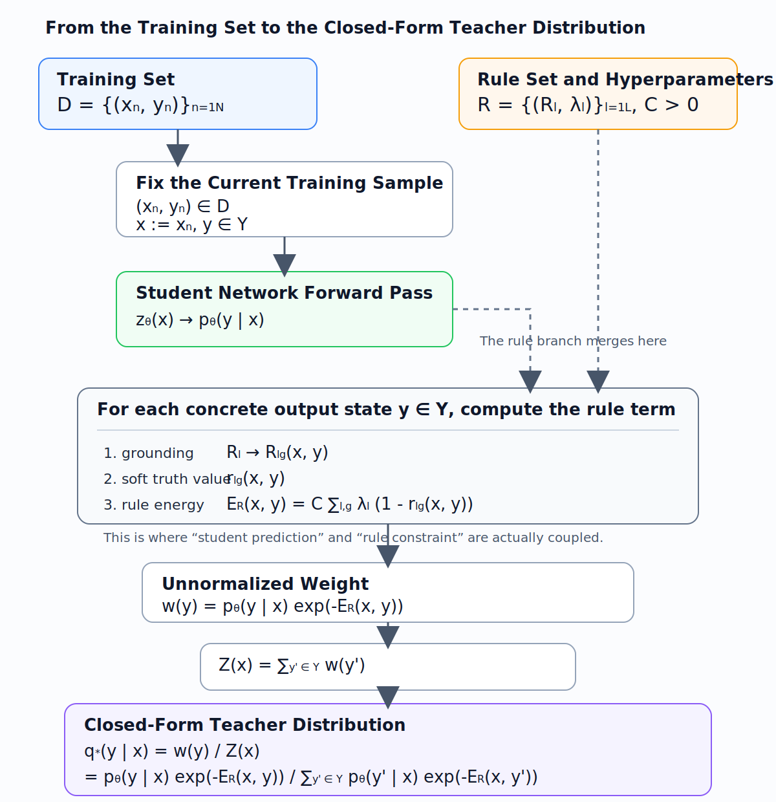
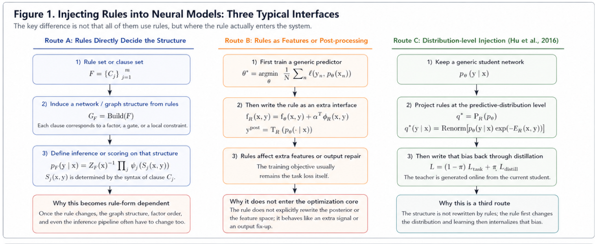
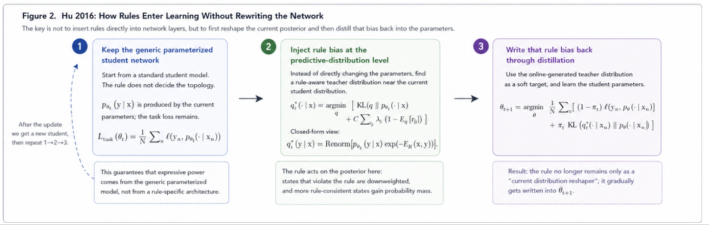

# Deep Structural Analysis of Logic-Net

## 0. Name Disambiguation and Source-Paper Confirmation

### 0.1 Why Disambiguation Must Come First

The name `Logic-Net` in the existing literature, project naming, and secondary notes does not always refer to one unique paper.

The key issue is that if the source paper is not identified first, then later discussions of logic encoding, optimization objectives, teacher-student mechanisms, and experimental settings can easily mix up mechanisms from different works.

### 0.2 Which Paper This Document Mainly Refers To

This document mainly corresponds to:

- Hu et al., ACL 2016, *Harnessing Deep Neural Networks with Logic Rules*

This is also the paper that the `LogicNet` entry, `logic-net.txt`, and the actual reading path in this repository all point to.

### 0.3 Another Homonymous Entry That Is Still Unconfirmed

There is another homonymous entry that has not yet been fully verified. For now it remains only as a placeholder, with no technical details added:

- Possible ICML 2019 paper (to be confirmed)

### 0.4 Default Conventions in This Document

Therefore, whenever this document involves the following topics, they all default to Hu et al. 2016:

- teacher-student distillation
- posterior regularization
- soft logic encoding
- the closed-form teacher distribution $q^\star$

In other words, this document analyzes a class of "Logic-Net-type methods" whose main axis is Hu 2016, rather than an unverified same-name paper.

### 0.5 Minimal Problem Setup and Notation

To make the whole document self-contained, we first fix the minimal setup used by default below.

Let the training set be
$$
\mathcal D=\{(x_n,y_n)\}_{n=1}^N.
$$

Here $x_n$ is the input and $y_n$ is the supervised label. If the output is a classification distribution, we write the base network as
$$
p_\theta(Y\mid X),
$$
where $\theta$ is the network parameter, $Y\in\mathcal Y$ is the output variable, and $\mathcal Y$ is the output space.

If we need to explicitly refer to the output layer, we write the logit as $z_\theta(x)$, and obtain $p_\theta$ from it through softmax or sigmoid.

The rule set is written uniformly as
$$
\mathcal R=\{(R_l,\lambda_l)\}_{l=1}^L,
$$
where $R_l$ is the $l$-th rule and $\lambda_l$ is its confidence weight. The number of groundings of the $l$-th rule is denoted by $G_l$.

For any grounding, let its relaxed soft truth value be
$$
r_{lg}(X,Y)\in[0,1],\qquad g=1,\dots,G_l.
$$

Based on this, define the rule energy as
$$
E_{\mathcal R}(X,Y)=C\sum_{l=1}^L\sum_{g=1}^{G_l}\lambda_l\bigl(1-r_{lg}(X,Y)\bigr),
$$
where $C>0$ is the overall strength coefficient for rule violation.

### 0.5.1 The Full Pipeline from the Training Set to the Closed-Form Teacher Distribution

This subsection does only one thing: it reorganizes the main line from "obtaining the training set" to "computing the closed-form teacher distribution $q^\star$" into a single non-jumping chain. All formulas and examples below follow this order.

If you prefer a more diagram-like presentation, you can directly look at the figure below. The subscripts and superscripts are built into the image, so they do not depend on code-block rendering:

If you only want to remember one sentence, the whole chain is:
$$
(x_n,y_n)\in\mathcal D
\Longrightarrow
x:=x_n,\ y\in\mathcal Y,\ \mathcal R,\ C,\{\lambda_l\}
\Longrightarrow
p_\theta(y\mid x)
\Longrightarrow
r_{lg}(x,y)
\Longrightarrow
E_{\mathcal R}(x,y)
\Longrightarrow
w(y)
\Longrightarrow
Z(x)
\Longrightarrow
q^\star(y\mid x).
$$

There are three points along this chain that are especially easy to confuse, but also especially important:

- The closed-form teacher distribution $q^\star(\cdot\mid x)$ is defined for a fixed input $x$. It is not computed directly for the whole training set $\mathcal D$ in one shot.
- The supervised label $y_n$ does not directly enter the closed-form projection formula. It mainly updates the student network $p_\theta$ through the supervised loss, and only then indirectly affects every later step that generates $q^\star$.
- The rule and the student distribution truly merge at
$$
w(y)=p_\theta(y\mid x)\exp\bigl(-E_{\mathcal R}(x,y)\bigr),
$$
that is, the student distribution first gives the raw tendency, and the rule energy then determines how much each output state should be suppressed.

### 0.5.2 A Unified Running Example

To avoid switching back and forth between different numbers later, we first fix a minimal example that runs through this entire section. The later concept explanations, state-level formulas, and closed-form computations all use it.

- Task: binary-label `bird/animal`
- Rule: `bird => animal`
- Input: fix one sample $x$
- Student marginal outputs:
$$
u=p_\theta(Y_b=1\mid x)=0.8,\qquad v=p_\theta(Y_a=1\mid x)=0.5
$$
- One possible corresponding pair of logits:
$$
z_{\text{bird}}(x)=\operatorname{logit}(0.8)=\ln 4\approx 1.386,\qquad
z_{\text{animal}}(x)=\operatorname{logit}(0.5)=0
$$
- Rule strength: temporarily set
$$
C=2,\qquad \lambda=1
$$

First look only at these local concepts at the continuous-output level:

| Concept | Formula | Value | Interpretation |
| --- | --- | --- | --- |
| logit | $z_{\text{bird}}(x),z_{\text{animal}}(x)$ | $\ln 4,0$ | The raw network scores, not probabilities yet |
| grounding | `bird(x) => animal(x)` | 1 grounding | The instantiation of the abstract rule on the current sample |
| soft truth value | $r_{\phi_{ba}}(u,v)=\min\{1,1-u+v\}$ | $\min\{1,1-0.8+0.5\}=0.7$ | How well the current continuous outputs satisfy the rule |
| local rule energy at the continuous-output level | $C\lambda(1-r_{\phi_{ba}}(u,v))$ | $2\times 1\times (1-0.7)=0.6$ | If we look directly at the continuous outputs, this is the violation cost of the rule |

It is important to stress that the $r_{\phi_{ba}}(u,v)$ and $C\lambda(1-r_{\phi_{ba}}(u,v))$ in the table above are local quantities defined directly on the continuous outputs $(u,v)$, while the later $E_{\mathcal R}(x,y)$ inside the teacher distribution is a state-level energy computed separately for each concrete candidate output state $y\in\mathcal Y$. They are related, but not the same kind of object.

### 0.5.3 The Mathematical Definition and Closed Form of the Teacher Distribution

In Hu 2016, the teacher distribution obtained from rule projection is written uniformly as
$$
q^\star(\cdot\mid X)=\mathcal P_{\mathcal R}\bigl(p_\theta(\cdot\mid X)\bigr).
$$

If we discuss the $t$-th training round, we write it as $q_t^\star$ and $p_{\theta_t}$. The weight with which the student imitates the teacher is denoted by $\pi_t\in[0,1]$.

For a fixed input $x$, the teacher distribution can be viewed as a probability distribution on the output space $\mathcal Y$:
$$
q^\star(\cdot\mid x)\in \Delta(\mathcal Y)
:=
\left\{q:\mathcal Y\to[0,1]\ \middle|\ \sum_{y\in\mathcal Y}q(y)=1\right\}.
$$

It is first defined by the following optimization problem:
$$
q^\star(\cdot\mid x)
=
\arg\min_{q\in\Delta(\mathcal Y)}
\left[
\mathrm{KL}\bigl(q(\cdot\mid x)\,\|\,p_\theta(\cdot\mid x)\bigr)
+
C\sum_{l,g}\lambda_l\Bigl(1-\mathbb E_q[r_{lg}(x,Y)]\Bigr)
\right].
$$

The two terms respectively represent:

1. Staying close to the original student distribution:
$$
\mathrm{KL}\bigl(q(\cdot\mid x)\,\|\,p_\theta(\cdot\mid x)\bigr)
=
\sum_{y\in\mathcal Y}q(y\mid x)\log\frac{q(y\mid x)}{p_\theta(y\mid x)}.
$$
The smaller this term is, the less the teacher distribution $q$ deviates from the current student distribution $p_\theta$.

2. Increasing average rule satisfaction:
$$
\mathbb E_q[r_{lg}(x,Y)]
=
\sum_{y\in\mathcal Y}q(y\mid x)\,r_{lg}(x,y).
$$
Therefore
$$
1-\mathbb E_q[r_{lg}(x,Y)]
$$
is the average violation degree of the rule under the distribution $q$, and
$$
C\sum_{l,g}\lambda_l\Bigl(1-\mathbb E_q[r_{lg}(x,Y)]\Bigr)
$$
is the weighted total cost of average rule violation over all rules.

So the whole objective is a tradeoff between two requirements:

- keep $q$ from straying too far from the original student distribution $p_\theta$;
- at the same time, let $q$ shift probability mass toward output states that satisfy the rules better.

The closed-form solution of this optimization problem is
$$
q^\star(y\mid x)
=
\frac{p_\theta(y\mid x)\exp\bigl(-E_{\mathcal R}(x,y)\bigr)}
{Z(x)},
\qquad y\in\mathcal Y,
$$
where
$$
Z(x)=\sum_{y'\in\mathcal Y}p_\theta(y'\mid x)\exp\bigl(-E_{\mathcal R}(x,y')\bigr),
$$
and
$$
E_{\mathcal R}(x,y)=C\sum_{l,g}\lambda_l\bigl(1-r_{lg}(x,y)\bigr).
$$

That is, $q^\star(\cdot\mid x)$ is not a single number. Rather, for every $y\in\mathcal Y$, one computes a separate component according to the formula above, and then stitches these components together into the full distribution.

If one expands the expectation term in the objective, it becomes more transparent why the exponential reweighting form appears. The original objective is equivalent to minimizing
$$
\sum_{y\in\mathcal Y} q(y\mid x)\log\frac{q(y\mid x)}{p_\theta(y\mid x)}
-\sum_{y\in\mathcal Y}q(y\mid x)\Bigl(C\sum_{l,g}\lambda_l r_{lg}(x,y)\Bigr),
$$
together with the normalization constraint $\sum_y q(y\mid x)=1$. Solving the corresponding Lagrangian problem yields
$$
q^\star(y\mid x)\propto
p_\theta(y\mid x)\exp\!\Bigl(C\sum_{l,g}\lambda_l r_{lg}(x,y)\Bigr),
$$
and then by using
$$
E_{\mathcal R}(x,y)=C\sum_{l,g}\lambda_l(1-r_{lg}(x,y))
$$
one can equivalently rewrite it as
$$
q^\star(y\mid x)\propto p_\theta(y\mid x)e^{-E_{\mathcal R}(x,y)}.
$$

### 0.5.4 State-Level Specialization and Full Computation for `bird => animal`

Now we plug the same numbers fixed in 0.5.2 into the closed-form teacher distribution and obtain a self-contained full computation chain.

First fix the output space:
$$
\mathcal Y=\{(0,0),(0,1),(1,0),(1,1)\}.
$$

Since there is only one rule `bird => animal` here, and only one grounding, the only violating state is $(1,0)$. Therefore the state-level rule energy can be written as
$$
E_{\mathcal R}(x,y_b,y_a)=C\lambda\,\mathbf 1_{\{y_b=1,\ y_a=0\}}.
$$

In the current unified example, $u=0.8,v=0.5$, and we adopt the conditional-independence approximation between the labels. Thus the four components of the student distribution are
$$
\begin{aligned}
p_\theta(0,0\mid x)&=(1-u)(1-v)=0.2\times 0.5=0.1,\\
p_\theta(0,1\mid x)&=(1-u)v=0.2\times 0.5=0.1,\\
p_\theta(1,0\mid x)&=u(1-v)=0.8\times 0.5=0.4,\\
p_\theta(1,1\mid x)&=uv=0.8\times 0.5=0.4.
\end{aligned}
$$

Then compute the rule energy separately for the four concrete output states. Because only $(1,0)$ violates the rule, and here we take $C=2,\lambda=1$, we have
$$
\begin{aligned}
E_{\mathcal R}(x,(0,0))&=0,\\
E_{\mathcal R}(x,(0,1))&=0,\\
E_{\mathcal R}(x,(1,0))&=2,\\
E_{\mathcal R}(x,(1,1))&=0.
\end{aligned}
$$

Therefore the unnormalized weights are
$$
\begin{aligned}
w(0,0)&=0.1e^0=0.1,\\
w(0,1)&=0.1e^0=0.1,\\
w(1,0)&=0.4e^{-2}\approx 0.054,\\
w(1,1)&=0.4e^0=0.4.
\end{aligned}
$$

The normalization constant is
$$
Z(x)=0.1+0.1+0.4e^{-2}+0.4\approx 0.654.
$$

Hence the closed-form teacher distribution becomes
$$
\begin{aligned}
q^\star(0,0\mid x)&=\frac{0.1}{0.654}\approx 0.153,\\
q^\star(0,1\mid x)&=\frac{0.1}{0.654}\approx 0.153,\\
q^\star(1,0\mid x)&=\frac{0.4e^{-2}}{0.654}\approx 0.083,\\
q^\star(1,1\mid x)&=\frac{0.4}{0.654}\approx 0.612.
\end{aligned}
$$

This example makes the role of the projection especially transparent:

- the violating state $(1,0)$ is strongly downweighted;
- the probability mass removed from that violating state is reassigned to the three satisfying states;
- and after normalization we obtain a new teacher distribution that is more rule-consistent than the original student distribution.

### 0.6 The Running Example Used Throughout the Whole Text

To avoid returning to abstract notation later, we fix one minimal but representative binary-label example throughout the whole document:

- $Y_b\in\{0,1\}$: whether the object is `bird`
- $Y_a\in\{0,1\}$: whether the object is `animal`
- rule: $\phi_{ba}: Y_b \Rightarrow Y_a$

This rule is equivalent to
$$
Y_b \le Y_a.
$$

The benefit of this example is that there is exactly one violating state, so the differences among the posterior path, the loss path, and the feasible-set path become very clear.

| State $(Y_b,Y_a)$ | Does it satisfy $\phi_{ba}$? | Interpretation |
| --- | --- | --- |
| $(0,0)$ | yes | not a bird, and not an animal |
| $(0,1)$ | yes | not a bird, but it may still be an animal |
| $(1,0)$ | no | a bird but not an animal |
| $(1,1)$ | yes | it is a bird, so it should also be an animal |

If we move to continuous outputs, write
$$
u=p_\theta(Y_b=1\mid X),\qquad v=p_\theta(Y_a=1\mid X).
$$

Under the soft-logic semantics adopted in this text, using $\neg Y_b \vee Y_a$ allows us to write the rule as
$$
r_{\phi_{ba}}(u,v)=\min\{1,\,1-u+v\},
$$
and hence its violation degree is
$$
1-r_{\phi_{ba}}(u,v)=\max\{u-v,0\}.
$$

The intuitive meaning of these formulas is:

- as long as $u\le v$, the rule is completely satisfied;
- once $u>v$, the violation degree is proportional to the difference between them;
- therefore the same rule can enter a soft-logic energy, can enter a surrogate loss, and can also directly define a feasible set.

If we return to the state-level notation used in the earlier flowchart, then the
$$
R_l \longrightarrow R_{lg}(x,y)
$$
there is not, strictly speaking, a numerical formula. It is a grounding step: it instantiates the abstract rule $R_l$ on the current sample $x$ and a concrete output state $y$, yielding the $g$-th concrete rule instance $R_{lg}(x,y)$.

If the $l$-th rule contains variables
$$
\xi=(\xi_1,\dots,\xi_m),
$$
and the $g$-th grounding corresponds to a substitution
$$
\sigma_{lg}:\ \xi_i\mapsto a_{gi}(x),
$$
then the grounded rule can be written as
$$
R_{lg}(x,y):=R_l[\sigma_{lg},\,Y:=y].
$$
Equivalently,
$$
R_{lg}(x,y)=R_l\!\bigl[a_{g1}(x)/\xi_1,\dots,a_{gm}(x)/\xi_m,\ y/Y\bigr].
$$

The meaning of this step is: first replace the object variables in the rule with concrete objects from the current sample, and then fix the output variable $Y$ to some candidate output state $y$. In this way one obtains a concrete rule instance whose truth value or soft truth value can be directly checked.

The next object in the figure,
$$
r_{lg}(x,y),
$$
is what turns the grounded rule into a number. In general one writes
$$
r_{lg}(x,y)=\operatorname{Truth}\bigl(R_{lg}(x,y)\bigr)\in[0,1].
$$
Thus, $R_{lg}(x,y)$ is the concrete rule instance, while $r_{lg}(x,y)$ is the truth value or soft truth value of that instance.

For the current `bird => animal` rule, if we write
$$
R_l:\ Y_b\Rightarrow Y_a,
$$
then there is usually only one grounding:
$$
G_l=1,\qquad R_{l1}(x,y)=\bigl(y_b\Rightarrow y_a\bigr),
$$
where
$$
y=(y_b,y_a)\in\{0,1\}^2.
$$

Hence the discrete truth value can be written as
$$
r_{l1}(x,y)=\mathbf 1\{y_b=0\ \text{or}\ y_a=1\}
=
\begin{cases}
1, & y\in\{(0,0),(0,1),(1,1)\},\\
0, & y=(1,0).
\end{cases}
$$

It is important to distinguish the two levels:
$$
r_{\phi_{ba}}(u,v)=\min\{1,1-u+v\}
$$
above is a soft truth value computed directly on the continuous outputs $(u,v)$; by contrast, the $R_{lg}(x,y)$ and $r_{lg}(x,y)$ here are the grounding step and the state-level truth computation for a concrete discrete state $y$.

---

## 1. Analysis of the Hu et al. 2016 Method

### 1.1 Core Goal of the Paper

#### Intuitive Understanding

The goal of this work is neither to build a symbolic reasoner from scratch nor to directly generate a special-purpose network architecture from the rules.

The real question it answers is:

> How can explicit logic rules be injected stably into the training process without rewriting the generic neural-network backbone?

The word "stably" is crucial here. The authors do not want rules to remain only at the post-processing stage; they want the rules to enter the learning process itself.

#### The Gap It Tries to Fill

Using the notation from Section 0.5, if we classify methods by which interface the rule actually uses to enter the neural model, then early neural-symbolic methods can roughly be grouped into two main routes, while Hu 2016 clearly takes a third one:

##### Route A: Directly Constructing the Network or Graph Model from Rules

The core idea of this route is to first write the rule set
$$
F=\{C_j\}_{j=1}^m
$$
as a structural object, and then let it directly determine the network topology, graph-model factorization, or inference graph.

This idea can be abstractly written as
$$
G_F=\operatorname{Build}(F),
$$
where $G_F$ is the computation graph, factor graph, or structured model induced by the rule set $F$. One then defines a predictive distribution on top of that structure, for example
$$
p_F(y\mid x)
\propto
\prod_{j=1}^m \psi_j\bigl(S_j(x,y)\bigr),
$$
where $S_j(x,y)$ denotes a local structure, local state, or higher-order factor determined by clause $C_j$.

The principle of such methods is that the rules do not merely provide an extra signal; rather, they directly decide how the model is decomposed, which variables must be connected, and which local consistencies must be explicitly modeled.

The problem comes precisely from this point. Since
$$
G_F=\operatorname{Build}(F)
$$
depends on the syntactic form of the rules, once the rule form changes, for example:

- from simple implications to higher-order relations;
- from propositional rules to variable-bearing relational rules;
- from local constraints to quantified constraints requiring global consistency;

then the model structure, factor order, and inference algorithm often all have to change accordingly. In other words, this route can be highly expressive, but the structure design becomes increasingly constrained by the form of the rules.

##### Route B: Rewriting Rules as Extra Features or Heuristic Post-processing

The idea of this route is to first keep a generic predictor, and then treat the rules as extra inputs or as a repair module after prediction. Its training objective is usually still the standard task loss:
$$
\theta^\star
=
\arg\min_\theta \frac{1}{N}\sum_{n=1}^N \ell\bigl(y_n,p_\theta(\cdot\mid x_n)\bigr).
$$

After that, the rules are used in two common ways:

1. As extra rule features written into the scoring function:
$$
f_{\mathcal R}(x,y)=f_\theta(x,y)+\alpha^\top \phi_{\mathcal R}(x,y).
$$

2. As heuristic corrections or reranking after prediction:
$$
\tilde y=T_{\mathcal R}\bigl(p_\theta(\cdot\mid x)\bigr).
$$

The advantage of such methods is implementation flexibility: one does not need to redesign a full structure for every rule. But the problem is that the rule usually does not directly become a constraint object that every optimization step must explicitly face.

More specifically:

- if the rule is only an extra feature $\phi_{\mathcal R}(x,y)$, then within optimization it behaves more like a standard input signal than an explicit logical constraint rewriting the output distribution;
- if the rule appears only in a post-processing step such as $T_{\mathcal R}$, then it will not update $\theta$ through gradient backpropagation at all;
- in either case, the optimization core is still mostly label fitting rather than the systematic suppression of logically violating states over the whole output space.

Therefore, the statement "the latter does not truly enter the optimization core" more precisely means that the rule does not enter each learning step as an online, explicit posterior-constraint object, but instead remains attached to the scoring function or stays at the post-prediction repair stage.

##### Hu 2016: A Third Interface Route

The entry point of Hu 2016 can be summarized in one sentence: do not let the rules determine the network structure, and do not let the rules remain only at the feature or post-processing level; instead, let the rules first reshape the current predictive distribution, and then distill that distributional bias back into the parameters.

Below we still use the notation from Section 0.5, and only unpack the three steps at the interface level.

##### 1. Preserve the Parameterized Expressive Power of a Generic Neural Network

First, use a parameterized student model in the usual way:
$$
p_{\theta_t}(y\mid x),
$$
and take the standard task loss as the base learning objective:
$$
L_{\mathrm{task}}(\theta)
=
\frac{1}{N}\sum_{n=1}^N \ell\bigl(y_n,p_\theta(\cdot\mid x_n)\bigr).
$$

Here the lowercase script $\ell$ denotes the loss function for a single sample, whereas $L_{\mathrm{task}}$ denotes the overall task loss obtained by averaging the per-sample losses over all training samples. In classification tasks, $\ell$ is often the cross-entropy or some other single-sample prediction error; the most common form is
$$
\ell\bigl(y_n,p_\theta(\cdot\mid x_n)\bigr)
=
-\log p_\theta(y_n\mid x_n).
$$

The key point here is that the rule does not determine the number of layers, the connectivity pattern, or the inference graph of the network. In other words, expressive power still comes from the generic neural network itself, rather than from a structure specifically assembled according to the rules.

This is exactly what "preserving the parameterized expressive power of a generic neural network" means.

##### 2. Inject Rule Bias at the Predictive-Distribution Level

Next, instead of modifying the parameter $\theta_t$ directly, perform a posterior-regularization projection on the current student distribution $p_{\theta_t}$ to obtain a more rule-consistent teacher distribution:
$$
q_t^\star(\cdot\mid x)
=
\arg\min_{q\in\Delta(\mathcal Y)}
\left[
\mathrm{KL}\bigl(q(\cdot\mid x)\,\|\,p_{\theta_t}(\cdot\mid x)\bigr)
+
C\sum_{l,g}\lambda_l\Bigl(1-\mathbb E_q[r_{lg}(x,Y)]\Bigr)
\right].
$$

Its closed form is
$$
q_t^\star(y\mid x)
\propto
p_{\theta_t}(y\mid x)\exp\bigl(-E_{\mathcal R}(x,y)\bigr).
$$

Here the symbol $\propto$ means "proportional to." In other words, the left-hand side is not literally equal to the right-hand side; rather, it differs only by a normalization constant. More explicitly, one first assigns unnormalized weights according to
$$
p_{\theta_t}(y\mid x)\exp\bigl(-E_{\mathcal R}(x,y)\bigr),
$$
and then divides by a normalization constant to obtain the actual probability distribution $q_t^\star(y\mid x)$.

The principle of this step is:

- the first term $\mathrm{KL}(q\|p_{\theta_t})$ requires the teacher distribution not to drift too far away from the current student;
- the second term requires the teacher distribution to move probability mass toward output states that satisfy the rules better;
- so the rule does not directly change the network structure. Instead, it first changes what the predictive distribution for this sample should look like.

This is exactly what "first injecting rule bias at the predictive-distribution level" means.

##### 3. Then Write that Bias Back into the Parameters through Distillation

If we stop at the previous step, then the rule still acts only as a current-distribution reshaper. The third step of Hu 2016 is to feed this online-generated teacher distribution back to the student, so that the parameters themselves gradually learn this rule bias. In unified notation:
$$
\theta_{t+1}
=
\arg\min_\theta \frac{1}{N}\sum_{n=1}^N
\left[
(1-\pi_t)\,\ell\bigl(y_n,p_\theta(\cdot\mid x_n)\bigr)
+
\pi_t\,\mathrm{KL}\bigl(q_t^\star(\cdot\mid x_n)\,\|\,p_\theta(\cdot\mid x_n)\bigr)
\right].
$$

Here:

- the first term keeps the student fitting the true labels;
- the second term lets the student imitate the teacher distribution produced by rule projection in the current round;
- $\pi_t$ controls the weight between listening to the true labels and listening to the rule teacher.

Two quantities in particular should be distinguished:

- $\theta_{t+1}$ is not another independent hyperparameter. It is the next-round student parameter obtained after the update at round $t$. That is, the current student uses $\theta_t$, and after seeing the true labels and the teacher distribution in this round, its parameter is updated to $\theta_{t+1}$.
- $\pi_t\in[0,1]$ is the actual distillation-strength weight. The larger $\pi_t$ is, the more the $t$-th round emphasizes listening to the rule teacher; the smaller $\pi_t$ is, the more the round emphasizes listening to the true labels.

If you want the phrase "how the teacher is fed back round by round" to be completely transparent, it is best to first look at a one-sample toy computation. Here we deliberately simplify the neural network into a student that directly outputs the probabilities of four states, so that one can explicitly compute what happens in each round.

Fix one sample $x_n$, and let the true label be
$$
y_n=(1,1),
$$
while continuing to use the same unified example as before:
$$
\mathcal Y=\{(0,0),(0,1),(1,0),(1,1)\},\qquad
\phi_{ba}: Y_b\Rightarrow Y_a,\qquad
C=2,\ \lambda=1.
$$

Now let the initial student distribution be
$$
p_{\theta_0}(\cdot\mid x_n)
=
\bigl(0.1,\,0.1,\,0.4,\,0.4\bigr),
$$
where the four components correspond in order to
$$
(0,0),\ (0,1),\ (1,0),\ (1,1).
$$
The only violating state is $(1,0)$.

To make the distillation-feedback mechanism stand out, temporarily choose a fixed distillation weight
$$
\pi_0=\pi_1=\pi_2=0.8.
$$
This means that in each round we use $80\%$ weight to listen to the rule teacher, while keeping $20\%$ of the true-label supervision.

In this toy model, one can approximately regard the actual mixed target distribution that the student tries to match at round $t$ as
$$
\widetilde q_t(y\mid x_n)
=(1-\pi_t)\,\delta_{(1,1)}(y)+\pi_t\,q_t^\star(y\mid x_n),
$$
where $\delta_{(1,1)}$ is the one-hot distribution at the true label $(1,1)$. This formula has a direct meaning:

- one part of the target comes from the true label;
- another part comes from the rule-projected teacher;
- the next-round student parameter $\theta_{t+1}$ is then pushed so that its output distribution moves toward this mixed target.

In this toy example, to make the mechanism maximally transparent, we further adopt the most simplified assumption: after one update, the student distribution becomes directly equal to the mixed target, namely
$$
p_{\theta_{t+1}}(\cdot\mid x_n)\approx \widetilde q_t(\cdot\mid x_n).
$$
In a real neural network, one would of course only move toward this target through gradient descent rather than become exactly equal to it in one step; but this approximation is enough to clarify the distillation chain itself.

The three-round feeding process is then as follows.

**Round 0: generate the teacher from the current student**

The current student is
$$
p_{\theta_0}(\cdot\mid x_n)=(0.1,\,0.1,\,0.4,\,0.4).
$$
The rule penalizes only the violating state $(1,0)$, so the unnormalized weights are
$$
w_0=(0.1,\,0.1,\,0.4e^{-2},\,0.4)\approx(0.1,\,0.1,\,0.054,\,0.4).
$$
After normalization, the teacher distribution becomes
$$
q_0^\star(\cdot\mid x_n)
=
\frac{w_0}{\sum w_0}
\approx
(0.153,\,0.153,\,0.083,\,0.612).
$$

Then mix the teacher with the true label to form the target for the next student:
$$
\widetilde q_0
=
0.2\,\delta_{(1,1)}+0.8\,q_0^\star
\approx
(0.122,\,0.122,\,0.066,\,0.690).
$$
Hence the toy student is updated to
$$
p_{\theta_1}(\cdot\mid x_n)\approx(0.122,\,0.122,\,0.066,\,0.690).
$$

**Round 1: regenerate the teacher from the updated student**

Now the teacher no longer uses the old student, but the new student $p_{\theta_1}$:
$$
w_1
=
\bigl(0.122,\,0.122,\,0.066e^{-2},\,0.690\bigr)
\approx
(0.122,\,0.122,\,0.009,\,0.690).
$$
After normalization,
$$
q_1^\star(\cdot\mid x_n)\approx(0.130,\,0.130,\,0.010,\,0.731).
$$
Then mix it again with the true label:
$$
\widetilde q_1
=
0.2\,\delta_{(1,1)}+0.8\,q_1^\star
\approx
(0.104,\,0.104,\,0.008,\,0.785).
$$
Thus the toy student continues updating as
$$
p_{\theta_2}(\cdot\mid x_n)\approx(0.104,\,0.104,\,0.008,\,0.785).
$$

**Round 2: project again, distill again**

Generate the teacher once more from $p_{\theta_2}$. The violating state is further suppressed:
$$
w_2
=
\bigl(0.104,\,0.104,\,0.008e^{-2},\,0.785\bigr)
\approx
(0.104,\,0.104,\,0.001,\,0.785).
$$
After normalization,
$$
q_2^\star(\cdot\mid x_n)\approx(0.105,\,0.105,\,0.001,\,0.790).
$$
Then mix again:
$$
\widetilde q_2
=
0.2\,\delta_{(1,1)}+0.8\,q_2^\star
\approx
(0.084,\,0.084,\,0.001,\,0.832),
$$
and therefore
$$
p_{\theta_3}(\cdot\mid x_n)\approx(0.084,\,0.084,\,0.001,\,0.832).
$$

If we line up the three rounds, the pattern becomes very clear:

| Round | Current student $p_{\theta_t}$ | Current teacher $q_t^\star$ | Next student $p_{\theta_{t+1}}$ |
| --- | --- | --- | --- |
| $t=0$ | $(0.100,0.100,0.400,0.400)$ | $(0.153,0.153,0.083,0.612)$ | $(0.122,0.122,0.066,0.690)$ |
| $t=1$ | $(0.122,0.122,0.066,0.690)$ | $(0.130,0.130,0.010,0.731)$ | $(0.104,0.104,0.008,0.785)$ |
| $t=2$ | $(0.104,0.104,0.008,0.785)$ | $(0.105,0.105,0.001,0.790)$ | $(0.084,0.084,0.001,0.832)$ |

The quantity worth tracking most closely in this table is the probability of the unique violating state $(1,0)$:
$$
0.400\ \longrightarrow\ 0.066\ \longrightarrow\ 0.008\ \longrightarrow\ 0.001.
$$
Meanwhile, the state $(1,1)$, which both matches the true label and satisfies the rule, increases round by round:
$$
0.400\ \longrightarrow\ 0.690\ \longrightarrow\ 0.785\ \longrightarrow\ 0.832.
$$

So feeding the teacher back through distillation does not mean directly inserting a logical rule into the parameter vector. Rather, it means:

1. first use the current student $p_{\theta_t}$ to generate a rule teacher $q_t^\star$;
2. then let the student imitate that teacher through a weighted loss;
3. as a result, the updated parameter $\theta_{t+1}$ makes the new student distribution more rule-consistent than in the previous round;
4. then use the new student to generate a new teacher again, and repeat.

If $\pi_t=0$, the student does not listen to the teacher at all and the procedure reduces to ordinary supervised learning. If $\pi_t=1$, then in that round the student listens only to the teacher and not to the true labels. Hu 2016 works precisely by taking a balance between these two extremes.

Therefore, the rule bias is no longer merely a test-time fix-up. It is gradually written into the next-round parameter $\theta_{t+1}$.

This is exactly what is meant by writing that bias back into the parameters through distillation.

##### Why Hu 2016 Can Be Read as Addressing the Tensions in the First Two Routes

When the three steps above are put together, one possible reading of Hu 2016 becomes clearer:

- unlike Route A, it does not let the rules determine the network topology, so it preserves the parameterized expressive power of a generic neural network;
- unlike Route B, it does not treat the rules merely as extra features or post-prediction repair, because the rule first explicitly rewrites the current posterior distribution $q_t^\star$;
- and it does not stop at a distributional bias at the current time step, because it further writes that bias back into the parameters through distillation.

Therefore, a useful way to interpret the contribution of Hu 2016 is not simply that it uses logical rules, but that it introduces a different injection interface:
$$
\text{generic parameterized student}
\Longrightarrow
\text{rule-projected teacher distribution}
\Longrightarrow
\text{distill back into the parameters}.
$$

Section 1.2 below will further unpack the posterior regularization, soft truth values, rule energy, and closed-form teacher distribution that appear here into formal mathematical objects.

#### Why Standard Neural Networks Cannot Naturally Enforce Hard Logic

Suppose the model output is $p_\theta(y\mid x)$. Ordinary empirical risk minimization optimizes only
$$
\min_\theta \frac{1}{N}\sum_{n=1}^N \ell\bigl(y_n, p_\theta(\cdot\mid x_n)\bigr).
$$

The key point is that this objective only requires the model to fit the training labels. It does not require the model to exclude some output combinations that are logically forbidden over the whole output space.

From the optimization perspective, this means:

- cross-entropy constrains label fitting;
- it does not explicitly define a feasible output set;
- it also does not drive logic-violating states to zero probability.

Therefore, even if the training error is low, one still cannot conclude that the model will strictly satisfy the rule on unseen samples.

#### A Minimal Takeaway

If some logical constraint requires that certain output combinations never appear, then plain softmax + cross-entropy alone usually cannot remove those combinations from the support set.

This is exactly why Hu 2016 needs posterior reshaping.

---

### 1.2 Mathematical-Level Analysis

#### 1.2.1 What Object the Rules Actually Are

The modeling object in the original paper is not a single logical formula, but a rule set with confidence weights:
$$
\mathcal R=\{(R_l,\lambda_l)\}_{l=1}^L.
$$

The meanings are:

- $R_l$: the $l$-th rule;
- $\lambda_l$: the confidence of that rule;
- $\lambda_l=\infty$: a hard rule.

For unified discussion, one may merge all groundings into a single global logical object:
$$
F(X,Y)=\bigwedge_{l=1}^L \bigwedge_{g=1}^{G_l} R_{lg}(X,Y).
$$

The key point here is that this is only an analytical shorthand. The original paper does not perform exact Boolean reasoning over $F$; instead, it handles the soft truth value of each grounding separately.

#### 1.2.2 How Logic Is Relaxed into Continuous Form

The authors use soft logic to map Boolean logic into the interval $[0,1]$.

##### Operation Table

| Logical object | soft-logic form | Role |
| --- | --- | --- |
| conjunction | $A \wedge_s B = \max\{A+B-1,0\}$ | approximate "both true" |
| disjunction | $A \vee_s B = \min\{A+B,1\}$ | approximate "at least one true" |
| negation | $\neg A = 1-A$ | continuous negation |
| averaged conjunction | $A_1 \,\bar\wedge\, \cdots \,\bar\wedge\, A_N = \frac{1}{N}\sum_i A_i$ | softly aggregates multiple clauses |

For each grounding, let its soft truth value be
$$
r_{lg}(X,Y)\in[0,1].
$$

The meaning of this formula is direct:

- $r_{lg}=1$: fully satisfied;
- $r_{lg}<1$: there is a violation;
- $1-r_{lg}$: can be viewed as the degree of violation.

##### Intuitive Understanding

The key point here is that the authors do not directly optimize Boolean logic itself. Instead, they first convert logic into a numerical object, and then let this numerical object enter a distributional optimization problem.

##### Optimization Meaning

Once the logic has been written as $r_{lg}\in[0,1]$, one can later penalize low-truth outputs through a continuous cost function.

This step changes the rule from a discrete constraint into an energy signal that can be coupled with a probability distribution.

---

#### 1.2.3 How Constraint Satisfaction Enters the Optimization

The key point of Hu 2016 is not "adding a logic penalty directly to the parameters," but rather "first constructing a teacher distribution."
Given a student distribution $p_\theta(Y\mid X)$, the teacher distribution is obtained through a posterior-regularization projection:
$$
\min_{q,\ \xi\ge 0}\ \mathrm{KL}\bigl(q(Y\mid X)\,\|\,p_\theta(Y\mid X)\bigr)+C\sum_{l,g}\xi_{lg}
$$
$$
\text{s.t.}\quad \lambda_l\Bigl(1-\mathbb E_q[r_{lg}(X,Y)]\Bigr)\le \xi_{lg},\quad \forall l,g.
$$

The key ideas are:

- $q$ is the teacher distribution that obeys the rules better;
- $\mathrm{KL}(q\|p_\theta)$ keeps the teacher from moving too far away from the student;
- the slack variables $\xi_{lg}$ allow controlled rule violation;
- $C$ controls the strength of the violation cost.

If one eliminates the slack variables, the problem can be written as
$$
\mathrm{KL}(q\|p_\theta)+C\sum_{l,g}\lambda_l\Bigl(1-\mathbb E_q[r_{lg}]\Bigr).
$$

The plain-language reading of this expression is:

- first term: do not let the teacher distribution drift too far from the current model;
- second term: let the teacher distribution move probability mass toward outputs that satisfy the rules better.

From the optimization perspective, the object of this step is not the parameter $\theta$, but the posterior distribution $q$.

---

#### 1.2.4 The Closed-Form Teacher Distribution and the Energy Interpretation

This projection problem has a closed-form solution. Define the rule energy
$$
E_{\mathcal R}(X,Y)=C\sum_{l,g}\lambda_l\bigl(1-r_{lg}(X,Y)\bigr).
$$

Its meaning is that the more rules are violated, the larger $E_{\mathcal R}$ becomes; and the more reliable the rule is, the more strongly that violation is amplified in the energy.

The teacher distribution can then be written as
$$
q^\star(Y\mid X)=\frac{1}{Z(X)}\,p_\theta(Y\mid X)\exp\bigl(-E_{\mathcal R}(X,Y)\bigr),
$$
where
$$
Z(X)=\sum_Y p_\theta(Y\mid X)\exp\bigl(-E_{\mathcal R}(X,Y)\bigr).
$$

These two expressions should be understood separately:

- the first gives the reweighted form of the teacher distribution;
- the second is only a normalization constant that guarantees $q^\star$ remains a valid probability distribution.

##### Intuitive Understanding

This step is not simply adding an extra logic loss.

More accurately, it is doing the following:

the original distribution $p_\theta(Y\mid X)$
-> reweight it according to the rule violation degree
-> obtain a more rule-consistent distribution $q^\star(Y\mid X)$.

##### Mathematical Mechanism

If some output $Y$ seriously violates the rules, then $E_{\mathcal R}(X,Y)$ is large. Therefore $\exp(-E_{\mathcal R}(X,Y))$ is small, and the weight of that output in the teacher distribution is suppressed.

##### Optimization Meaning

The key point here is that logic first changes the target distribution, and only then changes the parameters.

Therefore, Hu 2016 is not a simple soft-penalty method. It is a posterior-regularization method that couples:

- soft-logic encoding,
- posterior-regularization projection,
- teacher-student distillation.

#### 1.2.5 Plugging the Abstract Objects Back into Our Running Example

Now plug the abstract objects above back into the single rule $bird \Rightarrow animal$.

If the output is a discrete Boolean state $Y=(Y_b,Y_a)$, then the energy of this rule can be written as
$$
E_{\phi_{ba}}(Y)=C\lambda\,\mathbf 1[(Y_b,Y_a)=(1,0)].
$$

The plain-language reading is:

- the three satisfying states receive no penalty;
- the unique violating state $(1,0)$ is suppressed;
- so along the posterior route, we are essentially redistributing probability mass across the four candidate states.

If the output has already been relaxed into the continuous pair $(u,v)$, then the corresponding soft truth value and violation degree are
$$
r_{\phi_{ba}}(u,v)=\min\{1,1-u+v\},
$$
$$
1-r_{\phi_{ba}}(u,v)=\max\{u-v,0\}.
$$

Hence the continuous energy form of the rule can be written as
$$
E_{\phi_{ba}}(u,v)=C\lambda \max\{u-v,0\}.
$$

The key point here is that the semantic core of the rule itself has not changed across methods; what changes is the interface through which that rule enters the optimization system.

#### 1.2.6 Current Mechanism Map

| Stage | Object | Role in the current mechanism |
| --- | --- | --- |
| 1 | current student distribution $p_\theta(y\mid x)$ | gives the base prediction before rule injection |
| 2 | logic rule $F$ and soft truth value $r_{lg}$ | turns discrete rules into computable continuous objects |
| 3 | posterior projection operator $\mathcal P_{\mathcal R}$ | rewrites probability mass according to rule violation |
| 4 | teacher distribution $q^\star(y\mid x)$ | forms an online rule teacher |
| 5 | distillation target and distillation loss | sends teacher information back into parameter learning |
| 6 | updated $p_\theta(y\mid x)$ | gives the new student distribution |

What matters most in this picture is not merely that there is a teacher, but that the teacher is not externally given. It is generated online by projecting the current student distribution through the rules.

---

## 2. Logic-Net (ICML 2019?) Placeholder (to be completed if the paper is provided)

This section remains only as a placeholder for now, with no technical content added.

### 2.1 Information That Is Still Unconfirmed

- the exact paper title
- the authors and conference information
- whether this repository already contains the corresponding PDF / TXT / code

### 2.2 Current Writing Boundary

Before these pieces of information are verified, we should not mistake the mechanism of Hu et al. 2016 for "the ICML 2019 Logic-Net," nor should we merge an unverified same-name work into the working interpretation of this document.

---

## 3. Mechanism Comparison (A Unified Perspective)

### 3.1 The Unified Question: Where Does the Constraint Actually Enter?

If we place Hu 2016, Semantic Loss, and DL2 under the same analytical coordinate system, the most important thing to unify is not that "all of them use logic," but rather:

> For the same constraint $\phi$, at which layer of the optimization system does it actually enter?

In this document, we divide the interface into three types:

1. entering the posterior
2. entering the loss
3. entering the feasible set

#### Overall Structure Diagram

| Where the constraint enters | Representative method | Direct effect of the constraint on optimization |
| --- | --- | --- |
| posterior distribution | Hu et al. 2016 | first rewrite the world distribution, then distill back into the parameters |
| loss function | Semantic Loss / DL2 | directly turn constraint violation into an optimization cost |
| feasible set | DL2 | first restrict the search set, then optimize inside the feasible region |

### 3.2 A Unified Abstract Form

Writing the three routes into a unified mathematical form gives:
$$
\text{posterior route:}\qquad q_\phi^\star=\arg\min_q D(q\|p_\theta)+\Omega_\phi(q),
$$

whose meaning is: the constraint first rewrites the distribution, and then the distribution influences learning.

$$
\text{loss route:}\qquad \min_\theta\ L_{\text{task}}(\theta)+\lambda\,\Psi_\phi(\theta),
$$

whose meaning is: the constraint is directly turned into an extra cost term.

$$
\text{feasible-set route:}\qquad \min_{u\in \mathcal C_\phi}\ \Psi(u,\theta).
$$

whose meaning is: the constraint first defines the searchable set, and only then do we optimize over that set.

From the optimization perspective, the difference lies not in the notation but in the object on which the constraint acts:

- the posterior route acts on a distribution;
- the loss route acts on the objective function;
- the feasible-set route acts on the search domain.

#### Running Example: What the Same Rule Looks Like in the Three Routes

Take the same rule as before:
$$
\phi_{ba}: Y_b\Rightarrow Y_a.
$$

At the posterior level, it becomes
$$
q^\star(y\mid x)\propto p_\theta(y\mid x)\exp\bigl(-E_{\phi_{ba}}(y)\bigr),
$$
meaning that probability mass is moved away from violating states.

At the loss level, it becomes something like
$$
\Psi_{\phi_{ba}}(u,v)=\max\{u-v,0\}
\quad\text{or}\quad
-\log\Pr[\text{the rule is satisfied}],
$$
meaning that the violation is directly turned into a penalty term.

At the feasible-set level, it becomes
$$
\mathcal C_{\phi_{ba}}=\{(u,v):u\le v\},
$$
meaning that the search itself is restricted to the region satisfying the rule.

The key point here is that the semantic meaning of the rule is the same, while the interface at which it enters the optimization system is completely different.

### 3.3 Constraint Entering the Posterior: Hu et al. 2016

#### Intuition

The main interface in Hu 2016 is not the loss, but the posterior.

It does not first ask, "How much should a rule violation be penalized?" Instead, it first asks:

> Among all candidate outputs currently proposed by the model, which outputs should be reweighted?

#### Mathematical Mechanism

The teacher distribution is given by
$$
q^\star(Y\mid X)\propto p_\theta(Y\mid X)\exp\big(-E_{\mathcal R}(X,Y)\big).
$$

The plain-language explanation is:

- states with stronger rule violation get their probability suppressed;
- when the rule is more trusted, this suppression becomes stronger;
- the teacher distribution is a "rule-corrected belief."

#### Optimization Meaning

What is changed first in this step is the belief geometry, not a scalar objective.

Therefore, logic knowledge enters training through the chain

rule
$\to$ rewrite the target distribution
$\to$ distill it back into the parameters.

This is a different interface design from ordinary penalty learning.

---

### 3.4 Constraint Entering the Loss: Semantic Loss and DL2

What Semantic Loss and DL2 have in common is that they both translate the constraint into an optimizable scalar term; what differs is the object they translate it into.

#### 3.4.1 Semantic Loss: Optimizing the Total Probability Mass of Valid Worlds

If $\alpha$ is a propositional constraint and $p$ is the Bernoulli parameter vector of the output, then
$$
L_s(\alpha,p)= -\log \sum_{x\models \alpha}\prod_{i:x_i=1} p_i \prod_{i:x_i=0}(1-p_i).
$$

The key interpretation of this expression is:

- the sum ranges over all discrete worlds satisfying $\alpha$;
- the smaller the loss, the more total probability mass is assigned to valid worlds;
- this is not a soft-logic approximation, but an exact probability sum over satisfying assignments.

#### Intuition

Semantic Loss does not ask, "How much is this rule violated?" Instead, it asks:

> How much probability mass does the current output distribution assign to worlds that are logically allowed?

#### Optimization Meaning

Therefore, its gradient is naturally globally coupled. Changing any one output component may alter the total mass over the set of satisfying worlds.

---

#### 3.4.2 DL2: Optimizing a Continuous Satisfiability Surrogate

DL2 recursively translates a logical formula into a nonnegative surrogate loss.

For example, for an atomic comparison one may write
$$
L(t\le t')=\max(t-t',0),
$$

whose meaning is: as long as $t\le t'$ is satisfied, the loss is zero; once the constraint is violated, the loss equals the magnitude of that violation.

Logical compositions are then built recursively:
$$
L(\phi\land\psi)=L(\phi)+L(\psi),\qquad
L(\phi\lor\psi)=L(\phi)L(\psi).
$$

The key point here is:

- it preserves the correspondence "zero iff satisfied";
- it does not preserve the exact probability semantics of Semantic Loss;
- it is better viewed as a continuous surrogate system for rule violation.

#### Optimization Meaning

Therefore, DL2 gradients are more local and more direct:

- atomic inequalities correspond to local violation magnitudes;
- composed logic propagates through addition or multiplication;
- the geometry depends on how the surrogate is constructed.

---

### 3.5 Constraint Entering the Feasible Set: DL2's Second Interface

If DL2 is viewed only as "yet another loss-based method," one misses its most distinctive component.

#### Intuition

DL2 not only writes constraints into the loss; it can also extract the convex input constraints suitable for projection and use them to define the search boundary directly.

#### Mathematical Mechanism

The inner problem can be written as
$$
\min_{z} L(\neg\phi)(x,z,\theta).
$$

But if part of the constraint can be written as an explicit set, it is further rewritten as
$$
z\in \mathcal C_\phi,
$$
and PGD or L-BFGS-B is used on that domain.

#### Optimization Meaning

This means:

- Hu 2016 changes the target distribution;
- Semantic Loss changes the objective function;
- DL2 can go one step further and change the search space itself.

This is why DL2 is more general for both training and query-time use.

---

### 3.6 Unified Comparison Table

| Dimension | Hu et al. 2016 | Semantic Loss | DL2 |
| --- | --- | --- | --- |
| main entry point of the constraint | posterior | loss | loss + feasible set |
| core object | $q^\star(Y\mid X)$ | total probability mass of valid worlds | surrogate satisfaction loss |
| representative form | $q^\star \propto p_\theta e^{-E_{\mathcal R}}$ | $-\log \Pr[x\models\alpha]$ | $L(\phi)=0 \iff \phi$ is satisfied |
| logic semantics | soft-logic approximation | exact propositional semantics | surrogate semantics |
| source of gradient | distillation term | global probability-mass redistribution | local violation propagation |
| suitable problems | rule-biased distillation | logical constraints on discrete outputs | training + query + input-domain constraints |
| main bottleneck | teacher projection and approximate inference | WMC / circuit compilation | nested optimization / PGD |

From the unified perspective, the three methods are not "different implementations of the same logic regularization idea," but three different interface designs.

---

## 4. Unified Analysis of Optimization Mechanisms

### 4.1 First Write the Three Families as Unified Optimization Programs

If one only says that "all of them inject constraints into training," the analysis quickly becomes distorted. A more rigorous approach is to separate three issues first:

1. What is the variable directly optimized?
2. Which object is treated as a constant at each step?
3. Does the gradient actually pass through the constraint transformation itself?

From this viewpoint, the three families can be unified in the following table.

| Route | Representative method | Direct optimization variable | Quantity frozen during each outer update | Where the real difficulty lies |
| --- | --- | --- | --- | --- |
| constraint enters the posterior | Hu et al. 2016 | first optimize $q$, then update $\theta$ | $q_t^\star$ is frozen in the student step | online teacher drift and alternating coupling |
| constraint enters the loss | Semantic Loss / DL2 | directly update $\theta$ | ideally no extra frozen quantity | gradient geometry and surrogate quality |
| constraint enters the feasible set | DL2 inner search | optimize inner variable $z$, then update outer $\theta$ | the outer level often treats approximate $z^\star$ as given | bilevel optimization and inner approximation error |

Let us state a boundary clearly:

- the equations below for Hu 2016 try to stay close to the training mechanism in the original paper;
- the equations below for Semantic Loss and DL2 are analytical abstractions adopted for unified comparison.

In other words, the "unified analysis" and the "original paper formulation" will be distinguished explicitly rather than mixed.

---

### 4.2 Hu 2016 Training Is Essentially a Projection-Distillation Alternation

#### Current Mechanism Map

| Stage | Object | Role in the training procedure |
| --- | --- | --- |
| 1 | parameters $\theta_t$ | generate the current student prediction |
| 2 | student distribution $p_{\theta_t}(Y\mid X)$ | serves as the input to posterior projection |
| 3 | teacher distribution $q_t^\star(Y\mid X)$ | temporary target obtained by rule projection |
| 4 | student-step objective $J_t(\theta;q_t^\star)$ | teacher is fixed during this update |
| 5 | parameters $\theta_{t+1}$ | complete one distillation-driven parameter update |

#### Mathematical Mechanism

If we isolate outer iteration $t$, the core of Hu 2016 can be written in two steps:
$$
q_t^\star
=
\arg\min_q
\Big[
\mathrm{KL}\big(q(Y\mid X)\,\|\,p_{\theta_t}(Y\mid X)\big)
\,+\,\Omega_{\mathcal R}(q)
\Big],
$$
$$
J_t(\theta;q_t^\star)
=
(1-\pi_t)L_{\text{task}}(\theta)
\,+\,
\pi_t\,L_{\text{distill}}(\theta; q_t^\star),
$$
$$
\theta_{t+1}\approx \arg\min_\theta J_t(\theta;q_t^\star).
$$

The variable in the first step is the posterior distribution $q$; only in the second step does the variable become the parameter $\theta$.

The plain-language explanation of these three equations is:

- first project the current student $p_{\theta_t}$ into a more rule-consistent teacher $q_t^\star$;
- then treat that teacher as a fixed target and update the student parameters;
- during student updating, the teacher is not an independent model, but an online target formed by rule-correcting the current student.

#### Why This Is Not an Ordinary Single-Level Static Objective

If one insists on writing it as a "single objective," the most natural analytical form is actually
$$
\widetilde J_t(\theta)
=
(1-\pi_t)L_{\text{task}}(\theta)
\,+\,
\pi_t\,L_{\text{distill}}\big(\theta; q^\star[p_\theta]\big),
$$
where $q^\star[p_\theta]=\mathcal P_{\mathcal R}(p_\theta)$.

But the key point is that the actual training in the paper does not perform strict end-to-end differentiation through $\widetilde J_t(\theta)$. Instead, it uses:

1. first solve for the teacher $q_t^\star$;
2. freeze $q_t^\star$ in the student step;
3. then update the parameter $\theta$.

Therefore, from the viewpoint of the optimization program, it is closer to alternating optimization or fixed-point iteration than to standard SGD on a static smooth objective.

#### Optimization Meaning

This point must be made explicit because it determines the object of all later stability discussions.

- If the teacher is fixed, the student step is very close to ordinary distillation training.
- But the teacher is not fixed; it is generated online by the current student.
- Therefore, what truly evolves at the outer level is an operator $T:\theta_t\mapsto\theta_{t+1}$.

From the optimization perspective, the problem in Hu 2016 is not just "how should the loss be written," but "is this operator stable?"

#### Running Example: Why the Posterior Route Is Fundamentally Rewriting World Probabilities

In the $bird \Rightarrow animal$ example, write the four discrete states as
$$
(0,0),\ (0,1),\ (1,0),\ (1,1).
$$
Then the unique violating state is $(1,0)$. Therefore the teacher projection can be written directly as
$$
q_t^\star(1,0\mid x)
=
\frac{p_{\theta_t}(1,0\mid x)e^{-C\lambda}}{Z_t(x)},
$$
$$
q_t^\star(y\mid x)
=
\frac{p_{\theta_t}(y\mid x)}{Z_t(x)},
\qquad y\in\{(0,0),(0,1),(1,1)\}.
$$

The intuitive meaning of these two equations is:

- the posterior route does not penalize parameters first;
- it first lowers the probability of the unique violating state $(1,0)$;
- then uses this new distribution as the student's distillation target.

Thus, in this minimal example, the action of Hu 2016 can be compressed into one sentence:

> First squeeze the violating world out of the high-probability set, then train the network to fit this rule-corrected world distribution.

---

### 4.3 Student-Step Gradient: Which Terms Are Truly Optimized, and Which Are Not Backpropagated

#### Mathematical Mechanism

For a single sample $x_n$, if the supervision label is a one-hot vector $y_n$ and the teacher target is denoted by $q_n^{\star,t}$, then the student step can usually be written as
$$
\ell_n^{(t)}(\theta)
=
-(1-\pi_t)\sum_k y_{nk}\log p_{nk}
\,-\,
\pi_t\sum_k q_{nk}^{\star,t}\log p_{nk},
$$
where $p_{nk}=p_\theta(y=k\mid x_n)$.

Taking derivatives with respect to the logit $z_{nk}$ gives
$$
\frac{\partial \ell_n^{(t)}}{\partial z_{nk}}
=
p_{nk}-\widetilde y_{nk}^{(t)},
\qquad
\widetilde y_{nk}^{(t)}=(1-\pi_t)y_{nk}+\pi_t q_{nk}^{\star,t}.
$$

The plain-language explanation is:

- the student is not fitting the hard label $y_n$ alone;
- the student is not fitting only the teacher $q_n^{\star,t}$ either;
- the student fits the convex-combination target $\widetilde y_n^{(t)}$.

#### What Extra Term Would Appear If We Really Differentiated Through the Teacher

If the teacher is treated as a function of $\theta$, then the full chain rule should read
$$
\nabla_\theta \widetilde J_t(\theta)
=
\nabla_\theta J_t(\theta;q_t^\star\ \text{frozen})
\,+\,
\pi_t
\frac{\partial L_{\text{distill}}(\theta;q)}{\partial q}\bigg|_{q=q^\star[p_\theta]}
\frac{\partial q^\star[p_\theta]}{\partial \theta}.
$$

The second term here is exactly the gradient that passes through the projector. The Hu 2016 training procedure typically does not keep this term explicitly; instead, it treats $q_t^\star$ as a given target during each student step.

This means:

- what is actually optimized is a local surrogate objective with the teacher frozen;
- it is not the true single-level objective obtained by full implicit differentiation through $q^\star[p_\theta]$.

#### Gradient Magnitude and Limit Cases

At the output layer, $\widetilde y_{nk}^{(t)}\in[0,1]$ and $\sum_k\widetilde y_{nk}^{(t)}=1$, therefore
$$
\left|\frac{\partial \ell_n^{(t)}}{\partial z_{nk}}\right|\le 1.
$$

The meaning of this inequality is straightforward:

- at least at the output layer, the distillation mixture itself does not create gradient explosion;
- if numerical explosion occurs, it is more likely to come from deeper network Jacobians, the optimizer step size, or upstream activations, rather than from this convex-combination formula itself.

What is more common instead are two kinds of weak-gradient phenomena:

1. when $\pi_t\to 0$, the effect of the rule degenerates to nearly zero;
2. when $q_t^\star$ is already very sharp and the network is close to saturation, the update direction is still clear, but the effective magnitude of change becomes small.

#### A Central Takeaway

From the gradient viewpoint, the key point of Hu 2016 is not that it makes gradients "larger" or "smaller," but that it changes the gradient target from a hard label to a soft target that evolves dynamically during training.

---

### 4.4 Differentiability of the Posterior Projection Itself, Nonsmooth Points, and Flat Regions

#### Mathematical Mechanism

The teacher distribution is written as
$$
q^\star(Y\mid X)
=
\frac{1}{Z(X)}\,p_\theta(Y\mid X)\exp\big(-E_{\mathcal R}(X,Y)\big),
$$
where
$$
E_{\mathcal R}(X,Y)=C\sum_{l,g}\lambda_l\big(1-r_{lg}(X,Y)\big).
$$

If we temporarily fix which `max/min` branches are active in soft logic, then $r_{lg}$ is piecewise linear, $E_{\mathcal R}$ is also piecewise linear, and $q^\star$ is piecewise smooth with respect to both $p_\theta$ and $r_{lg}$.

#### Where Nonsmooth Points Arise

Nonsmoothness mainly comes from three sources:

| source | where it appears | direct consequence |
| --- | --- | --- |
| `max/min` in soft logic | boundaries such as $A+B-1=0$, $A+B=1$, etc. | the gradient is nondifferentiable on the boundary and only subgradient-style interpretation is possible |
| hard-rule limit $\lambda_l\to\infty$ | some states are forced toward zero probability | the projection becomes sharp and local geometry deteriorates |
| approximate inference instead of exact projection | when sampling or heuristic inference switches regime | the teacher distribution itself acquires extra noise or jumps |

#### Do Flat Regions Exist?

Yes, and this is often overlooked in soft logic.

For example, conjunction
$$
A\wedge_s B=\max\{A+B-1,0\}
$$
has zero derivative when $A+B<1$; disjunction
$$
A\vee_s B=\min\{A+B,1\}
$$
also saturates when $A+B>1$.

This means:

- some rules stop giving extra gradient in the "already satisfied" region, which is reasonable;
- but some connectives may also enter a flat regime in the "severely violated" region, weakening the local correction signal.

#### Optimization Meaning

Two things must be distinguished precisely here:

1. The student step in Hu 2016 does not backpropagate end-to-end through these nonsmooth points, so it avoids the most direct chain-rule difficulty.
2. But these nonsmooth points still change the geometry of the teacher distribution, and therefore appear in the outer loop as target switching, rule effects that suddenly strengthen or weaken, or regions where the rule signal remains too weak for a long time.

So what Hu 2016 avoids is only the difficulty of explicit end-to-end backpropagation through logic; it does not eliminate the difficulty of logic geometry itself.

---

### 4.5 Constraint Entering the Loss: The Single-Level Objective Is More Direct, but the Gradient Geometry Is Completely Different

From a unified viewpoint, the loss route can be written as
$$
\min_\theta\ L_{\text{task}}(\theta)+\lambda\,\Psi_\phi(\theta).
$$

The key point of this expression is not merely that an extra term $\lambda\Psi_\phi$ is added, but what object $\Psi_\phi$ takes as the notion of "violation."

#### 4.5.1 Semantic Loss: Optimizing the Total Probability Mass of Satisfying Assignments

In the standard propositional multilabel setting, if the output dimension is $m$ and the network produces an independent Bernoulli probability vector $p=(p_1,\dots,p_m)$, then Semantic Loss is commonly written as
$$
\Psi_\phi^{\text{SL}}(p)
=
-\log
\sum_{y\models\phi}
\prod_{i=1}^m p_i^{y_i}(1-p_i)^{1-y_i}.
$$

The plain-language explanation is:

- first enumerate all Boolean worlds satisfying $\phi$;
- sum their total probability mass under the current model;
- then take the negative logarithm of that mass as the violation cost.

From the optimization perspective, it does not locally correct one rule; it redistributes total probability mass between valid worlds and invalid worlds.

This yields two strict consequences:

1. As soon as one constraint involves many Boolean variables, the gradient becomes globally coupled.
2. The semantics are exact, but the computational burden is typically shifted to logical compilation, WMC, or equivalent counting structures.

#### 4.5.2 DL2: Optimizing the Violation Defined by a Continuous Surrogate

The unified abstraction of DL2 can be written as
$$
\Psi_\phi^{\text{DL2}}(x,\theta)
=
\widetilde{\mathrm{viol}}_\phi\big(f_\theta(x)\big),
$$
where $\widetilde{\mathrm{viol}}_\phi$ is built recursively from atomic comparisons, logical connectives, and quantifier structure.

The meaning of this expression is:

- the logical formula does not enter training as "total probability mass of satisfying worlds";
- it is first translated into a continuous surrogate;
- what is finally optimized is the numerical geometry of the surrogate, not the original logical semantics itself.

From the optimization perspective, it is closer to "continuous violation regression."

This brings three differences:

1. the gradient is more local and is usually dominated by the atom with the strongest current violation;
2. differentiability is easier to obtain, but only at the surrogate level;
3. the shape of the surrogate directly determines flat regions, scale sensitivity, and gradient direction.

#### Running Example: The Same Rule Produces Two Completely Different Gradient Geometries Along the Loss Route

For the rule $\phi_{ba}: Y_b\Rightarrow Y_a$ used in this document, if we parameterize the two labels by independent Bernoulli variables $u,v$, then Semantic Loss becomes
$$
\Psi_{\phi_{ba}}^{\mathrm{SL}}(u,v)
=
-\log(1-u+uv).
$$

Differentiating gives
$$
\frac{\partial \Psi_{\phi_{ba}}^{\mathrm{SL}}}{\partial u}
=
\frac{1-v}{1-u+uv},
\qquad
\frac{\partial \Psi_{\phi_{ba}}^{\mathrm{SL}}}{\partial v}
=
-\frac{u}{1-u+uv}.
$$

The key point here is:

- increasing $u$ raises the potential mass of "bird but not animal";
- increasing $v$ pulls mass back toward satisfying worlds;
- the two gradients are coupled because Semantic Loss optimizes satisfying mass.

If we switch to the DL2 surrogate, then
$$
\Psi_{\phi_{ba}}^{\mathrm{DL2}}(u,v)=\max\{u-v,0\}.
$$

Its gradient is piecewise:
$$
\nabla \Psi_{\phi_{ba}}^{\mathrm{DL2}}(u,v)
=
\begin{cases}
(1,-1), & u>v,\\
(0,0), & u<v.
\end{cases}
$$

Therefore, even within the loss route, the same rule splits into two completely different numerical objects:

- Semantic Loss adjusts the total probability mass of satisfying worlds;
- DL2 adjusts the current magnitude of violation.

#### A Strict Comparison Table

| dimension | Semantic Loss | DL2 |
| --- | --- | --- |
| how the constraint enters | exact semantic probability mass | surrogate violation magnitude |
| directly optimized object | total probability of satisfying assignments | continuous atomic comparisons and their compositions |
| gradient structure | globally coupled | local, piecewise, design-dependent |
| source of flat regions | valid mass becomes extremely small or the compilation structure becomes too rigid | saturation regimes of `max/min/hinge` |
| main cost | logical compilation / WMC | surrogate design and numerical scaling |

---

### 4.6 Constraint Entering the Feasible Set: This Is a Bilevel Problem, Not an Ordinary Penalty

#### Intuition

When the constraint describes not "which output is better" but "which solutions are allowed to be searched at all," writing it only as a penalty misses the nature of the problem.

#### Mathematical Mechanism

In DL2-like methods, one often encounters an inner problem of the form
$$
z^\star(x,\theta)
=
\arg\min_{z\in\mathcal C_\phi(x,\theta)}
L_{\text{viol}}(x,z,\theta),
$$
after which the outer level uses $z^\star$ to update $\theta$.

The plain-language explanation is:

- $\mathcal C_\phi$ first defines the set within which search is allowed;
- the optimizer does not wander over the whole space, but searches inside the feasible set for the worst point, hardest point, or most relevant point;
- whether the outer training is correct depends on whether the inner search is sufficient.

#### Optimization Meaning

This is crucially different from Hu 2016:

- the inner variable in Hu 2016 is a posterior distribution $q$;
- in feasible-set methods, the inner variable is often an input perturbation, query variable, or auxiliary state $z$.

Therefore, although both look like two-level procedures, their optimization meanings are completely different:

- in Hu 2016, the difficulty is the moving teacher;
- in feasible-set methods, the difficulty is the biased outer update caused by the approximate inner solution $z^\star$.

If the inner problem is solved only approximately, then the outer level receives not an exact hypergradient, but a biased update that depends on solver quality.

#### Running Example: The Feasible-Set Route Directly Forbids $u>v$

For the same rule, the feasible-set version is written most directly as
$$
\mathcal C_{\phi_{ba}}=\{(u,v)\in[0,1]^2:\ u\le v\}.
$$

The meaning of this expression is very direct:

- the posterior route allows violating points to exist, but suppresses their probability;
- the loss route allows violating points to exist, but raises their cost;
- the feasible-set route directly excludes all points with $u>v$ from the search domain.

In this example, the difference among the three routes can be compressed into:

| route | how violating worlds are handled |
| --- | --- |
| posterior route | violating worlds may exist, but their probability is lowered |
| loss route | violating worlds may exist, but their loss is increased |
| feasible-set route | violating worlds are not allowed to be searched at all |

---

### 4.7 Unified View: What Are These Three Families Actually Optimizing?

Compressing the previous subsections yields a stricter comparison table.

| method family | where the constraint enters | what is actually optimized | does it differentiate end-to-end through logic? | main source of nonsmoothness | dominant risk |
| --- | --- | --- | --- | --- | --- |
| Hu et al. 2016 | posterior | alternating optimization of $q$ and $\theta$ | usually no; the student step freezes $q_t^\star$ | soft-logic kinks, sharp projections, approximate inference | online teacher drift, unstable fixed points |
| Semantic Loss | loss | single-level $\theta$ | yes, but only when the semantic objective is computable | logical compilation structure and concentration of probability mass | global coupling, scalability |
| DL2-loss | loss | single-level $\theta$ | yes, but only through the surrogate | piecewise boundaries of the surrogate | flat regions, scale dependence |
| DL2-feasible-set | feasible set | inner $z$, outer $\theta$ | depends on the inner solver and approximation strategy | switching of inner search and constraint boundaries | bilevel bias, solver cost |

A concise working summary is:

- Hu 2016 does not "turn the rule directly into a loss"; it first turns it into a projector.
- Semantic Loss is not soft logic; it is exact semantics on satisfying mass.
- The core of DL2 lies not in the word "logic," but in the numerical geometry of its surrogate or feasible set.

---

## 5. Limitations and Research Extensions

### 5.1 First Write the Failure Chain as an Operator Diagram

If one merely lists "what the problems are," the analysis stays at the empirical level. A more rigorous approach is to write the Hu 2016 training process as a failure chain.

#### Current Mechanism Map

| Stage | Object | Position in the failure analysis |
| --- | --- | --- |
| 1 | rule set $\mathcal R$ | enters the numerical system after grounding and continuous relaxation |
| 2 | soft-truth scores $r_{lg}(X,Y)$ | turn rule satisfaction into a computable quantity |
| 3 | rule energy $E_{\mathcal R}(X,Y)$ | defines the cost scale of violating the constraint |
| 4 | teacher distribution $q_t^\star=\mathcal P_{\mathcal R}(p_{\theta_t})$ | forms the temporary supervision after rule projection |
| 5 | mixed target $\widetilde y_t=(1-\pi_t)y+\pi_t q_t^\star$ | injects the teacher signal into the student update |
| 6 | updated student distribution $p_{\theta_{t+1}}$ | becomes the input to the next projection step |

Failure interfaces:
- A: whether the logic has been relaxed too hard or too flat;
- B: whether the projector is too sensitive to its input distribution;
- C: whether the distillation target lies outside the student's function class;
- D: whether the rule strength matches the training stage.

If one denotes one outer iteration by the operator $T$, then
$$
\theta_{t+1}=T(\theta_t;\mathcal D,\mathcal R).
$$

All the later limitations correspond, in essence, to some local property of this operator going wrong: instability, oversensitivity, excessive cost, non-expressibility, or non-approximability.

#### Running Example: How These Failures Appear in $bird \Rightarrow animal$

If we plug the operator diagram back into the running example of this document, the landing points of the later problems in Section 5 become clearer:

| mechanism problem | direct manifestation in this example |
| --- | --- |
| projector too weak | the probability of $(1,0)$ stays too high, so the rule scarcely enters the teacher distribution |
| projector too hard | $q^\star(1,0\mid x)$ is almost cut to zero, so the student faces a low-entropy target too early |
| $\lambda$ oversensitivity | a tiny change in weight moves the mass of $(1,0)$ from "clearly present" to "almost gone" |
| teacher-student gap | the teacher almost never outputs $u>v$, but the student may still output $u>v$ at test time |
| surrogate / feasible-set difference | one penalizes the case $u>v$, while the other does not allow $u>v$ to be searched at all |

The point of this table is not to repeat later text, but to pin the abstract failure modes back onto the same rule first.

---

### 5.2 Limitation Analysis at the Mechanism Level

Each limitation below is expanded at the same level of analysis:

1. phenomenon: what one observes in experiments;
2. mechanism chain: at which stage of the pipeline the problem is amplified;
3. mathematical reason: why it happens;
4. consequence: what it ultimately affects.

#### 5.2.1 Optimization Instability: The Problem Is Not SGD, but Whether the Outer Operator Is Contractive

##### Phenomenon

Typical observations include:

- in early training, the rule effect swings between too strong and too weak;
- teacher quality fluctuates with the student;
- later the process may settle into a state that is locally self-consistent but not necessarily optimal.

##### Mechanism Chain

| stage of perturbation propagation | changing object | mechanism meaning |
| --- | --- | --- |
| 1 | $\delta\theta_t$ | parameter perturbation |
| 2 | $\delta p_{\theta_t}$ | the student distribution changes |
| 3 | $\delta q_t^\star$ | the projector amplifies or attenuates this change |
| 4 | $\delta\theta_{t+1}$ | after distillation updating, the perturbation returns to the parameter level |

##### Mathematical Reason

If one views a training round as the operator $T$, then local stability typically requires at least
$$
\rho\!\left(J_T(\theta^\star)\right)<1,
$$
where $\rho(\cdot)$ is the spectral radius and $J_T$ is the Jacobian of the operator.

The plain-language meaning is: one perturbation should not be amplified in the next round.

Hu 2016 does not guarantee this automatically, because:

1. the projector $P_{\mathcal R}$ reweights $p_{\theta_t}$ into a sharper $q_t^\star$;
2. the student update then chases this sharper target in return;
3. once the two steps are chained together, the outer operator need not be a contraction.

Especially when the rules cause the entropy of $q_t^\star$ to fall rapidly, a small distribution perturbation may switch the set of optimal states and make the next-round target jump.

##### Consequence

- lack of strong convergence guarantees;
- an erroneous teacher can be distilled repeatedly;
- when data and rules are mildly inconsistent, oscillation, premature convergence, or amplification of rule bias can easily occur.

##### One-Sentence Judgment

The instability here is operator-level instability, not ordinary mini-batch noise.

---

#### 5.2.2 Sensitivity to the Rule Weight $\lambda$: It Changes Exponential Reweighting, Not a Linear Penalty

##### Phenomenon

In practice, the two most typical failures are:

- the rule has almost no effect;
- the rule overwhelms the data, so the teacher becomes too hard and the student follows the bias.

##### Mechanism Chain

| point where the change starts | intermediate effect | final impact |
| --- | --- | --- |
| changing $\lambda_l$ or $C$ | changes the relative scale of $E_{\mathcal R}(X,Y)$ | changes the entropy and mass allocation of $q^\star$ |
| changing the contrast of exponential reweighting | changes the geometry of the teacher | then changes the student target $\widetilde y_t$ |

##### Mathematical Reason

Because
$$
q^\star(Y\mid X)\propto p_\theta(Y\mid X)\exp\big(-E_{\mathcal R}(X,Y)\big),
$$
the rule weight enters the teacher distribution through exponential reweighting rather than linear addition.

For a given rule $R_l$, one may write
$$
\frac{\partial \log q^\star(Y\mid X)}{\partial \lambda_l}
=
-C\sum_{g=1}^{G_l}\big(1-r_{lg}(X,Y)\big)
\,+\,
C\,\mathbb E_{q^\star}\!\left[\sum_{g=1}^{G_l}\big(1-r_{lg}(X,Y)\big)\right].
$$

The meaning of this expression is:

- if a state $Y$ violates rule $R_l$ more than the current teacher-average violation, then its log probability will be further pushed down;
- if it violates the rule less than the average, then its relative weight will be raised.

Now recall the student target
$$
\widetilde y_t=(1-\pi_t)y+\pi_t q_t^\star,
$$
and we see that $\pi_t$ directly transmits this teacher-side sensitivity to the student.

Therefore, "how strong the rule is" is actually a two-level coupling:

$$
\text{effective rule strength}
=
\text{teacher-side exponential reweighting}
\times
\text{student-side imitation weight}.
$$

##### Consequence

- hyperparameters are no longer smooth or easily transferable;
- with slightly noisy rules, the optimal weight may shift dramatically;
- the same $\lambda_l$ may behave completely differently at different entropy levels of the model.

##### One-Sentence Judgment

The essence of $\lambda$ sensitivity is not "one more hyperparameter," but that the weight changes the posterior geometry through an exponential mechanism.

---

#### 5.2.3 Scalability Limitation: What Really Explodes Is the State Space and Dependency Structure

##### Phenomenon

As soon as the rules become complex, training cost deteriorates significantly, especially in:

- multilabel outputs;
- sequence or structured prediction;
- higher-order rules;
- cross-sample or cross-time dependency rules.

##### Mechanism Chain

| source of complexity | intermediate consequence | final result |
| --- | --- | --- |
| more rules / more groundings / stronger coupling | evaluating $E_{\mathcal R}(X,Y)$ becomes more expensive | exact computation of $Z(X)$ becomes harder |
| normalization becomes harder | $q^\star$ depends more on approximate inference | both training cost and bias increase |

##### Mathematical Reason

The normalization term of exact projection is
$$
Z(X)=\sum_{Y\in\mathcal Y} p_\theta(Y\mid X)\exp\big(-E_{\mathcal R}(X,Y)\big).
$$

If the total number of groundings is
$$
G=\sum_{l=1}^L G_l,
$$
then under the most naive exact enumeration, the projection cost per input $X$ is at least
$$
\mathcal O(|\mathcal Y|\,G).
$$

The key point of this complexity estimate is not the constant factor, but the two exponential sources:

1. under structured outputs, $|\mathcal Y|$ itself may already be exponential;
2. once the rules couple output variables that were previously decomposable, the factorization structure of $q^\star$ is destroyed.

That is, even if the original network $p_\theta$ is label-wise independent, after multiplication by $\exp(-E_{\mathcal R})$, the new teacher distribution may no longer preserve this independence structure.

##### Consequence

- training is upgraded from "adding a rule bias" into "solving a structured inference problem";
- one must rely on sampling, approximate search, or heuristic decompositions;
- final performance starts being significantly affected by inference error, not merely estimation error.

##### One-Sentence Judgment

The scalability bottleneck of LogicNet is not network size itself, but whether the rules destroy the decomposable structure of the output distribution.

---

#### 5.2.4 Limitation of Expressivity: What Can Enter Optimization Is Logic That Has Passed Through Both Relaxation and Inference Filters

##### Phenomenon

The method seems, in wording, to support first-order logic rules, but in practice the rules that are stably usable are often only:

- templated and enumerable rules;
- rules that can be easily grounded;
- rules that can be mapped into soft truth while still allowing inference.

##### Mechanism Chain

| stage | object | explanation |
| --- | --- | --- |
| 1 | original logical formula $\phi$ | the starting point is the logic expression itself |
| 2 | grounded instantiated formulas | the rule is first expanded into computable objects |
| 3 | $r_\phi(X,Y)$ | then a soft relaxation is applied |
| 4 | $E_\phi(X,Y)$ | rule energy is constructed |
| 5 | $q_\phi^\star$ | it finally enters posterior projection or approximate inference |

##### Mathematical Reason

We may write the truly admissible family of rules as
$$
\Phi_{\text{adm}}
=
\Big\{
\phi:
\text{finite grounding},
\ r_\phi \text{ constructible},
\ q_\phi^\star \text{ inferable or approximable}
\Big\}.
$$

This definition expresses three thresholds:

1. it must be groundable syntactically;
2. it must be relaxable semantically;
3. it must be inferable computationally.

More importantly, semantic equivalence in classical logic is generally not preserved after continuous relaxation. That is, even if
$$
\phi \equiv \psi
$$
holds under Boolean semantics, it does not imply
$$
r_\phi(X,Y)=r_\psi(X,Y)
\quad\text{or}\quad
E_\phi(X,Y)=E_\psi(X,Y).
$$

This reveals an important but often overlooked fact:

- once we enter soft logic, optimization results depend on the surface form of the formula;
- the "syntactic form" of logic may no longer be just a matter of writing style, but may change the training geometry itself.

##### Consequence

- complex quantifiers, counting logic, and combinational constraints are difficult to express naturally;
- formula rewrites from classical logic are no longer guaranteed to remain equivalent;
- aggregate operations such as mean-style conjunction can further weaken the hard semantics of "must all hold simultaneously."

##### One-Sentence Judgment

LogicNet is not handling "general logic"; it is handling a class of logical templates that are enumerable, relaxable, and inferable.

---

#### 5.2.5 The Teacher-Student Gap: The Root of Distillation Failure Is Often Function-Class Non-Containment

##### Phenomenon

Typical manifestations include:

- the teacher $q^\star$ satisfies rules much more strongly than the student $p_\theta$;
- during training the teacher looks good, but if only the student is kept at test time, the gain shrinks;
- the more complex the rules, the more distillation resembles a softened approximation rather than structural preservation.

##### Mechanism Chain

| stage | object | meaning |
| --- | --- | --- |
| 1 | $p_\theta$ | original student distribution |
| 2 | projection operator $P_{\mathcal R}$ | injects rule-corrected structure |
| 3 | $q^\star$ | yields the rule teacher |
| 4 | best student in model class $\mathcal P$ | the best student reachable after distillation |

##### Mathematical Reason

Let the student function class be
$$
\mathcal P=\{p_\theta:\theta\in\Theta\}.
$$

Because $q^\star=\mathcal P_{\mathcal R}(p_\theta)$ contains explicit rule-projection structure, in general one cannot guarantee $q^\star\in\mathcal P$. Therefore there exists an approximation lower bound
$$
\varepsilon_{\text{app}}(x)
=
\inf_{p\in\mathcal P}
\mathrm{KL}\big(q^\star(\cdot\mid x)\,\|\,p(\cdot\mid x)\big).
$$

If $\varepsilon_{\text{app}}(x)>0$, then no matter how thoroughly distillation is performed, the student cannot fully learn the teacher back.

The plain-language meaning is:

- teacher capability = original network expressivity + structure introduced by the projector;
- student capability = original network expressivity alone;
- when the projector introduces structure outside the student's function class, distillation contains irreducible approximation error.

##### Consequence

- if the teacher is used only during training, part of the rule gain remains in the training phase and cannot be fully transferred into deployment;
- the more higher-order and global the rules are, the larger this gap tends to be;
- in the end, what the student learns resembles the projected shadow of the rule influence rather than the rule structure itself.

##### One-Sentence Judgment

The essence of the teacher-student gap is not "insufficient distillation," but that the distribution generated by the projector typically does not belong to the student's function class.

---

### 5.3 Summary Table of Limitations: At Which Interface Does the Problem Get Stuck?

| limitation | failure interface | formal symptom | direct consequence | primary direction of improvement |
| --- | --- | --- | --- | --- |
| optimization instability | projector + distillation | outer operator $T$ is non-contractive | oscillation, prematurity, self-consistent bias | geometric projection, stabilized outer loop |
| sensitivity to $\lambda$ | energy scaling | posterior exponential reweighting is oversensitive | hard tuning, weak transferability | adaptive $\lambda$, local confidence |
| scalability limitation | inference | computation of $Z(X)$ is difficult and structural coupling increases | slower training and larger approximation bias | amortized projector, decomposable approximation |
| expressivity limitation | grounding + relaxation | $\phi$ must be simultaneously enumerable, relaxable, and inferable | general logic is difficult to realize | granular rule objects, alternative representations |
| teacher-student gap | model-class mismatch | $\varepsilon_{\text{app}}>0$ | deployment gains shrink | feature-level rules, retaining the projector |

---

### 5.4 Research Extensions: Not Generic Future Work, but Specific Operator-Level Modifications

The extensions here are not phrased as "things that may be improved later," but answer three concrete questions:

1. Which operator or interface is being modified?
2. Why is that position worth modifying?
3. After the modification, which failure chain is specifically alleviated?

#### 5.4.1 From KL Projection to Geometric Projection: Make the Projector a More Stable Constraint Map

##### Motivation

The current projector has the basic form
$$
q^\star
=
\arg\min_q
\mathrm{KL}(q\|p_\theta)+\Omega_\phi(q).
$$

It emphasizes "do not move too far away from the original distribution," but it does not explicitly control the local geometry of the projector, so its stability is difficult to analyze directly.

##### Mechanism Idea

Write the rule-feasible set as $\mathcal M_\phi$, and consider a more explicit geometric projection:
$$
q^\star
=
\arg\min_q
D(q,p_\theta)+\tau\,d(q,\mathcal M_\phi)^2,
$$
where $D$ may be KL, a Bregman distance, or a Wasserstein distance, and $d(q,\mathcal M_\phi)$ explicitly measures the distance to the rule manifold.

The key point is not merely changing the name of the distance, but that:

- rule satisfaction is viewed as a geometric set rather than a pure penalty term;
- the normal and tangential behavior of the projector can be analyzed separately;
- one may have a chance to design an outer operator that is smoother and closer to a contraction.

##### Expected Benefit

- directly alleviate the outer instability in 5.2.1;
- make it easier to explain posterior collapse or over-sharp teachers;
- provide a geometric explanation of which changes are allowed by the rules and which are prohibited.

##### The New Problem It Solves

It mainly addresses the fact that the current KL projection only says "how far from the original distribution," but not "along which geometric direction to approach the rule-feasible set."

---

#### 5.4.2 Replace Global Uniform Rules with Granular / Rough-Set Objects: Localize Rule Confidence

##### Motivation

The common problem behind 5.2.2 and 5.2.4 is that the original method assumes one rule holds in the same way for all samples and all local regions.

But real knowledge is often local, boundary-dependent, and uncertain.

##### Mechanism Idea

Replace the global constant weight by a local granular object, for example
$$
\lambda_{lg}(x)\in[\underline\lambda_{lg}(x),\overline\lambda_{lg}(x)],
$$
and rewrite the soft truth into lower and upper approximations:
$$
\underline r_{lg}(X,Y)\le r_{lg}(X,Y)\le \overline r_{lg}(X,Y).
$$

Accordingly, the energy term is no longer a single number, but can be driven by a local confidence interval:
$$
E_{\mathcal R}(X,Y)
=
C\sum_{l,g}\lambda_{lg}(x)\big(1-r_{lg}(X,Y)\big).
$$

The key point here is:

- rules are no longer globally equally hard objects;
- the same rule may be strong in some regions, weak in others, or only preserved through upper/lower approximations;
- incorrect knowledge will not contaminate the entire training set with the same strength.

##### Expected Benefit

- alleviate sensitivity to a global $\lambda$;
- improve robustness on heterogeneous data;
- enlarge the class of expressible knowledge, from deterministic rules to fuzzy-boundary, locally valid knowledge granules.

##### The New Problem It Solves

It mainly addresses the fact that the original method treats knowledge as globally consistent truth, whereas in research scenarios knowledge is often more like a locally valid approximate structure.

---

#### 5.4.3 Push Rules Down to the Feature Level: Directly Shrink the Teacher-Student Function-Class Gap

##### Motivation

The core problem in 5.2.5 is not insufficient distillation, but that the student's function class does not contain the structure generated by the projector.

If rules act only at the output end, this gap is hard to eliminate.

##### Mechanism Idea

Let the intermediate representation of the network be $h_\theta(x)$. In addition to output-level rules, introduce a representation-level constraint:
$$
L_{\text{feat-logic}}
=
\sum_l \rho_l\big(h_\theta(x),R_l\big),
$$
and optimize it jointly with the output-level rule term:
$$
\min_\theta
L_{\text{task}}
\,+\,
\lambda_{\text{out}}L_{\text{out-logic}}
\,+\,
\lambda_{\text{feat}}L_{\text{feat-logic}}.
$$

The core meaning of this expression is:

- it does not require only that "the final output is more rule-consistent";
- it also requires that the intermediate representation itself move toward a rule-friendly subspace;
- thus part of the structure introduced by the projector is absorbed into the student's own function class.

##### Expected Benefit

- directly alleviate the teacher-student gap;
- let rules influence representation learning instead of merely correcting the final output;
- connect naturally with feature selection, interpretable representations, and granular feature grouping.

##### The New Problem It Solves

It mainly addresses the fact that the current method applies rules too late, making it difficult to internalize rule structure into the student's own representation.

---

#### 5.4.4 Replace Fixed Rule Weights by Adaptive $\lambda$ / Dual-Style Updates

##### Motivation

The problem in 5.2.2 suggests that fixed $\lambda_l$, $C$, and $\pi_t$ implicitly assume that rule reliability and teacher quality remain unchanged throughout training, which may be too strong from the optimization viewpoint.

##### Mechanism Idea

Instead of vaguely saying "dynamic reweighting," a more concrete approach is to treat rule violation as a controlled constraint slack. Let the average violation of rule $l$ at outer iteration $t$ be
$$
v_{l,t}
=
1-\frac{1}{G_l}\sum_{g=1}^{G_l}\mathbb E_{q_t^\star}\big[r_{lg}(X,Y)\big].
$$

Then use a dual-ascent-style update:
$$
\lambda_{l,t+1}
=
\Big[\lambda_{l,t}+\eta_\lambda\big(v_{l,t}-\varepsilon_l\big)\Big]_+,
$$
where $\varepsilon_l$ is the allowed violation budget of that rule.

The plain-language explanation is:

- if a rule is currently violated too much, automatically increase its constraint strength;
- if the rule is already stably satisfied or is clearly in conflict with data, do not mechanically keep its weight high.

The same idea can also be applied to $\pi_t$: increase the imitation weight only when the teacher entropy is low enough and the teacher is stable enough.

##### Expected Benefit

- alleviate over-hard or over-soft behavior caused by globally fixed weights;
- reduce contamination of the student by early-stage noise;
- match the pace of rule injection to the stage of training.

##### The New Problem It Solves

It mainly addresses the fact that the rule strength in the original method is static, whereas the training process itself is dynamic.

---

#### 5.4.5 Amortized Teacher Inference: Turn the Expensive Projector into a Learnable Module

##### Motivation

The bottleneck in 5.2.3 suggests that once rules become complicated or the output space grows, explicitly constructing $q_t^\star$ at each iteration can quickly become the dominant cost.

##### Mechanism Idea

Introduce an approximate projector $\hat q_\varphi$ that learns the mapping
$$
\hat q_\varphi(\cdot\mid x, p_\theta)
\approx
\mathcal P_{\mathcal R}\big(p_\theta(\cdot\mid x)\big),
$$
and train this approximation module using
$$
\min_\varphi
\mathbb E_x\,
\mathrm{KL}\Big(
\mathcal P_{\mathcal R}(p_\theta(\cdot\mid x))
\;\Big\|\;
\hat q_\varphi(\cdot\mid x,p_\theta)
\Big).
$$

This is not merely "adding another network." It changes

"perform an online projection at every step"

into

"first learn the mapping behavior of the projector, then call it quickly through amortized approximation."

##### Expected Benefit

- reduce the cost of explicit projection;
- make it easier to inject complex rules into large-model training;
- if $\hat q_\varphi$ is retained at deployment time, it can also partly alleviate the teacher-student gap.

##### The New Problem It Solves

It mainly addresses the fact that once the method leaves the small-scale or decomposable-rule regime, it degrades from "a regularization trick" into "an expensive structured inference system."

---

### 5.5 Map of Possible Improvement Directions

| current bottleneck | corresponding improvement direction |
| --- | --- |
| logic relaxation too hard / too flat | geometric projection, stable projection operators |
| rule weights globally fixed | adaptive $\lambda$ / dual-style updates |
| rules act only on the output end | feature-level regularization |
| rule objects are overly treated as "global truths" | granular / rough-set rule objects |
| the projector is too expensive at every step | amortized projector / learned correction layer |

The research route suggested by this map can be read as:

1. first make the projector more stable;
2. then make rule strength more adaptive;
3. then push rules down from the output end to the representation layer;
4. finally handle the computational scale under complex rules.

---

### 5.6 Connection to My Own Research

#### Intuition

For informed machine learning, the value of LogicNet is not that it reports an empirical gain on a text task, but that it turns the question of "how prior knowledge enters a learning system" into a clear optimization chain.

#### Structural Understanding

This chain can be compressed as:

external knowledge source
$\to$ rule formalization
$\to$ posterior projection
$\to$ distill back into parameters.

This corresponds exactly to the informed-ML taxonomy:

`knowledge source -> representation -> integration location`

where the integration location mainly lies in the learning algorithm, rather than in the model structure itself.

#### What It Suggests for Knowledge-Guided Regularization

The most valuable perspective to preserve from LogicNet is:

> Knowledge does not have to appear only as an $\Omega(\theta)$ term acting directly on parameters; it may also first appear as a geometric reshaping of the posterior.

The key point is that knowledge-guided regularization may happen in:

- parameter space
- posterior space
- feature space

and LogicNet emphasizes the posterior space.

#### Relation to Feature Selection

If this idea is extended to feature selection, the most natural connection point is:

- which feature subspaces support a given rule;
- which features consistently lead to rule violations.

This suggests a research direction of the form:

feature subset
$\to$ rule activation / violation
$\to$ feature-importance reweighting.

This makes it natural that:

- rough sets / granular computing can first perform local feature-granule partitioning;
- rule distillation can then provide an external bias for feature-retention priority.

#### A Final Judgment

Therefore, for my own research direction, LogicNet is more like an intermediate bridge.

It still has not solved:

- precision of knowledge representation;
- rule uncertainty;
- large-scale structured inference.

But it clearly demonstrates one point:

> Knowledge guidance does not have to rely on manually changing structure; it may also enter optimization through "posterior shaping + distillation."

This is mathematically compatible, rather than only superficially associated, with later interests such as:

- knowledge-guided regularization
- granular confidence
- feature selection

