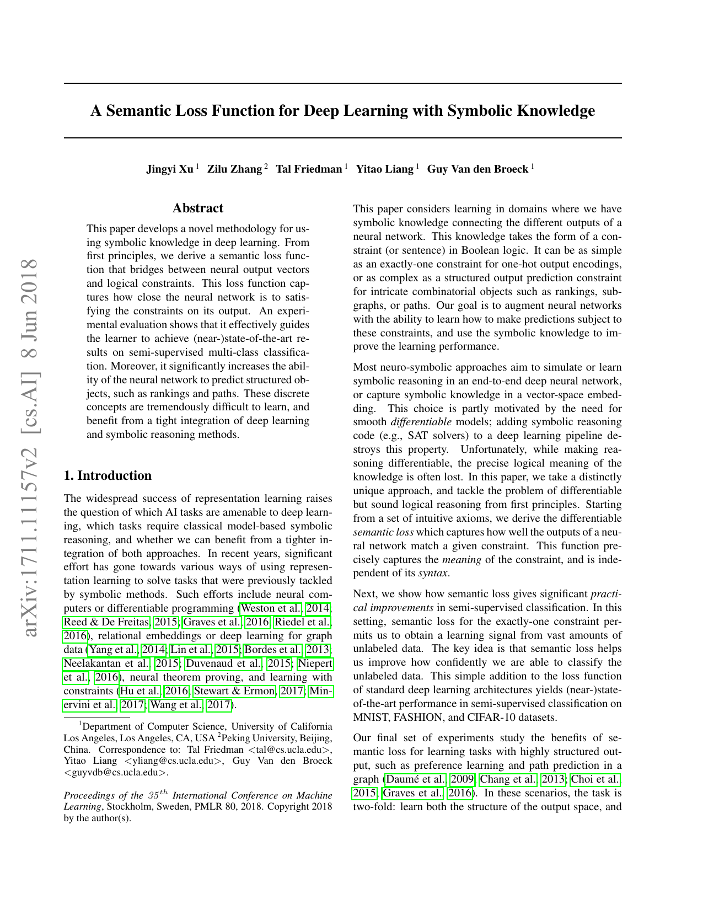
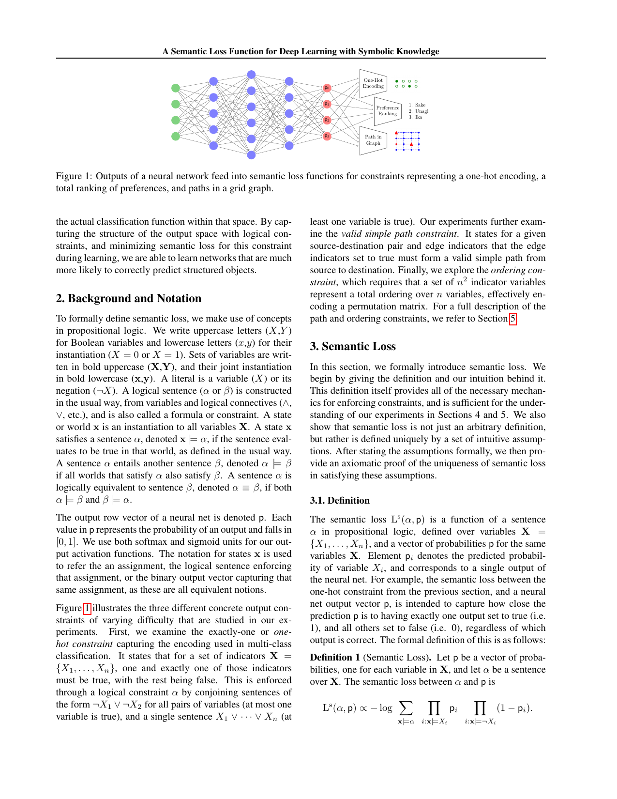

# Semantic Loss 深度结构解析

## 0. 名称消歧与论文来源确认

### 0.1 当前文档主要对应哪篇论文

当前这份文档主要对应的是：

- Xu et al., ICML 2018, *A Semantic Loss Function for Deep Learning with Symbolic Knowledge*

本文默认讨论的 `Semantic Loss`，都指这篇论文提出的那种：

- 以命题逻辑约束 $\phi$ 为对象；
- 以“满足 $\phi$ 的所有布尔世界总概率质量”为核心；
- 把该总概率质量取负对数后写成可训练的损失。

### 0.2 它在阅读路线里的位置

如果把 `Hu et al. 2016 -> Semantic Loss -> DL2` 看成一条逐步加深的逻辑约束路线，那么这篇论文回答的问题是：

> 能不能不先造一个规则教师分布，而是直接把“输出是否满足逻辑”写成一个严格有语义的 loss？

换句话说：

- Hu 2016 更像：`rule -> teacher distribution -> student`
- Semantic Loss 更像：`rule -> exact semantic loss -> parameter update`
- DL2 更像：`constraint language -> differentiable surrogate / feasible set -> training + querying`

因此，这篇论文的真正新意不在于“第一次把逻辑写进训练”，而在于：

- 不经 teacher；
- 不经 soft logic 局部真值；
- 直接优化满足逻辑约束的总概率质量。

---

## 0.5 最小问题设定与记号

为使全文自包含，先固定后文的最小设定。

设训练集为
$$
\mathcal D=\{(x_n,y_n)\}_{n=1}^N.
$$

对输入样本 $x$，神经网络输出一组布尔输出变量
$$
X=(X_1,\dots,X_m),
$$
并给出对应的独立 Bernoulli 概率向量
$$
p=(p_1,\dots,p_m),\qquad p_i=P(X_i=1\mid x).
$$

这里的默认建模方式是：

- 每个输出位 $X_i$ 对应一个二值随机变量；
- 网络先输出各位为 1 的概率 $p_i$；
- 然后把整个输出空间看成所有布尔世界
$$
\mathcal X=\{0,1\}^m.
$$

> 小框注：这里的“独立 Bernoulli 概率向量”可以拆成三层来理解。  
> 1. `Bernoulli` 指每个输出位 $X_i$ 都是一个二值随机变量，只能取 $0/1$。  
> 2. `概率向量` 指网络对每一位单独输出一个为真的概率
> $$
> p=(p_1,\dots,p_m),\qquad p_i=P(X_i=1\mid x).
> $$
> 3. `独立` 指在这个建模近似里，给定输入 $x$ 后，各个输出位被当作彼此独立，因此任意一个完整布尔世界
> $$
> x=(x_1,\dots,x_m)\in\{0,1\}^m
> $$
> 的概率可以按乘法写成
> $$
> P_p(x)=\prod_{i:x_i=1}p_i\prod_{i:x_i=0}(1-p_i).
> $$
> 这和普通 softmax 多分类分布不同：softmax 直接输出“属于哪一类”的分布，而这里输出的是“每一位单独为真”的概率，随后再拼成整个布尔世界的概率。

这里要特别强调一件事：本文默认使用的是 `independent Bernoulli` 参数化，而不是普通多分类里那种
softmax 概率向量。也就是说：

- 这里的 $p_i$ 是“第 $i$ 个输出位单独为 1 的概率”；
- 它们原则上不要求和为 1；
- `exactly-one` 这条逻辑约束本身，就是用来鼓励网络把总概率质量集中到 one-hot 合法世界上。

如果一开始就直接用 softmax，把输出空间先天压成“必有且仅有一个类”，那么 `exactly-one` 的语义监督就会被大幅削弱，甚至变得近乎平凡。

#### 一个最容易混淆的对照：softmax 概率向量、`exactly-one` 与 one-hot 合法世界

先看 softmax。若网络最后一层输出 logit
$$
z=(z_1,\dots,z_m)\in\mathbb R^m,
$$
则 softmax 概率向量定义为
$$
\pi_i=\frac{e^{z_i}}{\sum_{j=1}^m e^{z_j}},
\qquad i=1,\dots,m.
$$

它满足
$$
\pi_i>0,\qquad \sum_{i=1}^m \pi_i=1.
$$

这说明 softmax 描述的不是 $m$ 个彼此独立的布尔位，而是一个单独的多分类随机变量
$$
Y\in\{1,\dots,m\},
\qquad \pi_i=P(Y=i\mid x).
$$

也就是说，softmax 的语义是：

- “属于第 1 类”的概率是多少；
- “属于第 2 类”的概率是多少；
- $\dots$
- “属于第 $m$ 类”的概率是多少。

它天然带着“只能选一个类”的结构，因此天然接近 one-hot 语义。

而本文的 `exactly-one` 逻辑约束，说的是另一件事：  
对布尔输出位
$$
X=(X_1,\dots,X_m),
\qquad X_i\in\{0,1\},
$$
要求恰好有一个位置为 1。它可以写成
$$
\phi_{\text{exo}}
=
\left(X_1\vee\cdots\vee X_m\right)
\wedge
\bigwedge_{i<j}(\neg X_i\vee \neg X_j).
$$

这条约束的数学含义就是
$$
\sum_{i=1}^m x_i = 1,
\qquad x_i\in\{0,1\}.
$$

所谓 `one-hot 合法世界`，就是所有满足上式的那些具体布尔世界。  
更准确地说，这里的 one-hot 是输出空间里的 0/1 布尔向量，不是 softmax 意义下“各类概率”组成的概率向量。  
例如当 $m=4$ 时，合法世界只有 4 个：
$$
(1,0,0,0),\ (0,1,0,0),\ (0,0,1,0),\ (0,0,0,1).
$$

之所以叫“合法”，只是因为它们满足 `exactly-one`；  
与之相对，下面这些世界都是“不合法”的：
$$
(0,0,0,0),\qquad (1,1,0,0),\qquad (1,0,1,0),\qquad (1,1,1,1).
$$

因此，这里真正需要区分的是两层对象：

1. softmax 概率向量 $\pi$  
   它本身已经是“一个类别变量 $Y$ 取各类值的分布”。

2. one-hot 合法世界 $x\in\{0,1\}^m$  
   它是输出空间里的具体布尔赋值；只有恰好一个位置为 1 时，才满足 `exactly-one`。

所以在 Semantic Loss 里：

- 如果一开始就用 softmax，那么“只能选一个类”几乎已经被模型结构编码进去了；
- 如果使用 independent Bernoulli，那么模型一开始允许出现很多非法世界；
- `exactly-one` 这条约束的作用，就是把总概率质量往这些 one-hot 合法世界上推。

#### 为什么这里说“把总概率质量往 one-hot 合法世界上推”

最容易混淆的地方在于：`exactly-one` 是**约束本身**，而不是说当前网络输出已经天然满足这个约束。

在本文默认的 independent Bernoulli 参数化里，网络先输出的是
$$
p=(p_1,\dots,p_m),
$$
而不是某一个已经确定的 one-hot 向量。  
这组 $p_i$ 会在输出空间 $\{0,1\}^m$ 上诱导出一个完整分布，因此当前网络其实同时给：

- 合法世界分配一些概率；
- 非法世界也分配一些概率。

所以，“`exactly-one` 只能其中一个类是 1”这句话，说的是**哪些具体世界是合法的**；  
“把总概率质量往 one-hot 合法世界上推”这句话，说的是**训练时要让当前分布把更多概率放到这些合法世界上**。

继续用上面的 running example：
$$
p=(0.7,\,0.2,\,0.1,\,0.1).
$$

这里要特别注意：$p_i$ 永远表示“第 $i$ 位取 1 的概率”，而不是“第 $i$ 位取 0 的概率”；  
因此某一位若在具体世界里取 0，就应该乘 $1-p_i$，而不是直接乘 $p_i$。

此时 4 个 one-hot 合法世界的概率分别为
$$
P_p(1,0,0,0)=0.7\times 0.8\times 0.9\times 0.9=0.4536,
$$
$$
P_p(0,1,0,0)=0.3\times 0.2\times 0.9\times 0.9=0.0486,
$$
$$
P_p(0,0,1,0)=0.3\times 0.8\times 0.1\times 0.9=0.0216,
$$
$$
P_p(0,0,0,1)=0.3\times 0.8\times 0.9\times 0.1=0.0216.
$$

因此，满足 `exactly-one` 的总概率质量是
$$
P_p(\phi_{\mathrm{exo}})
=
0.4536+0.0486+0.0216+0.0216
=
0.5454.
$$

这说明当前网络虽然已经把一部分质量放到了 one-hot 合法世界上，但还没有“几乎全放上去”；  
剩下的
$$
1-0.5454=0.4546
$$
仍然落在各种非法世界上，例如：
$$
P_p(0,0,0,0)=0.3\times 0.8\times 0.9\times 0.9=0.1944,
$$
$$
P_p(1,1,0,0)=0.7\times 0.2\times 0.9\times 0.9=0.1134.
$$

所以这里“往 one-hot 合法世界上推”的准确含义是：

- 提高 $P_p(\phi_{\mathrm{exo}})$；
- 等价地，压低非法世界的总概率质量；
- 理想情况下，让绝大多数概率都集中到满足 `exactly-one` 的那些 one-hot 世界上。

这也是为什么在 independent Bernoulli 参数化下，`exactly-one` 是一条真正有内容的结构约束；  
它不是重复声明“类别只能有一个”，而是在显式地改造当前分布在整个布尔世界空间上的质量分配。

把上面的数字压缩成一个最小对照表，就是：

| 世界类型 | 定义 | 当前总质量 |
| --- | --- | --- |
| 合法世界 | 满足 `exactly-one` 的 one-hot 世界 | `0.5454` |
| 非法世界 | 不满足 `exactly-one` 的其余世界 | `0.4546` |

这个表最想说明的只有一句话：当前网络还没有把概率几乎全部放到合法世界上，所以 semantic loss 仍然有明显的“继续往合法区推”的优化空间。

任意一个具体世界记为
$$
x=(x_1,\dots,x_m)\in\{0,1\}^m.
$$

若世界 $x$ 满足逻辑公式 $\phi$，记为
$$
x\models \phi.
$$

在独立 Bernoulli 假设下，该世界在当前网络下的概率为
$$
P_p(x)=\prod_{i:x_i=1}p_i\prod_{i:x_i=0}(1-p_i).
$$

因此，满足公式 $\phi$ 的总概率质量为
$$
P_p(\phi)=\sum_{x\models \phi}P_p(x)
=
\sum_{x\models \phi}
\prod_{i:x_i=1}p_i\prod_{i:x_i=0}(1-p_i).
$$

Semantic Loss 的核心定义就是
$$
L_s(\phi,p)=-\log P_p(\phi).
$$

一句话解释：

- 先把所有满足约束 $\phi$ 的世界找出来；
- 再把这些世界在当前输出分布下的概率全部加起来；
- 若这部分质量很大，则 loss 小；
- 若这部分质量很小，则 loss 大。

### 0.5.1 从神经网络输出到 semantic loss 的总流程

如果只想记一条最短主线，那么这篇论文的计算链就是：
$$
x_n
\Longrightarrow
p=(p_1,\dots,p_m)
\Longrightarrow
\phi
\Longrightarrow
\{x\in\{0,1\}^m:x\models\phi\}
\Longrightarrow
P_p(\phi)
\Longrightarrow
L_s(\phi,p)=-\log P_p(\phi).
$$

这条链和 `Logic-Net` 最关键的区别是：

- `Logic-Net` 先把规则写成后验投影，再得到教师分布 $q^\star$；
- `Semantic Loss` 不引入教师分布；
- 它直接把约束 $\phi$ 作用到当前输出概率向量 $p$ 上。

因此，规则真正进入优化核心的位置，就是
$$
L(\theta)=L_{\text{task}}(\theta)+\beta\,L_s(\phi,p_\theta(x)),
$$
里的第二项，而不是某个额外的后处理器。

### 0.5.2 一个贯穿全文的 running example

为了避免后面反复切换数字，这里固定一个最小例子：

- 输出位数：$m=4$
- 语义：4 个类指标位
$$
X=(X_1,X_2,X_3,X_4)
$$
- 逻辑约束：`exactly-one`

也就是：

- 至少一个为真；
- 至多一个为真；
- 合起来就是“4 个位置里恰好有 1 个位置为 1”。

若当前网络输出为
$$
p=(0.7,\,0.2,\,0.1,\,0.1),
$$
则满足 `exactly-one` 的世界只有 4 个：

- $(1,0,0,0)$
- $(0,1,0,0)$
- $(0,0,1,0)$
- $(0,0,0,1)$

它们在当前网络下的总概率质量为
$$
\begin{aligned}
P_p(\phi_{\text{exo}})
&=
0.7(1-0.2)(1-0.1)(1-0.1)\\
&\quad+(1-0.7)0.2(1-0.1)(1-0.1)\\
&\quad+(1-0.7)(1-0.2)0.1(1-0.1)\\
&\quad+(1-0.7)(1-0.2)(1-0.1)0.1\\
&=
0.4536+0.0486+0.0216+0.0216\\
&=0.5454.
\end{aligned}
$$

于是 semantic loss 为
$$
L_s(\phi_{\text{exo}},p)=-\log(0.5454)\approx 0.606.
$$

这里这组数值刚好满足
$$
0.7+0.2+0.1+0.1=1,
$$
但这只是一个数值巧合，不应把它误读成 softmax 输出。本文后面的计算仍然严格按独立 Bernoulli 位概率来解释，也就是仍然使用
$$
P_p(x)=\prod_{i:x_i=1}p_i\prod_{i:x_i=0}(1-p_i).
$$

这组数字后面会反复用到，因为它几乎把整篇论文的核心都压缩进去了：

- 网络不必已经给出 one-hot；
- 但只要满足 one-hot 的世界总质量越来越大，semantic loss 就会下降；
- 这就能把无标签样本也变成训练信号。

---

## 1. 论文想解决的核心问题

### 1.1 直觉问题

这篇论文真正想回答的问题是：

> 当我们知道输出必须满足某个离散逻辑结构时，能不能把这种结构直接变成 loss，而不牺牲逻辑语义本身？

作者针对的是这类场景：

- 多分类里 one-hot 编码；
- 排序里 permutation / total order 约束；
- 图路径里 simple path 约束；
- 更一般地，输出必须落在某个组合结构化空间里。

### 1.2 为什么普通监督损失不够

若只做普通监督学习，训练目标常写为
$$
\min_\theta \frac1N\sum_{n=1}^N \ell\bigl(y_n,p_\theta(\cdot\mid x_n)\bigr).
$$

比如分类里最常见的单样本损失是
$$
\ell\bigl(y_n,p_\theta(\cdot\mid x_n)\bigr)
=
-\log p_\theta(y_n\mid x_n).
$$

这个目标只要求：

- 模型在有标签样本上尽量拟合真标签；
- 但它并不直接要求整个输出空间上的逻辑一致性。

因此，如果你有大量无标签样本，仅靠上式并不能强迫模型学会：

- “4 个类指标中必须恰好一个为真”；
- “输出必须是一条有效路径”；
- “输出必须表示一个合法排名”。

Semantic Loss 的切入点就是：  
即使没有标签，只要知道输出结构必须满足某个命题逻辑约束 $\phi$，也能从中提取训练信号。

---

## 2. 论文中的两张关键图

### 2.1 图 1：作者到底把什么当成“约束对象”

这张图里最重要的不是视觉样式，而是它把约束对象明确成了三类输出结构：

- one-hot encoding
- preference ranking
- path in graph

作者想强调的是：  
Semantic Loss 不是只管简单分类，它针对的是“输出空间本身有离散结构”这一类问题。

如果用本文统一语言重写，这张图讲的是：

- 网络先给出一个概率向量 $p$；
- 然后不是直接拿它和标签比；
- 而是问：`p` 在多大程度上把质量放到了满足结构约束 $\phi$ 的那些世界上？

### 2.2 图 2：为什么它对无标签数据也能产生训练信号

这张图是整篇论文最直观的一页。它说明：

- 没有 semantic loss 时，线性分类器只会利用少量标签点；
- 加入 semantic loss 后，无标签数据也开始“要求模型给出更一致、更 confident 的结构化输出”；
- 最终决策边界被推到更合理的位置。

这正是本文半监督实验最核心的逻辑：

- 无标签样本没有给出“它属于哪一类”；
- 但无标签样本仍然要求“输出必须像一个合法 one-hot 编码”；
- 因此网络会被鼓励把概率质量集中到更明确的合法赋值上。

---

## 3. Semantic Loss 的核心定义

### 3.1 定义式

论文中的核心定义是：
$$
L_s(\phi,p)
=
-\log
\sum_{x\models\phi}
\prod_{i:x_i=1}p_i
\prod_{i:x_i=0}(1-p_i).
$$

这条式子可以一段段读：

1. $x\models\phi$：只枚举满足约束 $\phi$ 的世界；
2. $\prod_{i:x_i=1}p_i\prod_{i:x_i=0}(1-p_i)$：每个满足世界在当前网络下的概率；
3. 对所有满足世界求和：得到满足约束的总概率质量；
4. 取负对数：把它变成 loss。

因此更简洁地写就是
$$
L_s(\phi,p)=-\log P_p(\phi).
$$

### 3.2 为什么它叫 “semantic” loss

关键点在于：  
这个 loss 依赖的是“哪些世界满足 $\phi$”，而不是公式的书写形式。

也就是说，如果两个公式逻辑等价
$$
\phi \equiv \psi,
$$
那么它们对应的 semantic loss 也相同：
$$
L_s(\phi,p)=L_s(\psi,p).
$$

这就是作者强调的：

- 它依赖的是逻辑语义；
- 而不是语法形式。

### 3.3 它为什么是“负对数”

如果把
$$
P_p(\phi)
=
\sum_{x\models\phi}P_p(x)
$$
看成“当前网络随机采样一个输出时，采到合法世界的概率”，那么
$$
-\log P_p(\phi)
$$
就是“采到合法世界这件事的自信息 / surprise”。

因此：

- 若合法世界总质量接近 1，则 loss 接近 0；
- 若合法世界总质量很小，则 loss 很大。

这就是本文最核心的直觉。

---

## 4. 从公理到定义：作者想保住什么性质

论文不仅给了定义，还强调：  
这个定义不是随便拍出来的，而是由一组直观公理几乎唯一确定的。

更准确地说，作者主张的是：
$$
L_s(\phi,p)
=
-\log\sum_{x\models\phi}P_p(x)
$$
在一组自然公理下，除了一个整体乘法常数之外，几乎是唯一合理的选择。换句话说，如果只允许改成
$$
\widetilde L_s(\phi,p)=c\,L_s(\phi,p),\qquad c>0,
$$
那么它们在逻辑语义上仍属同一类对象；但若离开这类乘法常数缩放，就会破坏论文希望保住的那些公理性质。

### 4.1 单调性

若
$$
\phi\models \psi,
$$
那么 $\phi$ 比 $\psi$ 更强，因此 semantic loss 应满足
$$
L_s(\phi,p)\ge L_s(\psi,p).
$$

直观上：

- 约束越严格；
- 满足它就越难；
- 因而 loss 不应更小。

### 4.2 语义等价不变

若
$$
\phi \equiv \psi,
$$
则
$$
L_s(\phi,p)=L_s(\psi,p).
$$

这保证了：

- semantic loss 看的是逻辑 meaning；
- 不是看你把同一条规则写成 CNF、DNF 还是别的语法。

### 4.3 和普通标签损失的一致性

对单个 literal，semantic loss 应退化成普通交叉熵。

例如：
$$
L_s(X,p)=-\log p,
\qquad
L_s(\neg X,p)=-\log(1-p).
$$

这点非常重要，因为它说明：

- semantic loss 不是和传统监督 loss 完全分裂的怪对象；
- 它在最小的单变量情形下，与经典标签损失是一致的。

因此，普通监督学习其实可以看成 semantic loss 的一个极小特例。

### 4.4 为什么这些公理足以把它带进梯度训练

前面几条公理保证的是“逻辑上应该像什么”；但要把它真的放进神经网络训练，还需要一个数值层面的要求：

- 对固定的公式 $\phi$，$L_s(\phi,p)$ 应该随各个 $p_i$ 的变化保持连续；
- 并且至少在绝大多数位置上可微。

这一步的作用不是改变 semantic loss 的语义，而是保证它不只是一个“逻辑上好看”的量，而是一个确实能进入梯度下降的训练目标。

因此，这一节完整串起来后的含义是：

1. 单调性和语义等价不变，保证它保住逻辑 meaning；
2. literal 对应交叉熵，保证它和普通监督学习接得上；
3. 唯一性（在乘法常数意义下）说明这个定义不是随意挑的；
4. 连续 / 可微性则说明它能真正进入优化。

---

## 5. `exactly-one` 约束如何具体展开

### 5.1 逻辑形式

对 $m$ 个布尔变量 $X_1,\dots,X_m$，`exactly-one` 可以分成两部分：

1. 至少一个为真：
$$
X_1\vee X_2\vee \cdots \vee X_m
$$

2. 任意两个不能同时为真：
$$
\bigwedge_{i<j}(\neg X_i\vee \neg X_j)
$$

合起来得到
$$
\phi_{\text{exo}}
=
\left(X_1\vee \cdots \vee X_m\right)
\wedge
\bigwedge_{i<j}(\neg X_i\vee \neg X_j).
$$

### 5.2 它对应哪些满足世界

满足 `exactly-one` 的世界恰好是所有 one-hot 赋值：
$$
(1,0,\dots,0),\ (0,1,0,\dots,0),\ \dots,\ (0,\dots,0,1).
$$

所以
$$
P_p(\phi_{\text{exo}})
=
\sum_{i=1}^m
p_i\prod_{j\ne i}(1-p_j).
$$

从而 semantic loss 变成
$$
L_s(\phi_{\text{exo}},p)
=
-\log \sum_{i=1}^m p_i\prod_{j\ne i}(1-p_j).
$$

这正是论文在半监督多分类实验里最常用的实例化公式。

### 5.3 对本文 4 维 running example 的完整代入

对
$$
p=(0.7,0.2,0.1,0.1),
$$
我们已经算过
$$
P_p(\phi_{\text{exo}})=0.5454.
$$

因此
$$
L_s(\phi_{\text{exo}},p)=-\log(0.5454)\approx 0.606.
$$

如果换一组更“明显非法”的输出，例如
$$
p=(0.9,0.8,0.1,0.1),
$$
则满足 one-hot 的总质量为
$$
\begin{aligned}
P_p(\phi_{\text{exo}})
&=
0.9(1-0.8)(1-0.1)(1-0.1)\\
&\quad+(1-0.9)0.8(1-0.1)(1-0.1)\\
&\quad+(1-0.9)(1-0.8)0.1(1-0.1)\\
&\quad+(1-0.9)(1-0.8)(1-0.1)0.1\\
&=
0.1458+0.0648+0.0018+0.0018\\
&=0.2142,
\end{aligned}
$$
所以
$$
L_s(\phi_{\text{exo}},p)=-\log(0.2142)\approx 1.541.
$$

这说明：

- 当多个位置同时被高概率点亮时；
- 合法 one-hot 世界的总质量会明显下降；
- semantic loss 会迅速上升。

---

## 6. 它到底怎样进入训练

### 6.1 最直接的训练目标

论文给出的最直接接口是：
$$
L(\theta)
=
L_{\text{task}}(\theta)+\beta\,L_s(\phi,p_\theta(x)).
$$

这里：

- $L_{\text{task}}$ 是普通监督任务损失；
- $L_s$ 是逻辑约束损失；
- $\beta$ 控制这两者的相对强度。

如果写到半监督 setting，下标更清楚的形式可以写为
$$
L(\theta)
=
\frac1{|\mathcal D_L|}
\sum_{(x_n,y_n)\in\mathcal D_L}
\ell\bigl(y_n,p_\theta(\cdot\mid x_n)\bigr)
+
\beta\,
\frac1{|\mathcal D_U|}
\sum_{x_n\in\mathcal D_U}
L_s\bigl(\phi,p_\theta(x_n)\bigr).
$$

这条式子的意思非常直接：

- 有标签部分继续拟合真标签；
- 无标签部分没有 label，但仍要求输出分布尽量把质量压到满足约束的世界上。

### 6.2 它为什么不需要 teacher

这是和 `Logic-Net` 最本质的差别。

在 `Logic-Net` 中，规则先进到一个后验投影问题里，得到教师分布
$$
q^\star(\cdot\mid x),
$$
然后再蒸馏给学生。

而在 Semantic Loss 里，没有这一步。训练链条是：
$$
x
\Longrightarrow
p_\theta(x)
\Longrightarrow
L_s(\phi,p_\theta(x))
\Longrightarrow
\nabla_\theta L_s
\Longrightarrow
\theta \text{ 更新}.
$$

所以这篇论文的核心优点之一正是：

- 规则直接进入 loss；
- 而不是先变成一个中间教师。

### 6.3 一个最小“无标签样本也能产生梯度”的例子

假设某个无标签样本当前输出是
$$
p=(0.9,0.8,0.1,0.1),
$$
并使用 `exactly-one` 约束。

这时虽然你不知道它到底属于哪一类，但模型仍然会因为
$$
L_s(\phi_{\text{exo}},p)\approx 1.541
$$
而受到惩罚。

惩罚的含义是：

- 当前输出同时高亮了多个位置；
- 这不符合 one-hot 结构；
- 所以网络应把概率质量往“恰好一个位置为真”的世界集中。

因此，无标签样本虽然没有给出具体类别，却仍然给出了结构监督。

---

## 7. 它到底在优化什么

### 7.1 不是局部规则违反度

Semantic Loss 不是在问：

> 当前某条规则局部违反了多少？

它真正问的是：

> 在当前输出分布下，满足整个约束 $\phi$ 的世界总概率质量有多少？

因此，它优化的是
$$
P_p(\phi),
$$
而不是某个 soft truth 值
$$
r_\phi(u,v).
$$

这也是它和 soft logic 系方法最容易混淆、但又最重要的区别。

### 7.2 为什么它是“全局耦合”的

因为
$$
L_s(\phi,p)=-\log \sum_{x\models\phi}P_p(x)
$$
里的求和是对所有满足世界做的。

一旦一个约束涉及很多变量：

- 每个 $p_i$ 的变化都会影响很多世界的概率；
- 很多变量的梯度会同时耦合在一起；
- 这和只看某个局部 hinge 违反度完全不同。

对 `exactly-one` 来说，这种耦合还相对可控；  
但对更复杂的路径、排序、组合约束，这会迅速变重。

---

## 8. 它和 Logic-Net、DL2 的本质差别

### 8.1 和 Logic-Net 的区别

| 维度 | Logic-Net | Semantic Loss |
| --- | --- | --- |
| 规则入口 | 后验分布投影 | 直接进入损失 |
| 中间对象 | 教师分布 $q^\star$ | 无中间教师 |
| 优化对象 | 先投影分布，再蒸馏参数 | 直接更新参数 |
| 规则数值对象 | 软真值 / 规则能量 | 满足世界总概率质量 |
| 语义重点 | 规则偏置后的 posterior | exact satisfying mass |

一句话压缩：

- `Logic-Net`：先改分布，再改参数；
- `Semantic Loss`：直接通过 loss 改参数。

### 8.2 和 DL2 的区别

| 维度 | Semantic Loss | DL2 |
| --- | --- | --- |
| 逻辑对象 | 满足赋值集合 | declarative constraint formula |
| 数值化方式 | 满足世界总概率质量 | 连续 surrogate 违反度 |
| 语义精确性 | 高，保持 exact logical meaning | 依赖 surrogate |
| 梯度几何 | 全局耦合 | 更局部、分段、设计依赖 |
| 主要难点 | 逻辑编译 / 计数复杂度 | surrogate 设计与内层搜索 |

更直白地说：

- Semantic Loss 优化的是“合法世界总概率”；
- DL2 更常优化“当前连续违反幅度”或“某个可行域搜索目标”。

因此，这三篇的关系可以压成一句：

$$
\text{Logic-Net}: \phi \to q^\star \to \theta,\qquad
\text{Semantic Loss}: \phi \to L_s \to \theta,\qquad
\text{DL2}: \phi \to \Psi_\phi \text{ or } \mathcal C_\phi \to \theta.
$$

---

## 9. 这篇论文为什么有效

### 9.1 对半监督分类的帮助

在半监督 setting 下，大量无标签样本本来无法直接提供 label supervision。  
Semantic Loss 让它们至少提供一类更弱但仍有价值的监督：

- 输出必须像一个合法结构对象；
- 而不能是任意一团不一致的概率。

对 one-hot 任务来说，这相当于逼模型在无标签样本上也更 confident、更结构一致。

### 9.2 对结构化输出的帮助

对路径、排序等任务，普通分类损失往往还要同时学两件事：

1. 输出空间的结构是什么；
2. 在该结构空间里该选哪一个输出。

Semantic Loss 把第 1 件事提前用逻辑约束写死，所以网络只需更专注于：

- 学习在合法结构空间内如何做判别。

这就是作者在 ranking / path 任务上强调的收益。

---

## 10. 计算代价与局限性

### 10.1 公式优雅，不代表计算总是便宜

定义式非常漂亮：
$$
L_s(\phi,p)=-\log\sum_{x\models\phi}P_p(x),
$$
但真正的难点是：

- 满足世界有多少个；
- 怎样高效求这部分总质量；
- 是否需要逻辑编译、WMC 或等价计数结构。

对 `exactly-one` 这种简单约束，可以直接化简到
$$
\sum_{i=1}^m p_i\prod_{j\ne i}(1-p_j),
$$
成本可接受。

但一旦逻辑结构复杂，问题就不再是“求导”，而是“先能不能算出来”。

### 10.2 它更适合命题级离散输出结构

这篇方法最自然的对象是：

- propositional logic；
- 离散布尔输出位；
- 结构化输出空间。

它不太自然的地方包括：

- 复杂量词逻辑；
- 很深的 first-order relational structure；
- 连续变量主导的约束；
- 大规模组合约束下的可扩展性。

### 10.3 它虽然“语义精确”，但并不自动保证训练稳定

语义精确意味着：

- loss 真正对应满足世界总质量；

但并不意味着：

- 梯度一定局部；
- 数值一定稳定；
- 编译代价一定低；
- 约束一定和任务标签完全一致。

如果约束本身错了，那么 semantic loss 也会非常坚定地把模型往错方向推。

---

## 11. 与仓库 toy 代码的对应关系

当前仓库里已经有一个最直接的复现实验：

- [repro/03_semantic_loss_toy/README.md](../repro/03_semantic_loss_toy/README.md)
- [repro/03_semantic_loss_toy/constraints.py](../repro/03_semantic_loss_toy/constraints.py)

其中 `constraints.py` 里的核心实现正好对应本文定义：

- 先枚举所有合法赋值；
- 再对每个赋值计算 log-probability；
- 最后用 `logsumexp` 把满足世界总质量加起来。

如果把代码逻辑改写成公式，其实就是：
$$
\log P_p(\phi)
=
\log
\sum_{x\models\phi}
\exp\bigl(\log P_p(x)\bigr),
$$
其中
$$
\log P_p(x)
=
\sum_{i:x_i=1}\log p_i+\sum_{i:x_i=0}\log(1-p_i).
$$

代码里之所以用 `logsigmoid` 和 `logsumexp`，本质上是在做数值稳定版的同一件事。

---

## 12. 最小复现建议

### 12.1 最适合先做什么

最适合从 `exactly-one` 开始，因为它同时满足：

- 语义最直观；
- 公式最容易手算；
- 无标签半监督场景最自然；
- 和仓库已有 `semantic_loss_toy` 完全对齐。

### 12.2 一条最稳的最小复现路径

1. 固定 4 维输出位；
2. 用 `sigmoid` 输出 4 个独立 Bernoulli 概率；
3. 先训练 baseline；
4. 再加 `exactly-one` semantic loss；
5. 比较：
   - 训练曲线；
   - 约束满足率；
   - 决策边界；
   - 无标签样本上的 confident 程度。

### 12.3 最值得做的三个对照

- `baseline` vs `exactly_one`
  看正确语义约束能否提高约束满足率与泛化。

- `exactly_one` vs `at_least_one`
  看弱约束和强约束的差别。

- `exactly_one` vs `exactly_two_bad`
  看错误知识如何把模型带偏。

---

## 13. 一页压缩总结

如果只保留最关键的几句话，那么这篇论文的骨架就是：

1. 把逻辑约束 $\phi$ 看成一个满足世界集合。
2. 计算当前网络输出分布在这些满足世界上的总概率质量
$$
P_p(\phi)=\sum_{x\models\phi}P_p(x).
$$
3. 定义 semantic loss
$$
L_s(\phi,p)=-\log P_p(\phi).
$$
4. 用
$$
L(\theta)=L_{\text{task}}(\theta)+\beta L_s(\phi,p_\theta(x))
$$
直接训练参数。

所以它真正解决的是：

> 如何把“输出必须满足某个离散逻辑结构”这件事，直接而严格地写成一个可训练的 loss。

而它真正付出的代价是：

> 逻辑语义保持得越精确，满足世界总概率质量的计算往往越重。
