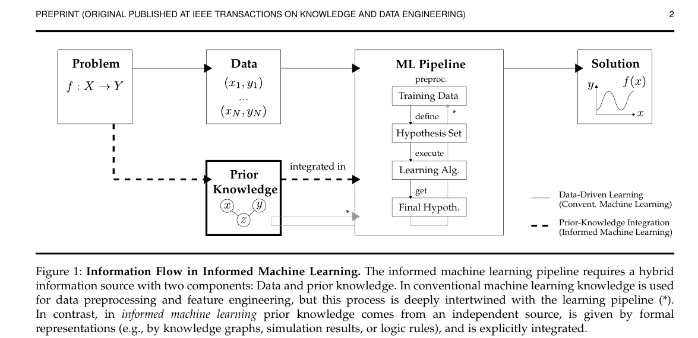
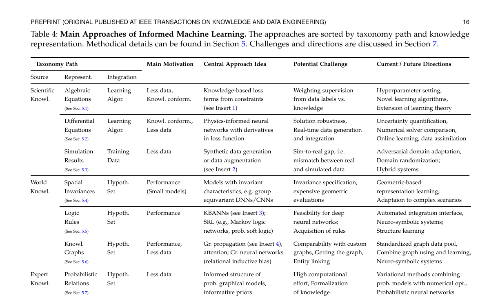
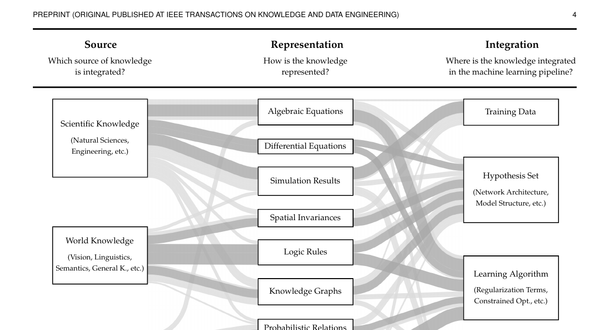
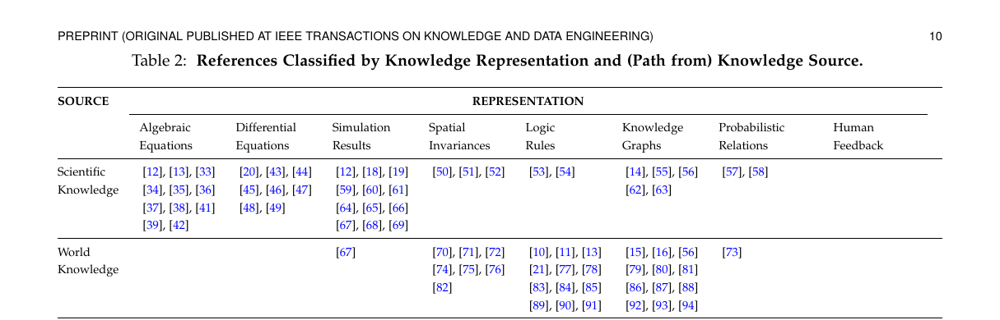
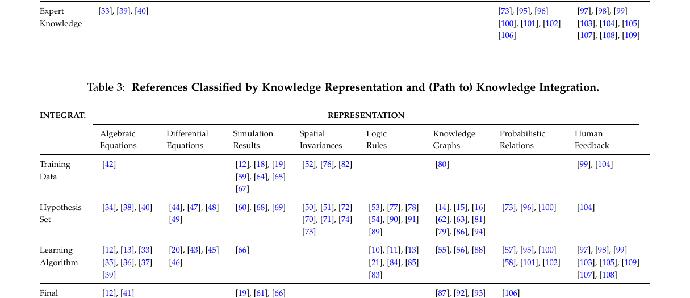
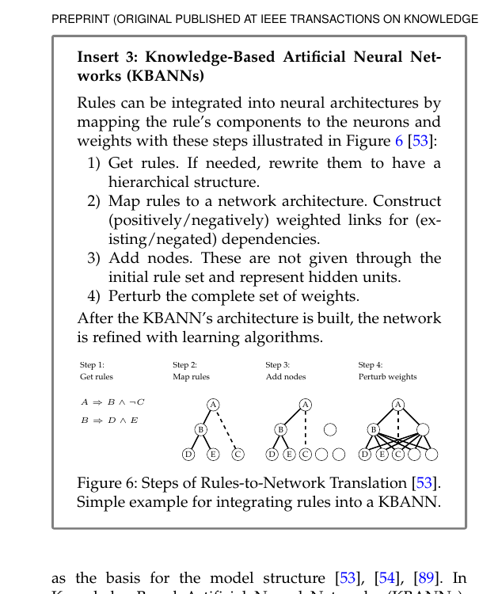
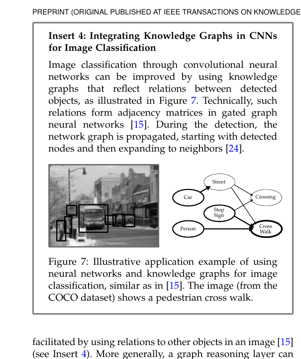

# Survey Notes (ZH)

## Citation

- Paper: *Informed Machine Learning: A Taxonomy and Survey of Integrating Prior Knowledge into Learning Systems*
- File: [taxonomy_survey_2021_tkde.pdf](../papers/survey/taxonomy_survey_2021_tkde.pdf)

## 这篇 survey 的核心任务

这篇文章不是在提出某一个新的 informed ML 方法，而是在做三件事：

1. 给出 informed machine learning 的概念边界。
2. 提出一个统一 taxonomy，描述“知识从哪里来、如何表示、如何进入学习系统”。
3. 按照这个 taxonomy 对已有方法做整理，并指出每条路径的挑战与未来方向。

因此，读这篇 survey 时最重要的不是记具体模型名，而是先抓住它的分析框架。

## 图 1 精读：Informed Machine Learning 的信息流

### 图的作用

Figure 1 不是方法图，而是概念图。它回答的问题是：

`informed machine learning` 和普通 machine learning 的本质区别到底在哪里？

### 图中的基本结构

整张图有两条输入来源：

- `Data`
- `Prior Knowledge`

它们共同进入 `ML Pipeline`，最终产生 `Solution`。

普通机器学习主要依赖样本数据：

- 从问题定义出发
- 收集训练数据
- 定义 hypothesis set
- 运行 learning algorithm
- 得到最终假设 `f(x)`

而 informed machine learning 在这个流程之外，再引入一个额外的信息源：

- 该信息源不是直接从训练样本中统计出来的
- 而是来自问题本身、科学规律、世界知识、专家经验或人类反馈
- 并且要以某种可形式化的方式显式接入 pipeline

### 这张图真正强调的 3 个条件

作者对 prior knowledge 的要求其实很严格，不是“任何经验”都算：

1. **独立来源**
   先验知识不是从当前训练数据中直接拟合出来的，而是来自外部。

2. **形式化表示**
   知识必须能以机器可操作的方式表达，例如方程、规则、图结构、仿真结果、概率关系等。

3. **显式集成**
   知识不是停留在研究者脑中，也不是只在特征工程里模糊使用，而是明确进入学习流程。

### 图中的 pipeline 该怎么理解

图里 `ML Pipeline` 里面有 4 个核心环节：

- `Training Data`
- `Hypothesis Set`
- `Learning Algorithm`
- `Final Hypothesis`

这里最值得单独记住的是 `Hypothesis Set`。

它不是“训练出来的最终模型”，而是：

- 模型允许落入的函数空间
- 模型结构和归纳偏置的集合
- 哪些解被允许、哪些解天然被排除

因此，先验知识有三种最典型的进入位置：

1. **进入训练数据**
   例如用仿真生成额外样本。

2. **进入 hypothesis set**
   例如把规则、图结构、对称性直接做成模型结构偏置。

3. **进入 learning algorithm**
   例如把约束改写成 loss、regularizer 或训练规则。

### 这张图对我读论文的启发

以后看到一篇 informed ML 论文，首先不要急着问“它用了什么网络”，而是先问：

1. 它的 prior knowledge 从哪里来？
2. 它被表示成了什么形式？
3. 它被注入到了数据、hypothesis set 还是 learning algorithm？

这 3 个问题其实就是后面 taxonomy 的骨架。

## 表 4 精读：Taxonomy Path 的读法

### 表的作用

Table 4 是这篇 survey 最实用的一张总表。它不是在列方法名字，而是在列“知识注入路径”。

每一行都可以读成一个三段式：

`Source -> Representation -> Integration`

也就是：

- 知识从哪里来
- 知识被表示成什么
- 知识从哪个接口进入机器学习系统

在这三列之后，作者又补了：

- `Main Motivation`
- `Central Approach Idea`
- `Potential Challenge`
- `Current / Future Directions`

这就把“方法为何出现、通常怎么做、难点在哪、接下来往哪走”串起来了。

### 这张表最重要的阅读方式

不要把它当成静态分类表，而要把每一行读成一句完整的话。

例如：

- `Scientific Knowledge -> Algebraic Equations -> Learning Algorithm`
  表示：知识来自科学规律，被表示为代数方程，并通过 loss / constraints 进入训练算法。

- `World Knowledge -> Logic Rules -> Hypothesis Set`
  表示：知识来自人们对世界的规则性认知，被表示为逻辑规则，并进入模型结构或假设空间。

- `Scientific Knowledge -> Simulation Results -> Training Data`
  表示：知识来自仿真系统，最终以样本或增强数据的形式进入训练集。

这样读，taxonomy 就从“分类记忆”变成了“方法理解工具”。

## 表 4 的逐行理解

### 1. Scientific Knowledge -> Algebraic Equations -> Learning Algorithm

这一类方法的主要动机是：

- 数据少
- 或者希望模型输出符合已有科学规律

中心思想是：

- 把知识写成代数约束
- 再把约束变成损失项或正则项

这类方法最典型的理解方式是：

> 不是只让模型去拟合标签，而是同时惩罚违反知识约束的预测。

主要挑战是：

- 数据监督和知识监督之间的权重怎么平衡

这也是很多 informed loss 方法最后都要调很多超参数的原因。

### 2. Scientific Knowledge -> Differential Equations -> Learning Algorithm

这一行对应的就是 physics-informed neural networks 这一大类方法。

中心思想是：

- 模型不仅要拟合观测数据
- 还要让模型的导数满足某个微分方程

它比一般代数约束更强，因为：

- 约束对象不是静态变量关系
- 而是函数及其导数的关系

作者强调的关键难点包括：

- 解的鲁棒性
- 实时数据的接入
- 与经典数值求解器的比较

这说明 PINNs 不是“只要加上 PDE loss 就一定更好”，而是要和数值分析传统认真对比。

### 3. Scientific Knowledge -> Simulation Results -> Training Data

这一类不是把知识直接做成 loss，而是先把知识通过仿真系统“展开”为数据。

因此它进入的是 `Training Data`，不是 `Learning Algorithm`。

常见形式包括：

- synthetic data generation
- data augmentation
- simulator-generated labels

它的关键挑战是 `sim-to-real gap`：

- 仿真数据和真实数据不一致
- 导致模型在模拟环境里好用，到了真实场景失效

因此未来方向常落在：

- domain adaptation
- domain randomization
- hybrid systems

### 4. World Knowledge -> Spatial Invariances -> Hypothesis Set

这里的知识是：

- 平移不变
- 旋转不变
- 群作用下的不变性 / 等变性

这类知识不是靠额外监督告诉模型的，而是直接被编码到模型结构里。

所以它进入的是 `Hypothesis Set`。

一句话理解：

> 不是训练后逼模型学会不变性，而是从一开始就只允许模型在满足这种几何规律的结构中学习。

这类方法的重要意义在于：

- 它往往能用更小模型达到更好泛化
- 因为结构偏置本身就减少了无效搜索空间

### 5. World Knowledge -> Logic Rules -> Hypothesis Set

这一类是 informed ML 中很重要的一条线，也是 neuro-symbolic 的核心接口之一。

作者提到的代表路径包括：

- KBANN
- Statistical Relational Learning
- Markov logic networks
- probabilistic soft logic

这里的重点是：

- 逻辑规则不只是一个训练时的 penalty
- 它还可以被映射为网络结构、推理结构或可行假设空间的一部分

关键挑战有两个：

1. 深度网络场景下的可扩展性
2. 规则本身从哪里来

第二点非常关键，因为真实任务里规则常常不是现成给好的，而是需要进一步做 structure learning。

### 6. World Knowledge -> Knowledge Graphs -> Hypothesis Set

这一类把关系知识表示成图。

它的核心思想通常是：

- 用图传播、注意力机制或图神经网络
- 把实体之间的关系结构作为 relational inductive bias 注入模型

这一条路线特别适合理解为：

> 图不是普通附加特征，而是“谁和谁有关、关系如何传播”的结构先验。

挑战主要在于：

- 图往往是定制的，不同论文难比较
- 图本身可能不完整
- entity linking 很难

所以作者提出的重要方向包括：

- 标准化图资源
- 图使用与图学习结合
- 更强的 neuro-symbolic integration

### 7. Expert Knowledge -> Probabilistic Relations -> Hypothesis Set

这里的 prior knowledge 不是规则硬约束，而是专家给出的概率关系、结构依赖或 informative priors。

这类方法常见于：

- probabilistic graphical models
- Bayesian priors
- variational approaches

其核心逻辑是：

- 先不要把知识理解成“必须满足”
- 而是理解成“某些结构或参数更可能出现”

它的主要困难是：

- 计算成本高
- 专家知识的形式化不容易

### 8. Expert Knowledge -> Human Feedback -> Learning Algorithm

这一路线说明：

- 人的反馈本身也可以是 prior knowledge
- 但它通常不是静态结构，而是进入训练过程

所以它更常进入 `Learning Algorithm`，而不是 `Hypothesis Set`。

作者列出的典型形式包括：

- HITL reinforcement learning
- explanation alignment
- visual analytics / interactive machine learning

这里的难点非常现实：

- 人的反馈慢
- 人的直觉难形式化
- 评价方式也不稳定

## 两张图合起来看，survey 的真正框架是什么

Figure 1 给出概念框架：

- informed ML = data + independently available prior knowledge

Table 4 给出操作性框架：

- `Source`
- `Representation`
- `Integration`

也就是说，这篇 survey 真正想建立的不是“方法列表”，而是一个分析坐标系：

1. 先判断知识来源。
2. 再判断知识表示。
3. 再判断它进入 pipeline 的位置。
4. 最后分析它的动机、方法、挑战和未来方向。

## 适合记忆的简化版结论

可以把这篇 survey 压缩成下面 4 句话：

1. informed ML 的本质不是“有经验”，而是“有独立来源、可形式化、可显式集成的先验知识”。
2. 任何方法都可以用 `Source -> Representation -> Integration` 来定位。
3. 科学知识更常进入 `Learning Algorithm`，世界知识更常进入 `Hypothesis Set`，仿真知识更常进入 `Training Data`。
4. 这篇 survey 的价值不在于提供统一模型，而在于提供统一读法。

## 读后可继续追问的问题

1. 哪些知识表示之间可以互相转换，例如规则、图、概率关系？
2. 同一种知识放进 `Hypothesis Set` 和放进 `Learning Algorithm`，效果有何本质区别？
3. 当数据与知识冲突时，系统应优先信谁？
4. informed ML 与 neuro-symbolic learning、physics-informed learning、causal learning 的边界分别在哪里？

## Section 4 精读：taxonomy 不是静态分类表，而是导航图

### 这一节在整篇 survey 里的位置

Section 4 的作用不是列举方法细节，而是把作者在文献调查中反复看到的模式抽象成一个统一框架。

换句话说：

- Section 2 解决“什么叫 informed ML”
- Section 3 解决“这个 taxonomy 是怎么从 survey 中归纳出来的”
- Section 4 解决“taxonomy 本身到底包含哪些维度和元素”
- Section 5 才开始把具体方法按 taxonomy 往里放

所以如果读到 Section 5 时觉得方法很多、很散，通常不是方法本身太乱，而是 Section 4 还没有真正吃透。

### taxonomy 的三条主轴

作者把 informed ML 的方法空间拆成 3 个维度：

1. `Knowledge Source`
2. `Knowledge Representation`
3. `Knowledge Integration`

这三个问题分别对应：

1. 先验知识从哪里来？
2. 它以什么形式表达？
3. 它进入机器学习流程的哪个环节？

这三条主轴里，作者其实最强调第二条：`representation`。

因为：

- source 更偏应用背景
- integration 更偏方法接口
- representation 则是两者之间真正的桥梁

也就是说，知识能不能被机器学习系统吸收，关键不只是“你有没有知识”，而是“这种知识被写成了什么样子”。

### Knowledge Source：三分法不是领域划分，而是形式化程度划分

Section 4.1 把知识来源分成：

- `Scientific Knowledge`
- `World Knowledge`
- `Expert Knowledge`

这三类最容易被误解成简单的“学科分类”，但作者真正想表达的是一种谱系：

- 从更正式、显式验证的知识
- 到较通用但 often implicit 的世界知识
- 再到更依赖经验和直觉的专家知识

所以这不是严格互斥的 ontology，而是一种实用划分。

作者也明确承认：

- 这些类别不完备
- 也不完全互斥

它们的作用主要是为了识别“常见知识注入路径”。

### Knowledge Representation：taxonomy 的核心接口

Section 4.2 是整套 taxonomy 最关键的部分。

作者抽出了 8 类常见表示：

- algebraic equations
- differential equations
- simulation results
- spatial invariances
- logic rules
- knowledge graphs
- probabilistic relations
- human feedback

这里一个很重要的判断是：

> 作者并不是在追求“数学上最简洁的表示集合”，而是在保留文献里最常见、最贴近实践的表示方式。

这就是为什么：

- 微分方程单独列为一类，而不是并回 algebraic equations
- simulation results 也单独列为一类，而不是看成 equation solver 的输出

原因不在于它们不能互相转换，而在于它们对应的机器学习接口经常不同。

#### 这 8 类表示可以按三组来记

第一组：**科学规律型**

- algebraic equations
- differential equations
- simulation results

这组通常服务于“让模型符合科学规律”或“用仿真补足数据”。

第二组：**符号与结构型**

- spatial invariances
- logic rules
- knowledge graphs

这组通常服务于结构偏置、关系建模、可解释约束。

第三组：**不确定与交互型**

- probabilistic relations
- human feedback

这组通常用于处理专家经验、直觉、不完整知识和人机交互。

这样记，比直接死背 8 个名词更稳。

### Knowledge Integration：知识不是只能进 loss

Section 4.3 的价值在于把“知识进入模型”拆成 4 个位置：

- `Training Data`
- `Hypothesis Set`
- `Learning Algorithm`
- `Final Hypothesis`

很多人一提 informed ML，第一反应是“加一个 knowledge loss”。  
这只是其中一类，而且只是 `Learning Algorithm` 这一栏。

作者想说明的是：

- 你可以用知识造数据
- 可以用知识限定模型空间
- 可以用知识修改训练规则
- 甚至可以在训练后用知识校验或修正最终输出

#### 这里面最常见的两个位置

虽然 4 个位置都可能，但作者明确说大多数论文集中在两个中心环节：

- `Hypothesis Set`
- `Learning Algorithm`

这和你的阅读体验也一致：

- 结构偏置类方法，经常把知识做进 architecture / graph / kernel / rule structure
- 约束优化类方法，经常把知识做进 loss / regularizer / constrained optimization

### Figure 2 真正展示的不是 taxonomy 本身，而是 taxonomy + literature frequency

Figure 2 很容易被看成一张普通分类图，但其实它还叠了一层 survey 结果：

- 方块大小反映该元素在文献中出现的相对频率
- Sankey 路径宽度反映某条组合路径出现得多不多
- 深色路径表示作者认为的 main paths

这点很重要，因为这意味着：

> 这不是逻辑上所有可能的方法空间，而是“文献中已经被反复实践过的方法空间”。

因此它有两种用途：

1. 给初学者当入门地图
2. 给研究者当 baseline / gap 分析工具

### taxonomy 的两个阅读方向

作者在 Section 4 里提了一个很容易被忽略但非常有用的观点：

- application-oriented 的人适合从左往右读
- method-oriented 的人适合从右往左读

也就是：

#### 从左往右读

如果你手里先有知识来源，例如：

- 物理方程
- 医学图谱
- 语言规则

那么你会问：

- 它更适合用什么表示？
- 再从什么接口注入系统？

#### 从右往左读

如果你先会一种方法，例如：

- constrained optimization
- graph neural networks
- teacher-student distillation

那么你会反过来问：

- 这种接口最适合接什么表示？
- 这些表示通常来自什么知识源？

这个视角非常适合做选题。

### Section 4 的一个经验性结论：不同 source 会自然偏向不同 representation

作者在 Section 3.2 和 Section 4 的衔接里反复强调一个经验现象：

- `Scientific Knowledge` 经常走向 equations / simulations
- `World Knowledge` 经常走向 logic rules / graphs / invariances
- `Expert Knowledge` 经常走向 probabilistic relations / human feedback

这不是绝对规则，但说明知识的“来源气质”会影响它适合采用的形式。

这里最值得记的是：

> informed ML 不是“先有统一方法，再把各种知识塞进去”，而是“不同知识天然偏向不同接口”。

### Section 4 和 Table 2 / Table 3 的关系

Section 4 给的是概念 taxonomy。  
Table 2 和 Table 3 给的是 survey 中观察到的交叉分布。

可以这样理解：

- Section 4 告诉你“坐标轴是什么”
- Table 2 告诉你“source 和 representation 常怎么配”
- Table 3 告诉你“representation 和 integration 常怎么配”

所以这篇 survey 不是只给一张大图，而是给了三层信息：

1. 概念框架
2. 经验频率
3. 代表性主路径

### 我对 Section 4 的一个总结

Section 4 的真正贡献不是发明了几个分类名字，而是把 informed ML 从“很多零散方法”重新组织成一个可以导航的方法空间。

可以压缩成一句笔记：

> taxonomy 的意义不在于把论文归档，而在于把“知识如何进入学习系统”这件事拆成 source、representation、integration 三个可分析接口。

## Section 5.5 精读：Logic Rules 这一路到底在做什么

### 为什么 logic rules 在这篇 survey 里地位很高

在所有表示类型里，logic rules 是最接近传统符号 AI 的一类。

它的重要性在于：

- 它保留了明确的语义关系
- 又能和学习系统发生多种接口
- 是 informed ML 与 neuro-symbolic learning 最直接的交汇点之一

换句话说，logic rules 不是一种边缘表示，而是一条非常核心的 informed ML 主线。

### 5.5.1：logic rules 最常来自 world knowledge

作者说 logic rules 可以来自多种来源，但最常见的是 `World Knowledge`。

这里给了几类很典型的例子：

- 物体属性规则  
  例如会飞且会下蛋的动物更可能是鸟。

- 物体关系规则  
  例如某些角色在游戏场景中经常共同出现。

- 语言规则  
  例如句子里出现 `but` 时，后半句情感更主导；或者 citation tag 的顺序约束。

- 社交 / 关系依赖规则  
  例如相互引用的作者更可能来自相近研究领域。

这些例子共同说明一件事：

> logic rule 最适合表达“离散对象之间的关系性知识”。

它不像方程那样强调连续数值关系，而更强调：

- if-then 结构
- co-occurrence
- implication
- symbolic dependency

### 5.5.2：logic rules 主要有两种注入路线

作者在这一节里最重要的观察是：

- logic rules 主要进入 `Hypothesis Set`
- 其次进入 `Learning Algorithm`

也就是说，规则要么改模型结构，要么改训练目标。

这两条路线虽然都叫“规则注入”，但本质上很不一样。

### 路线 A：把规则注入 Hypothesis Set

#### 1. deterministic 路线：KBANN / neural-symbolic architecture

这一类方法最典型的代表就是 `KBANN`。

它的核心思想不是：

- 先训练一个普通网络
- 再用规则做后处理

而是：

- 直接把规则翻译成网络结构和初始权重

Insert 3 把这个过程拆成了 4 步：

1. 先拿到规则，必要时重写成层次化结构
2. 把规则映射到网络结构
3. 添加规则中没有显式给出的隐层节点
4. 对整个权重做扰动，再继续学习

这里最值得记住的是：

> KBANN 不是“规则做正则项”，而是“规则先塑造网络，再让数据细化网络”。

所以它体现的是一种强结构先验。

#### 2. probabilistic 路线：SRL / MLN / PSL

另一类把规则放进 hypothesis set 的方式不是确定性结构，而是概率结构。

作者把这一路归到 statistical relational learning。

代表框架包括：

- Markov Logic Networks
- Probabilistic Soft Logic

这类方法的基本思想是：

- 一阶逻辑规则不再被当作必须严格满足的硬约束
- 而是被当作定义概率依赖关系的模板

也就是说，规则决定的是：

- 哪些随机变量相关
- 哪些联合配置更可能
- 满足规则会提升某些状态的概率质量

这一步非常关键，因为它把：

- symbolic rule
- probabilistic uncertainty

接到了一起。

所以这一路可以理解为：

> 规则不再只是在“真/假”层面起作用，而是在“更可能/不太可能”层面塑造假设空间。

### 路线 B：把规则注入 Learning Algorithm

这一类方法和上面最大的区别是：

- 模型结构本身不一定直接由规则决定
- 但训练目标会被规则约束

作者提到的典型做法是 `semantic loss` 一类方法。

核心思想是：

- 把逻辑规则转成一个可微分的惩罚项
- 再把它加进 objective function

作者举的几个技术接口包括：

- 用 `t-norm` 把逻辑规则连续化
- 用一组公理化原则直接推出 semantic loss

这一路的意义在于：

> 规则被保留下来，但模型仍然可以保持常规深度学习结构，不必完全改写 architecture。

所以它通常更灵活，也更容易嵌入现有训练流程。

### teacher-student 这一路为什么值得单独记

Section 5.5 里还专门提到了一类非常重要的变体：

- 先在 teacher 侧融入规则
- 再让 student 通过 imitation 学 teacher

这个思路很关键，因为它说明规则并不一定直接约束最终部署模型本身。

它也可以：

- 先约束一个更强、更“知识化”的 teacher
- 再通过 distillation 把知识迁移到 student

这正是 `LogicNet` 那类工作的典型思路。

所以从你的 toy 角度看：

- `logic_net_toy` 更接近 rules -> learning algorithm -> teacher-student
- `semantic_loss_toy` 更接近 rules -> learning algorithm -> differentiable constraint

而 `KBANN` 则是另一条不同支路：

- rules -> hypothesis set -> architecture design

这三者都属于 logic rules 路线，但不是同一种方法。

### logic rules 路线最容易被混淆的地方

logic rules 相关方法表面上都在“让模型遵守规则”，但实际上至少有三种不同层次：

1. **结构层**
   规则塑造模型结构或可行假设空间，例如 KBANN。

2. **概率层**
   规则定义随机变量之间的依赖模板，例如 MLN / PSL。

3. **优化层**
   规则变成训练中的 differentiable penalty，例如 semantic loss。

如果不把这三层分开，logic-rule literature 很容易看成一锅粥。

### 作者对 logic rules 路线的判断

在 Section 7 的回看里，作者对 logic rules 给了两个核心挑战：

1. 这条路在深层神经网络时代到底还能不能高效扩展？
2. 如果规则不是现成给好的，那规则从哪里来？

第一个问题对应：

- 可扩展性
- 自动化知识注入接口
- 更现实的 neuro-symbolic systems

第二个问题对应：

- rule acquisition
- structure learning

也就是说，logic rules 路线的真正难点不只在“怎么用规则”，还在“规则本身怎么获得、怎么维护、怎么更新”。

### 我对 Section 5.5 的一个总结

logic rules 这一路不是单一方法族，而是一整类“把符号规则接到学习系统”的接口集合。

可以压缩成一句笔记：

> logic rules 的本质价值不只是提供约束，而是把离散关系知识变成可计算的结构偏置、概率依赖或优化信号。

## Section 5.6 精读：Knowledge Graphs 这一路到底在做什么

### 为什么 knowledge graphs 在 informed ML 里是一条独立主线

knowledge graphs 很容易被误看成 logic rules 的另一种写法，但作者把它单独拿出来，是有明确理由的。

logic rules 更强调：

- 命题关系
- 蕴含结构
- if-then 约束

knowledge graphs 更强调：

- 实体
- 关系
- 图上的连接结构

因此，graphs 的核心不是“规则是否成立”，而是：

> 世界中的对象如何相互关联，这种关联结构如何作为模型的 relational inductive bias 被利用。

这也是为什么 knowledge graphs 在这篇 survey 里不只是一个数据资源，而是一种独立的 knowledge representation。

### 5.6.1：graphs 最常来自 world knowledge，但不只来自 world knowledge

作者在 5.6.1 里先强调了一点：

- graph 是一种非常通用的建模工具
- 理论上可以表示多种结构化知识

但在 surveyed literature 里，最常见的来源仍然是 `World Knowledge`。

#### World Knowledge

作者给的典型例子很有代表性：

- `Visual Genome`
  把自然图像中的对象属性和对象关系做成图。

- `ConceptNet`
  把日常世界中的常识概念和关系做成图。

- `WordNet`
  把词语之间的语义和词汇关系做成图。

这些例子共同说明：

> graph 特别适合表达“实体之间有什么关系”，而不是“某条命题约束必须成立”。

这就是它和 logic rules 的根本区别。

对于语言任务尤其如此：

- rules 更像局部句法 / 语义约束
- graphs 更像概念网络、词汇网络、知识库结构

#### Scientific Knowledge

作者也强调 graphs 不只是常识图谱。

在科学领域里，graph 也可以直接表示结构化系统，例如：

- 物理系统中的 spring-coupled masses
- 医学中的 gene-protein interaction networks
- ICD 这类层级诊断体系

这说明：

> graph 不是“自然语言知识库专用形式”，而是一种普适的关系结构表示。

只要对象和关系是核心，graph 就是自然接口。

### 5.6.2：knowledge graphs 几乎可以进入 pipeline 的所有位置

这一节最值得记住的观察是：

- knowledge graphs 在四个 integration 位置都出现过
- 但最突出的是 `Hypothesis Set`

这和 logic rules 的情况有些像，但 graph 路线的重点更偏“关系结构偏置”，而不是“规则约束”。

### 路线 A：graphs 进入 Hypothesis Set

这是作者认为最核心的一条路径。

#### 1. graph neural networks 作为关系结构偏置

作者明确把 GNN 这类方法理解成：

- 模型结构本身就假设世界由相互关联的对象构成

换句话说，graph 进入 hypothesis set 的方式不是“加一条图约束”，而是：

- 直接让模型的运算方式围绕节点和边来组织

这就是 survey 里提到的 `relational inductive bias`。

可以把它理解成：

> 模型从一开始就不是把样本当成孤立向量，而是把它们当成图中的实体和关系来处理。

#### 2. 显式把外部 knowledge graph 作为第二信息源接进模型

除了“模型本身是图结构”之外，还有一种更强的做法：

- 已有一个外部 knowledge graph
- 把它当成额外信息源接入网络

这时 graph 不只是 inductive bias，而是真正的第二知识来源。

Insert 4 给出的图像分类例子很好理解：

- 图像里先检测到一些对象
- 对象之间的关系由知识图谱给出
- 图传播从已检测节点向邻居展开
- 利用对象之间的语义关联帮助当前对象判断

例如在街景中：

- `person`
- `crosswalk`
- `stop sign`
- `street`

这些对象单独看可能不够稳，但放到同一个关系图里，判断就会更强。

#### 3. graph reasoning layer 的意义

作者还提到一种更通用的说法：

- `graph reasoning layer`

它的思想是：

- 在已有神经网络某一层上再插一层图传播
- 通过知识图谱对表示进行增强

这说明 graph integration 不一定要求整个模型从头到尾都是 GNN。

更常见的现实情况可能是：

- 主干网络还是 CNN / Transformer / MLP
- 只是在中间插入一层 graph-based reasoning

这个思路在工程上很重要，因为它更容易和现有模型兼容。

### 路线 B：graphs 进入 Training Data

这一条在 graph literature 里非常重要，作者给的关键词是 `distant supervision`。

基本思想是：

- 用知识图谱中的实体关系去自动标注文本
- 从而生成训练样本

最朴素的做法是：

- 只要一句话里出现了一对图中已知相关的实体
- 就把它当成一个训练样本

但这种方法噪声很大，所以后续工作会用 attention 等机制去减轻噪声样本的影响。

这一条路线说明：

> knowledge graph 不一定直接进入模型，它也可以先转化成弱监督信号，进入训练数据。

这点和 simulation results 有某种相似性：

- 都可以先把知识“展开”为可训练样本

只是 graph 展开出来的常常是自动标注或远程监督，而不是仿真数据。

### 路线 C：graphs 进入 Learning Algorithm

作者举了两类很值得记的做法。

#### 1. graph Laplacian regularization

这是最经典的图正则化想法：

- 图上连得近的变量，在模型中也应表现得更相似
- 图上不连的变量，可以自由差异化

这类方法常见于：

- bioinformatics
- pathway information integration

它的本质是：

> 图结构被翻译成优化偏好，而不是直接翻译成模型结构。

#### 2. knowledge graph 增强 embedding / language model 训练

另一类方法是在训练词向量或语言模型时，把图中的关系当成额外上下文。

例如：

- 利用图中相关词关系增强 word2vec 的上下文
- 利用知识图谱 embedding 辅助 ERNIE / BERT 这类模型训练

这说明 graph 进入 learning algorithm 时，常常扮演：

- 正则化来源
- 额外上下文来源
- 表示学习中的语义补充来源

### 路线 D：graphs 进入 Final Hypothesis

这一条很容易被忽略，但其实非常有 practical value。

作者举了几种代表性做法：

- 用知识图谱后处理 word embeddings
- 用街道地图图谱去验证自动驾驶中的语义分割结果
- 在目标检测里用图一致性来修正预测概率

这说明 graph 不一定非要参与训练。

它也可以在训练后承担：

- consistency checking
- result refinement
- knowledge-based validation

从安全和可信 AI 的角度看，这一条尤其重要。

### knowledge graphs 和 logic rules 的关键区别

这两条路线很容易混，但最好强行分开记。

#### logic rules 更像：

- “如果 A 且 B，则 C”
- 重点在命题约束和逻辑可满足性

#### knowledge graphs 更像：

- “A 和 B 之间存在某种关系”
- 重点在实体网络和关系传播

所以：

- logic rules 更容易走向 semantic constraints、teacher-student、rule templates
- knowledge graphs 更容易走向 graph propagation、graph attention、GNN、entity linking

当然两者可以互相靠近，例如：

- 图中边可以隐含规则
- 规则也可以转成图结构

但在这篇 survey 里，它们被单独分类，是因为它们在机器学习里的接口重心不同。

### 作者对 knowledge graph 路线的判断

在 Section 7 里，作者对 knowledge graphs 的总结非常清楚。

主要挑战有三个：

1. **不同论文用的图不统一，方法难比较**
   很多人用 ConceptNet、Visual Genome 之类模板图，但又会做大量自定义修改。

2. **图本身难拿到**
   也就是作者说的 `Getting the graph`。

3. **entity linking 很难**
   尤其当模型要把文本、图像中的实体和图谱中的节点对齐时，这一步经常是瓶颈。

相应的未来方向包括：

- 建立标准化 graph pool / benchmark
- 把 graph using 和 graph learning 结合起来
- 继续往 neuro-symbolic systems 发展

这里最值得记住的一点是：

> knowledge graph 的难点往往不在“图网络怎么写”，而在“图从哪里来、图质量如何、图和当前任务对象怎么对齐”。

### 我对 Section 5.6 的一个总结

knowledge graphs 这一路的核心，不是简单“用图模型”，而是把关系结构当成第二信息源或结构偏置注入学习系统。

可以压缩成一句笔记：

> knowledge graph 的本质价值，是把实体关系网络变成模型可利用的 relational structure，从而增强表示、训练或结果校验。

## Logic Rules vs Knowledge Graphs 对照笔记

### 为什么这两条路线一定要单独对照

在 informed ML 文献里，`logic rules` 和 `knowledge graphs` 经常被一起归到“symbolic / structured knowledge”。

但如果不把它们认真拆开，就很容易发生两种误判：

1. 把 graph 当成“换了壳子的规则”。
2. 把 rule 当成“图上的一种边关系”。

这两种看法都不够准确。

更好的理解方式是：

- logic rules 解决的是“哪些命题关系应当成立”
- knowledge graphs 解决的是“哪些实体之间存在什么关系，以及这种关系结构如何传播”

所以它们虽然都属于结构化知识，但接口重心不同。

### 一句话区分

可以先记最短版本：

- `logic rules` 更像：**约束**
- `knowledge graphs` 更像：**结构**

再展开一点：

- `logic rules` 的核心语义单位是命题、条件和蕴含。
- `knowledge graphs` 的核心语义单位是实体、关系和连接模式。

### 对照 1：知识的基本单位不同

#### Logic Rules

基本单位通常是：

- 命题
- 谓词
- 逻辑关系
- if-then 结构

典型形式像：

- `A ∧ B -> C`
- “如果句子中出现 but，则后半句情感更重要”
- “如果对象会飞且会下蛋，则更可能是鸟”

这里的重点是：

- 条件成立时，结论应被支持或满足

#### Knowledge Graphs

基本单位通常是：

- 实体节点
- 关系边
- 局部邻域
- 全局连接结构

典型形式像：

- `(Mario, appears_with, Peach)`
- `(word, synonym_of, another_word)`
- `(gene_a, interacts_with, gene_b)`

这里的重点是：

- 谁和谁相关
- 相关关系如何在图上组织

### 对照 2：它们让模型“学会什么”也不同

#### Logic Rules 想让模型学会：

- 满足某种逻辑约束
- 不违反某些离散规则
- 在推理上符合某种 symbolic consistency

所以它更偏：

- consistency
- constraint satisfaction
- rule-guided reasoning

#### Knowledge Graphs 想让模型学会：

- 利用对象之间的关系结构
- 借助邻居和路径信息增强表示
- 在关系网络中传播证据

所以它更偏：

- relational reasoning
- context enrichment
- structure-aware representation learning

### 对照 3：最常见的 integration 位置不同

#### Logic Rules

survey 里最常见的是：

- `Hypothesis Set`
- `Learning Algorithm`

也就是：

- 规则塑造结构
- 或规则进入 loss / optimization

代表接口：

- KBANN
- MLN / PSL
- semantic loss
- teacher-student rule distillation

#### Knowledge Graphs

survey 里四个位置都出现，但最突出的仍然是：

- `Hypothesis Set`

除此之外也常见：

- `Training Data`
- `Learning Algorithm`
- `Final Hypothesis`

代表接口：

- GNN
- graph reasoning layer
- graph attention
- distant supervision
- graph Laplacian regularization
- knowledge-based validation

一句话看差异：

> rules 更常“约束模型”；graphs 更常“重构模型看世界的方式”。

### 对照 4：典型方法族不同

#### Logic Rules 这一路常见方法

1. `KBANN`
   规则 -> 网络结构

2. `MLN / PSL / SRL`
   规则 -> 概率依赖模板

3. `semantic loss`
   规则 -> 可微约束项

4. `teacher-student`
   规则 -> teacher guidance -> student imitation

#### Knowledge Graphs 这一路常见方法

1. `GNN / graph propagation`
   图结构 -> relational inductive bias

2. `graph reasoning layer`
   在已有主干网络中插入图传播

3. `graph attention`
   用图邻域增强表示或特征选择

4. `distant supervision`
   图关系 -> 自动标注 -> 训练数据

5. `graph regularization`
   图拉普拉斯等图约束 -> 学习算法

6. `knowledge-based validation`
   图一致性 -> 后验修正或结果校验

### 对照 5：最适合表达的知识类型不同

#### 更适合用 Logic Rules 的场景

当你的知识天然长成下面这种样子时，rules 通常更自然：

- “如果……则……”
- “不能同时成立”
- “必须满足某个离散约束”
- “标签之间有排斥 / 蕴含 / 顺序关系”
- “解释必须满足某种可满足性结构”

典型任务感觉包括：

- 标签约束
- 逻辑推理
- 结构输出约束
- 弱监督中的规则模板
- sentiment / sequence tagging 里的符号规则

#### 更适合用 Knowledge Graphs 的场景

当你的知识天然长成下面这种样子时，graphs 通常更自然：

- “谁和谁有关”
- “对象之间有多种关系”
- “要利用邻居、路径、局部上下文”
- “概念和实体构成网络”
- “需要基于关系传播额外证据”

典型任务感觉包括：

- 图像中的对象关系
- NLP 中的实体 / 概念网络
- 推荐 / 知识库问答
- 生物医学交互网络
- 任何“多实体、多关系、上下文传播”任务

### 对照 6：最容易踩的坑不同

#### Logic Rules 的主要难点

1. 规则从哪里来  
   很多任务里规则并不是现成给定的。

2. 规则如何 formalize  
   自然语言经验转成逻辑形式并不容易。

3. 规则与数据冲突怎么办  
   数据噪声、知识噪声和不完备性都可能导致冲突。

4. 规则如何 scalable  
   深层网络里，规则注入不一定稳定、高效。

#### Knowledge Graphs 的主要难点

1. 图从哪里来  
   这正是 survey 里说的 `getting the graph`。

2. 图质量如何  
   图可能不完整、过时、稀疏或任务不匹配。

3. entity linking 是否可靠  
   输入对象能不能正确对齐到图节点，经常是关键瓶颈。

4. 不同方法难比较  
   因为每篇工作往往都在自定义图资源。

### 对照 7：二者与可微学习系统的结合方式不同

#### Logic Rules 走向可微系统时

通常需要做的是：

- 把离散逻辑变成连续松弛
- 把 rule satisfaction 变成 loss
- 把规则模板映射为结构或概率项

也就是说，rules 进入神经网络时，常常要经历一个“离散 -> 可学习接口”的转化。

#### Knowledge Graphs 走向可微系统时

通常需要做的是：

- 把图变成 message passing 结构
- 把邻接关系变成 attention / propagation / regularization
- 把节点和边嵌入为连续表示

也就是说，graphs 本身更天然就是“结构”，更容易直接接入神经网络表示学习。

### 对照 8：二者不是对立的，而是可以配合

虽然二者不同，但在很多任务里可以自然组合。

一种常见的组合方式是：

- 用 graph 给出实体关系骨架
- 用 rules 规定哪些推理或输出是可接受的

也就是说：

- graph 负责“关系背景”
- rule 负责“推理约束”

再进一步：

- 图中的边类型可以诱导规则
- 规则也可以帮助筛选图中的有效关系

所以更准确的说法不是“rule vs graph 二选一”，而是：

> 当知识既有关系网络，又有符号约束时，二者往往应当分工合作。

### 一个选方法时非常实用的判断问题

如果你读到一篇论文，想快速判断它更属于哪一条路线，可以问 4 个问题：

1. 这篇工作的知识核心是在表达“约束”，还是在表达“关系网络”？
2. 模型更像是在“满足规则”，还是在“利用邻居和连接结构”？
3. 主要接口是 loss / constraint，还是 propagation / attention / graph architecture？
4. 如果把 graph 去掉或把 rule 去掉，模型失去的是“结构上下文”还是“逻辑一致性”？

这 4 个问题通常足够把论文定位清楚。

### 和你当前阅读路线的关系

从你现在这条路线看，这个对照尤其有用：

- `LogicNet`
  更明显地属于 logic rules 路线，重点在 rules -> teacher/student -> learning algorithm。

- `Semantic Loss`
  也属于 logic rules 路线，重点在 rules -> differentiable constraint。

- `Knowledge Graph` 相关工作
  会更偏 relations / propagation / graph-enhanced representation，而不是逻辑可满足性本身。

这意味着你后面读图谱类论文时，不要再用“它的规则是什么”当第一个问题，而要改成：

- 它的实体和关系怎么定义？
- 图怎么进入模型？
- 图是在传播信息，还是在约束输出？

### 最后的压缩记忆

可以用下面这组最短对照记：

- `Logic Rules`：命题约束、if-then、规则一致性、loss / architecture / probabilistic template
- `Knowledge Graphs`：实体关系、图结构、邻域传播、GNN / attention / validation

再压缩成一句：

> rules 更像“告诉模型什么不能错”，graphs 更像“告诉模型谁和谁有关”。

## 衔接理解：Section 4、5.5 和 5.6 应该怎么连起来

如果把前面的 Figure 1、Figure 2、Table 4，再加上这里的 logic rules 和 knowledge graphs 合在一起看，可以得到一个很清楚的层级：

1. Figure 1 说 informed ML 的本质是“数据 + 独立来源先验”。
2. Section 4 说这些先验可以用 `Source -> Representation -> Integration` 来系统分类。
3. Section 5.5 拿 `Logic Rules` 做展开，展示符号规则怎样变成结构偏置或训练约束。
4. Section 5.6 拿 `Knowledge Graphs` 做展开，展示关系结构怎样变成图传播、图注意力、图正则或结果校验。

所以：

- Section 4 提供方法空间
- Section 5.5 和 5.6 提供两条典型 symbolic / relational 路线的展开案例

这也是为什么读 survey 时，先吃透 taxonomy，再分别读 logic rules 和 knowledge graphs，会顺很多。

## 适合记到脑子里的压缩版

### Section 4

- taxonomy 不是静态分类表，而是 informed ML 的导航坐标系。
- `representation` 是连接应用知识和学习算法的中介接口。
- source、representation、integration 三维联合起来，才能真正定位一个 informed ML 方法。

### Section 5.5

- logic rules 是 informed ML 里最核心的符号知识表示之一。
- 规则可以改模型结构，也可以改训练目标，还可以定义概率依赖。
- KBANN、MLN / PSL、semantic loss / teacher-student 是三条不同层次的 logic-rule 路线。

### Section 5.6

- knowledge graphs 是 informed ML 里最核心的关系结构表示之一。
- 图可以进入 training data、hypothesis set、learning algorithm 和 final hypothesis，但最常见的是 hypothesis set。
- graph propagation、graph attention、GNN、distant supervision、graph Laplacian regularization 和 knowledge-based validation 是这一路的关键接口。
